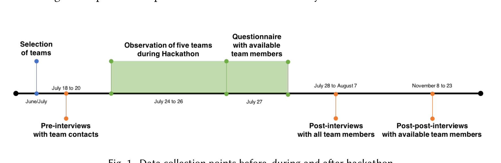
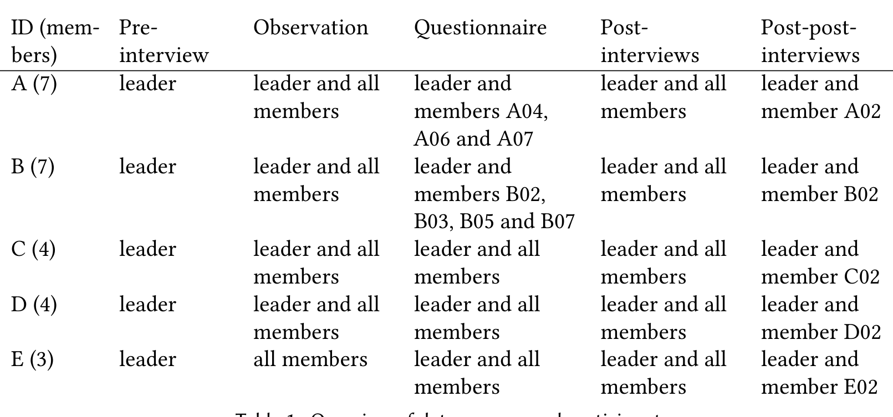
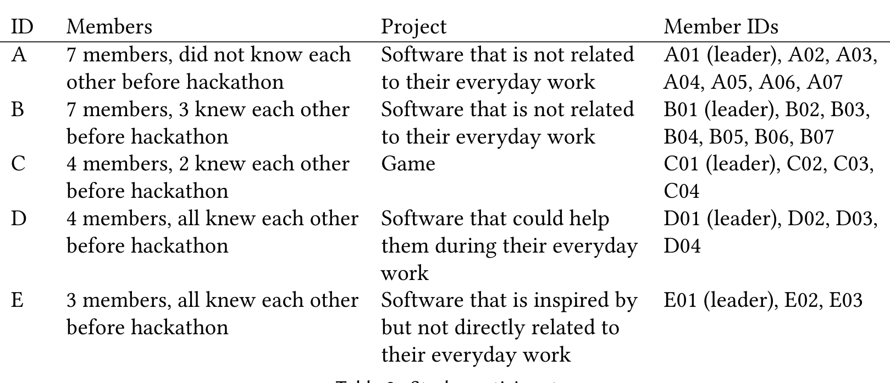
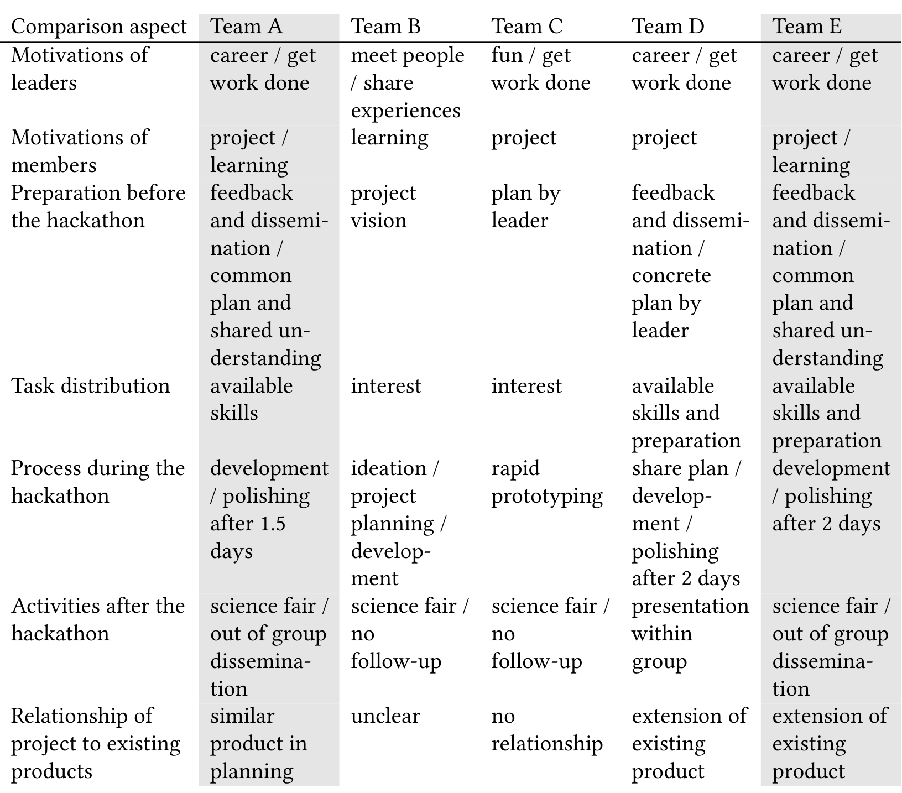

## You Hacked and Now What? – Exploring Outcomes of a Corporate Hackathon

ALEXANDER NOLTE, University of Tartu, Estonia & Carnegie Mellon University, USA  
EIPAPAPE-THAN, Carnegie Mellon University, USA  
ANNA FILIPPOVA, GitHub Inc., USA  
CHRISTIAN BIRD, Microsoft Research, USA  
STEVE SCALLEN, Microsoft Garage, USA  
JAMES D. HERBSLEB, Carnegie Mellon University, USA

Time-bounded events such as hackathons, data dives, codefests, hack-days, sprints or edit-a-thons have increasingly gained attention from practitioners and researchers. Existing research, however, has mainly focused on the event itself, while potential outcomes of hackathons have received limited attention. Furthermore, most research around hackathons focuses on collegiate or civic events. Research around hackathons internal to tech companies, which are nearly ubiquitous, and present significant organizational, cultural, and managerial challenges, remains scarce. In this paper we address this gap by presenting findings from a case study of five teams which participated in a large-scale corporate hackathon. Most team members voiced their intentions to continue the projects they worked on during the hackathon, but those whose projects did get continued were characterized by meticulous preparation, a focus on executing a shared vision during the hackathon, extended dissemination activities afterwards and a fit to existing product lines. Such teams were led by individuals who perceived the hackathon as an opportunity to bring their idea to life and advance their careers, and who recruited teams who had a strong interest in the idea and in learning the skills necessary to contribute efficiently. Our analysis also revealed that individual team members perceived hackathon participation to have positive effects on their career paths, networks and skill development.

Keywords: Hackathon; Project Sustainability; Innovation; Learning

### 1 INTRODUCTION

In recent years time-bounded events such as hackathons, data dives, codefests, hack-days, sprints or edit-a-thons have experienced a steep increase in popularity. During these and similar events people form teams – often ad-hoc – and engage in intense collaboration over a short period of time. Collegiate events that are organized by the largest hackathon league alone attract over 65,000 participants among more than 200 events each year1. But it is not collegiate events alone. Hackathons have become a global phenomenon [45] covering an abundant variety of different contexts ranging from corporations [19, 41] to higher education [27] and civic engagement [3, 23, 25].

Hackathons come in varying forms:
- Hackathons have different goals such as creating startups, innovative prototypes for arts and culture, medicine and civic open innovation. They also aim to strengthening interaction in specific scientific domains, teaching specific skills and identifying and fostering existing talent.
- Hackathons might involve newly formed teams or take place in existing communities [36].
- Teams might develop new project ideas or focus on the execution of well-defined agendas [46].

While there is a growing body of research around hackathons, existing work mainly focuses on the event itself. It contains descriptions of events [5] and covers themes such as how hackathons

---

teams self-organize [46], how teams and organizers deal with diverse audiences [17] and how non-software hackathons can be conducted [36]. Few studies, however, focus on the outcomes of hackathons. While there is some work around learning effects [37] and project sustainability [10, 11], a detailed exploration of how processes before, during, and after a hackathon contribute to the continuation of projects and how participation in such projects affects individual participants is missing. Furthermore, most studies that focus on the outcomes of hackathons are conducted in a student or civic context. Little attention so far has been paid to corporate hackathons.

The lack of research on corporate hackathons appears surprising since corporations increasingly invest in hackathons to foster internal innovation [41]. This in turn means that they have a vested interest in conducting hackathons that focus on creating sustained outcomes in the form of projects that can later be turned into products. Turning hackathon projects into products inevitably requires follow-up activities since it cannot be expected for a team to develop a shippable product during the course of a hackathon. Typical outcomes of hackathons are rather prototypes, demos, and videos which give life to a new idea [5, 28].

Our research, however, does not focus on technical outcomes alone. Corporations also have an interest in providing opportunities for their employees to expand their competencies [40], their network [20] and generally create a positive and motivating work environment [22]. Hackathons can provide such opportunities. They allow employees to collaborate that would not normally work together. Moreover they allow individuals to acquire new skills or expand on existing ones. Thus, we are focusing on a more general view on potential outcomes of corporate hackathons by specifically asking the following research questions:

### RQ1: How do activities before, during, and after a hackathon contribute to project continuation?

By activities in this context we refer to any actions individuals or teams engage in to prepare for the hackathon, their process during the hackathon and actions they engage in after the hackathon had ended. In addition we explore individual attitudes towards hackathon participation and project continuation.

### RQ2: What impacts do participants believe the event had on them?

By impact we refer to any perceived change on their individual attitudes and work environment which they attribute to participation in a hackathon.

In order to answer these questions we conducted a mixed method study on Microsoft's One Week hackathon in summer 2017. One Week is one of the largest corporate hackathons in the world with more than 18,000 employees working on more than 4,700 projects worldwide2. We focused on the largest site in Redmond where we selected five teams based on a variation of the dimensions of familiarity among team members and relationship between their hackathon project and their everyday work. We observed those teams during the entire duration of the hackathon and conducted interviews with them before, directly after and four months after the event. Finally we administered a questionnaire directly after the hackathon to all members of the teams we observed.

Our results provide insights into how activities before, during and after a hackathon along with motivations and intentions of project leaders and members can contribute to the sustainability of a project and the perceived impact on individuals related to their skills, careers and networks. Based on these results we developed the beginnings of a theory on how motivational, process and project management related factors can contribute to sustained outcomes on a project as well as on an individual level. The contribution of the paper is thus twofold. First it explores whether and how hackathon projects are continued and which aspects can promote or hinder their continuation2

---

## 2 A BRIEF HISTORY OF HACKING

The term hackathon was coined around the turn of the century while their rise in popularity took place during the mid to late 2000s. During that time they were mostly organized as competitive events for which young developers formed small ad-hoc teams and engaged in short-term intense collaboration on software projects for pizza and sometimes the prospect of a future job [5]. Since then, hackathons have spread across various domains ranging from large corporations [26] and small-medium-size enterprises [28] to student events [37, 42, 44], civic engagement [1, 39, 43] and others. This adoption has broadened the focus of hackathons from creating innovative ideas or software products [5, 10, 11] to covering themes such as informal and collaborative learning [18, 31, 37], expanding or creating communities [16, 36], supporting civic open innovation [1], tackling social [39] and environmental issues [49] and more.

The rise in hackathon popularity naturally led to an increasing interest by researchers to study them. Most research around hackathons however currently focuses on understanding how to organize and run them successfully [36, 46], how to deal with diverse audiences [13, 17] or how to run hackathons that are not solely focused on developing software [36]. While there is research around potential outcomes of hackathons, this work is still scarce and fragmented. Existing research points towards a disparity between the intention to continue projects after a hackathon and their actual continuation [8]. The lack of follow-up has been attributed to different factors depending on the goal and context of the respective hackathon. Multiple researchers pointed out that creating sustainable products and services in the context of civic innovation requires future stakeholders to be involved in the planning of a hackathon project [2, 9]. Cobham et al. [11] found the same for student hackathons that were conducted with the goal of creating start-up companies. Working in the field of computational biology, Lapp et al. [30] point out that the sustainability of hackathon projects depends on their fit to other existing projects. Finally, multiple studies found that in order for hackathon projects to be sustained it is necessary to identify suitable individuals that are willing and capable to continue a project after a hackathon has ended [10, 21]. These studies were conducted in the context of hackathons that aim at supporting the creation of start-up companies. Our work adds to aforementioned findings by providing a rich description of how various activities combined with individual attitudes towards hackathon participation and project continuation can contribute to the sustainability of projects.

Researchers also identified several benefits of hackathons for individual participants. They found tangible learning outcomes in student hackathons [37, 44] in addition to an increased interest in technology and an increased confidence in dealing with technology in general. Both these findings were confirmed for student hackathons [42] as well as hackathons that were conducted in the context of civic innovation [32]. Finally, multiple researchers found that participants were able to expand their respective network during a hackathon. This effect was observed in student hackathons [10] as well as community hackathons in the context of computational biology [7]. Our study expands on those findings in the context of corporate hackathons.

The previously described overview of existing literature also points to a lack of research around outcomes of corporate hackathons. Most of the current literature around hackathon outcomes focuses on student hackathons [10, 11, 21, 37, 42, 44] or civic events [2, 8, 9, 32]. Work focusing on the outcomes of corporate hackathons is largely absent. Our work addresses this gap.

Finally, most of the existing work on hackathon outcomes focuses on singular outcomes such as the sustainability of projects [2, 8–11, 21, 30] or individual learning outcomes [32, 37, 42, 44]. Our work however aims at examining a broader spectrum of potential outcomes related to projects in a corporate setting. Second, it indicates potential outcomes of corporate hackathons related to projects, teams and individuals.

---

and individuals. It also aims at identifying how attitudes and activities before, during and after a hackathon can foster or hinder aforementioned outcomes.

## 3 EMPIRICAL METHOD

To answer the research questions stated in the introduction, we conducted a mixed-method study of Microsoft’s One Week hackathon in summer 2017. We will elaborate on the context, our methods for data collection and our means of analysis in more detail in the following sections.

### 3.1 Setting

Microsoft’s One Week is an annual 4-day hackathon event that started in 2014. During the first 3 days of One Week (Monday to Wednesday), employees of Microsoft engage in intense collaboration to create any product or to conduct any project they are interested in. The last day (Thursday) is reserved for a presentation session. During this so-called science fair each hackathon team can present their project to the wider Microsoft public. Participation in the hackathon and the science fair is entirely voluntary. One Week is global in nature and takes place at different locations around the world. In order to orchestrate such a large scale hackathon, Microsoft uses a web-based system called Hackbox. Hackbox requires every participant to register and either join an existing project or propose their own project before the hackathon. Participants can also register as teams and/or search for additional project members that cover certain skills or fill certain roles which they perceive to be beneficial for their project. This allows e.g. a team of developers to find marketing experts or a team of content designers to find individuals with technical expertise. Hackbox is also used to register for the science fair by uploading a video for the project. The video also serves as a means to distribute the project to the wider Microsoft community since every Microsoft employee has access to Hackbox.

Our study focuses on the largest hackathon site at Microsoft’s corporate headquarters in Redmond, WA. This site hosted more than 6,700 participants working on more than 1,800 projects in two large tents. Around this hackathon we conducted an extensive data collection that included interviews, observations and questionnaires (c.f. Figure 1 for an overview of the data collection procedure).

> **Image description:** A horizontal timeline showing the study’s data-collection events and dates. Team selection is marked in June/July (blue), pre-interviews with team contacts occurred July 18–20 (orange), on-site observation of five teams is shown as a green bar spanning July 24–26, and a questionnaire with available team members is marked on July 27 (green). Post-interviews with all team members were conducted July 28–August 7 (orange), and post-post (follow-up) interviews with available members took place November 8–23 (orange). The figure summarizes when interviews, observations and the questionnaire were collected relative to the hackathon and its science-fair day.

Fig. 1. Data collection points before, during and after hackathon

### 3.2 Data sources

At the core of our study are five hackathon teams that consisted of three to seven members (c.f. Table 1 for an overview of the various data sources and Table 2 for an overview of the specifics for each team). We chose to focus on such teams for two main reasons: (1) most of the teams that

---

registered for the hackathon had between two and eight registered members (51.68%) with an average team size of four and (2) the team size needed to be manageable for a single researcher to observe. We selected teams that vary among the dimensions of familiarity among team members and relationship between their hackathon project and their everyday work since those dimensions can be expected to have an impact on the continuation of a hackathon project as well as the experiences of participants.

> **Image description:** The table summarizes data collection for five hackathon teams (A–E) and shows team sizes: A (7), B (7), C (4), D (4), E (3). Columns indicate which participants took part in pre-interviews, on-site observations, the immediate questionnaire, post-interviews, and four-month post-post interviews. Pre-interviews were conducted with each team leader only; observations covered the leader and all members for teams A–D and all members for E. Questionnaire participation varied (A: leader + A04, A06, A07; B: leader + B02, B03, B05, B07; C/D/E: leader and all members). Immediate post-interviews included leaders and all members for every team, while the four-month follow-up interviews were limited to the leader plus one member per team (A02, B02, C02, D02, E02).

Table 1. Overview of data sources and participants.

We initially identified ten teams that fit these dimensions through analyzing team profiles in the aforementioned Hackbox system and invited them to participate in our study. We conducted semi-structured interviews with the leaders of the teams that voiced an interest to participate a few days before the hackathon [14]. The aim of these interviews was to get an understanding about the team (e.g. "How did you find your team and when?"), their project and motivations (e.g. "Can you start by explaining what your project is about?") as well as potential activities that had already taken place in preparation for the hackathon ("How much preparation did you do as a team already?"). Based on these interviews we selected five teams for our study. The interviews of the leaders of the five projects we selected lasted between 22 and 28 minutes each.

For the hackathon, one member of the research team was assigned to each study team. The respective researcher stayed with the team during the entire duration of the hackathon and observed their activities, took detailed field notes, and made audio recordings when possible. Teams A, B, C and E worked on the main hackathon site while team D chose to work in a conference room near their offices. The five teams we studied mainly worked together on their hackathon projects during regular working hours between 9 am and 6 pm. Observation times vary between about 15 and 24.5 hours per team.

Directly after the hackathon we conducted post-interviews with all team members. During these interviews we asked them to elaborate on their experience starting with their motivations (e.g. "Why did you decide to participate in hackathon and work on this project?"), potential activities they conducted before the hackathon (e.g. "How did you prepare for hackathon?"), their satisfaction with the outcome (e.g. "How do you perceive the outcome of your project?") and their satisfaction with the way the outcome was achieved (e.g. "How effectively did you think you worked together?"). These interviews lasted between 15 and 44 minutes. We also conducted additional interviews with project leaders and members four months after the hackathon in order to assess the current status

---

of their hackathon project (e.g. "Are you satisfied with the current progress? Which potential obstacles prevent you from continuing to work on your project?"), their relationship with their hackathon team members (e.g. "Are you still in contact with members of your hackathon team? With who? About what?"), perceived effects of the hackathon on their career (e.g. "Do you think participation in the hackathon has helped your career in any way?"), communication about the hackathon and their hackathon project (e.g. "With whom did you talk about the hackathon or your hackathon project?") and their perspective on the hackathon itself (e.g. "What is your most vivid memory about the hackathon?"). These interviews lasted between 13 and 29 minutes each. We attempted to conduct both follow-up interviews with all team members but could not reach them all. We did however interview at least the respective leader and one member of every team four months after the hackathon. All interviews were transcribed for analysis. Interview protocols can be obtained from the authors upon request.

In addition to the aforementioned interviews and observations we also administered a questionnaire to all available members of the five teams we studied during the science fair (c.f. Table 1 and questionnaire in Figure 1)3. The questionnaire included six items that covered different potential motivations to participate in the hackathon:

1. Dedicated time to get work done
2. Learning new tools or skills
3. Meeting new people
4. Seeing what others are working on
5. Sharing your experience and expertise
6. Advancing my career

It also contained one question about individual intentions to continue their hackathon project. This question helps us understand the prevalence of individual continuation intentions immediately after the event. All variables were assessed on 5-point Likert scales [33]. The complete questionnaire can be obtained from the authors upon request.

> **Image description:** A four-column table enumerating five study teams (A–E) with columns for Members (team size and whether members knew each other before the hackathon), Project (short description), and Member IDs. Teams A and B were the largest (7 members each) and largely did not know each other beforehand (A: none knew each other; B: three knew each other); teams C and D had four members (C: two knew each other; D: all knew each other); team E was the smallest with three members who all knew each other. The Project column shows that A and B worked on software not related to their everyday work, C built a game, D built software intended to help everyday work, and E built software inspired by but not directly tied to their regular tasks; each team’s individual member IDs are listed with the leader labeled (A01, B01, C01, D01, E01). Notably, this table highlights contrasts in team composition (large/newly formed vs. small/pre-existing) that the paper links to differing preparation and continuation outcomes for the projects.

their everyday work

Table 2. Study participants

3 The questionnaire is based on a larger survey instrument by Filippova et al. [17].

---

### 3.3 Analysis procedure

In order to identify aspects that can potentially lead to the continuation of a hackathon project (RQ1) we first analyzed the interviews that were conducted four months after the hackathon, since they contain information about the current state of the respective hackathon project as well as aspects that potentially led to the continuation or discontinuation of a project. We analyzed these interviews using an open coding procedure which focused on project continuation and potential antecedents of project continuation. For the latter we used codes like motivation to continue project and project state after the hackathon. During the entire analysis we distinguished between team leaders and team members since we expected their experiences to be different based on their respective roles during the hackathon.

After this initial step we analyzed each project individually by reconstructing their story from the beginning of the project to the point of the last interviews which took place four months after the hackathon. For this we drew on all available data sources. We particularly focused on the origins of the project idea (pre-interviews), motivations of the team leader (pre-interviews and questionnaire items) and team members (post-interviews and questionnaire items), preparation activities before (pre- and post-interviews), activities during (observations and post-interviews) and activities after the hackathon (post-post-interviews) as well as individual continuation intentions and plans (post-interviews and questionnaire item). We focused on those particular aspects since we perceive them to most likely have an influence on the actual continuation of a project. Aforementioned aspects were used as initial codes in an open coding procedure (motivation, preparation activities, continuation plans, etc.). Results from this coding were then clustered based on our findings.

To answer the second research question — which focuses on the perceived impact of hackathon participation on individuals (RQ2) — we mainly focused on the interviews that were conducted four months after the hackathon, since they are most directly related to our research questions (post-post-interviews). We again employed an open coding procedure starting with coding each perceived individual outcome before clustering them into categories based on our findings. The observations during the hackathon as well as the interviews that were conducted before and those that followed immediately after the hackathon (pre-interviews and post-interviews) provided additional insight into their activities and how they perceived those activities to have affected their individual skills, careers and networks.

## 4 FINDINGS

We organized the results of our analysis along the two research questions stated in the introduction. The first research question focuses on the teams and their projects (RQ1, group level) while the second covers the individual team leaders and team members (RQ2, individual level).

### 4.1 Hackathon projects

In order to identify potential aspects that can lead to the continuation or discontinuation of a hackathon project (RQ1) we analyzed differences and commonalities between the five teams we studied (c.f. Table 2). In the following we will elaborate on the journey of each of those teams (sections 4.1.1 to 4.1.5) before conducting a comparison between them (section 4.1.6). The aim of the comparison is to identify differences between the teams that continued their projects and the teams that did not, thus identifying aspects that can potentially foster or hinder project continuation.

The descriptions are organized as follows. We start by outlining the origin of the idea along individual motivations of team leaders and team members. Afterwards we elaborate on preparation activities for each team before outlining their process during the hackathon. Finally we analyze project continuation intentions and activities that took place after the hackathon.

---

> **Image description:** Table of 5-point Likert responses (1–5) from team leaders and team members across seven items: Get work done, Learning, Networking, Interest in others’ work, Share experience, Career, and Continue project. Leaders of teams A, D, and E rated “Get work done” at the maximum (5.00); leaders of A and D also rated “Career” highly (5.00), while the leader of B emphasized Networking (5.00). Team A members report the strongest learning and networking motivations (Mlearning=4.67, Mnetworking=5.00) and the highest mean intention to continue their project (Mcontinue=4.50, SD=0.71); Team E members show unanimous moderate continuation intent (M=4.00, SD=0.00) and high learning (M=4.00). By contrast, members of teams B, C and D show lower average continuation intentions (M=3.75, 3.33, and 3.00 respectively), revealing notable leader–member divergences in some teams (for example, Team D’s leader scores continuation=5.00 while members report M=3.00, SD=0.00).

Team E SD = 0.71 SD = 0.00 SD = 0.00 SD = 0.71 SD = 0.71 SD = 0.71 SD = 0.00  
Table 3. Questionnaire responses to motivation and continuation questions by team leaders and team members. Member responses are reported as mean (M) and standard deviation (SD). All responses were given on a 5-point scale.

### 4.1.1 Team A.

The initiator and leader of this team (A01) is a marketing expert who had the idea to develop a tool to support career development ("was thinking about [...] career planning", A01). Her/his motivation to turn this idea into a hackathon project was to "broaden my depth and try new things out" (A01) and to further her/his career (c.f. 5.00 in Table 3). "Get work done" was thus a strong motivation for her/him (5.00). A01 purposefully assembled a diverse group of developers (A03, A05, A07), UX (A06) and HR (A02, A04) experts for this project. The eventual team members mainly got interested in this project because of its theme ("project that I'm interested in", A07), the opportunity to meet new people (M = 5.00, SD = 0.00, "meet new people", A06) and learn (M = 4.67, SD = 0.58, "expand my own knowledge", A02). None of the team members knew each other before participating in this hackathon project and the project was not directly related to any of their respective work tasks since the focus of aforementioned HR experts was not on internal career counseling.

The team conducted "weekly meetings before the hackathon" (A04) during which they ran through "a lot of iterations" (A03) to scope the project and develop a list of tasks. A01 also "talked to people about the project" (A01) beforehand in order to identify a suitable scope and to disseminate the project idea ("created a list of friends of [project name]", A01). Most team members also engaged in individual preparation activities before the hackathon. These were mainly related to specific technologies that the developers among the team members would use during the hackathon ("I was looking at those APIs", A03, "I was working on how I was gonna implement it", A05).

---

During the hackathon the team worked in parallel on developing a software prototype and a video. Team members selected and conducted tasks based on their respective skill set (A03, A05 and A07 focused on development, the others mainly worked on the video). During the first day minor changes were conducted based on discussions around the story of their video. At the mid point of the hackathon the team had a working prototype and a video script. They spent the rest of the hackathon time on polishing the prototype and creating the video. On the last day they discussed strategies of how to get a larger audience interested in their project, provided an update about their progress during the hackathon to those that they already contacted before the hackathon and prepared for the science fair. During the science fair they had a meeting with a senior manager during which they presented the project.

Questionnaire and interview responses indicated a strong intention for the team leader and all team members to continue the project after the hackathon (team leader: 4.00, team members: M = 4.50, SD = 0.71, "I'll definitely go and work on that project", A03). Immediately after the hackathon A01 engaged in dissemination activities by "present[ing] the project to multiple groups" (A01). One of her/his conversation partners subsequently advertised the project to a group that had already planned to create a similar product ("X told to Y: I think these guys [i.e., team A] have built what you [i.e., Y] are trying to build", A01). A01 had a meeting with this group which led to a definite commitment to the continuation of the project by that group ("we found the right team and the funding seems to be there", A01). This development, however, led to the project being taken over by this team which in turn meant that none of the original team members are involved in its continuation. A01 generally felt positive about the continuation of the project by that other group ("I am excited about the product", A01), although this statement reveals that s/he might be emotionally invested in the project. It is unclear how the other team members reacted to the project being taken over since this decision was taken after they were interviewed.

### 4.1.2 Team B.

This project was initiated by a marketing expert with a developer background (B01) who found it "extremely hard to meet people" (B01) in Microsoft. S/he thus created a hackathon project with the goal to develop a software that would support employees to meet others who are not part of the same organizational unit. Her/his main interest in the hackathon consequently was to "meet people" and to "share experiences" (c.f. 5.00 and 4.00 in Table 3). B01 assembled a group of interested developers (B07), engineers (B02), marketing experts (B02, B04, B06) and project managers (B03, B05) without any particular focus on their skill set. Only one team member voiced an interest in the theme of the project but only because "it was [B01’s] idea" (B06). The other team members were mainly interested in learning (M = 4.25, SD = 0.50, "learning new technology skills", B03) and "meeting people" (B07) for networking (M = 4.50, SD = 0.58). B01, B02 and B06 had worked together prior to the hackathon but none of the other team members knew each other before and the project was not directly related to any of their respective work tasks.

B01 organized a meeting before the hackathon to which "only [...] two people show[ed] up" (B01). During this meeting the participants talked about the "vision for the project, and the roles" (B03). In addition B01 created "a little one page type of spec of the technology and what my thought process was" (B01) which s/he distributed via email. Two of the team members engaged in individual preparation activities before the hackathon. B06 "set up the laptop" (B06) and B02 prepared "just a little like the weekend before" (B02). Other participants did not mention any particular preparation activities because of their perception that they did not entirely understand the project goals ("[I] didn't know what expectations [B01] had", B04).

At the beginning of the hackathon the group came together and started developing a project plan "completely from scratch" (B07). B01, B03 and B06 discussed the design of the software and came up with an initial plan. The work itself was then divided based on individual interest. During the

---

rest of the day the plan was adjusted multiple times and the team members frequently formed new subgroups to adjust to the changing requirements. In the morning of day 2 the focus shifted towards creating a story for a video which would be presented at the science fair. Most team members subsequently worked on a story for the video and on a fitting UI for most of the remainder of day 2. Two developers continued working on back-end code until the end of the hackathon. This code was never integrated. B01, B02, B03, B06 and B07 participated in the science fair.

The team leader had a strong intention to continue working on the project (5.00) while the intentions of the participants were mixed (M = 3.75, SD = 1.26). Neither the project leader nor any team member engaged in any continuation activities despite some team members expressing interest to continue working on it as "a side project" (B07). B01 mentioned that s/he did not feel comfortable showing the prototype to others at this point because s/he "would still have to explain [that] there's a lot of marked-up data" (B01).

### 4.1.3 Team C.

The idea for this project originated from a developer (C01) who had an interest in board games. Together with a friend who was a UX designer (C02) they formed a hackathon team with two other developers (C03, C04). The main interest of C01 was to "get work done" (c.f. 4.00 in Table 3), meet new people (4.00 in "networking") and work on a "cool idea" (C01). The rest of the team mainly joined because they were interested in the idea ("I'm a big fan of board games", C03), wanted to "share their experience" (M = 4.33, SD = 0.58) and do something that is "different than my day-to-day job" (C02) and that they "feel passionate about" (C04). C01 and C02 knew each other before the hackathon but did not work together. None of the other team members knew each other before the hackathon and the project was not related to any work tasks of any of the team members.

C01 and C04 met before the hackathon to "introduce [ourselves]" (C01) and discuss prototypes that C01 had created in advance. C01 had also "developed tools to make [game elements] etc." (C01) and created a "to-do list" (C01). C02 participated virtually in those meetings and prepared for the hackathon by "looking at some other games" (C02) while C03 and C04 did not prepare at all. C03 joined the team late in the afternoon on day 1 after the hackathon had already started.

During the hackathon the group mainly worked on details of the game such as labels for game elements and time limits. They also played multiple versions of the game during the hackathon to assess its quality. Tasks were distributed based on interest. In the afternoon of day 1 the group started to develop a script for a video. The team drew interest by scouts who were searching for interesting projects. This resulted in the team being visited by a senior manager in the morning of day 3 to whom they presented the game. After the visit the team developed a plan on how to promote their project at the science fair. At the science fair they received positive feedback ("people were really, really excited", C04).

C01 had an interest in continuing the project (4.00) but also stated that her/his "objective has been completed" (C01) and that "even if we stop here, [s/he] will say that it was a success" (C01). The other team members voiced similar intentions (M = 3.33, SD = 1.53) in that they would continue "if [we] get executive support" (C02). None of the team members engaged in any specific dissemination activities apart from one "meeting [...] where we had a bunch of demos from teams that participated in the hackathon and [they] demoed [their] project" (C01).

### 4.1.4 Team D.

This aim of this project was to develop software that supports the everyday work of a specific organizational unit within Microsoft to address customer requests more efficiently. The idea was circulated among this unit since the beginning of the year and D01 suggested to work on this during the hackathon at a meeting for which s/he received "positive feedback" (D01). The main motivation for D01 to participate in the hackathon was to "get work done" (c.f. 5.00 in Table 3). S/he did however also perceive the hackathon project as a means to advance her/his "career"

---

(5.00) and to identify if s/he wanted to "lead a project or be a fellow" (D01). Three developers who participated in aforementioned meeting and were part of the same organizational unit as D01 joined her/him for the hackathon (D02, D03, D04). Their motivations were to "get work done" and to "share experience[s]" (both M = 3.50, SD = 0.71). They also acknowledged that the project was "something that we needed" (D02).

The group had a meeting "on Friday before the hackathon" (D03) to "kind of hash things out" (D01). Before this meeting D01 had already "spent 2-3 weeks getting libraries set up" (D01) and had "learn[ed] more about the infrastructure" (D01). D01 also asked "another PM" (D01) for feedback about the project prior to the hackathon and got a "promise [for] developers" (D01) to continue the project after the hackathon. The other hackathon participants either did "no prep at all" (D04) or prepared for potential technical challenges by e.g. revisiting "some of the schemes that I wrote" (D02).

At the beginning of the hackathon the team first discussed their overall strategy and divided the project into tasks. The discussions were on a high technical level since all participants were familiar with the domain. The tasks were then distributed according to interest but the team had difficulties assigning UI related tasks because no one had the required experience in this field. D03 finally agreed to work on them. They spent most of the time during the hackathon with coding and only modified the plan when they hit a technical barrier. A first version of the software was ready in the afternoon of day 2. Afterwards the team discussed about making a video but decided to rather spend the remaining time on polishing the software.

After the hackathon D01 mentioned that s/he was "surprised by how much we got done" (D01) and s/he voiced a definite intention to continue the project (5.00). The other team members did not have any particular intention to continue the project (M = 3.00, SD = 0.00, "I probably won’t have any involvement, which is kind of okay", D02). One week after the hackathon D01 presented the software at the "big team meeting" (D01) which is also attended by their "[second level] manager" (D01). During the meeting they discussed that "[the project] needs a month to make it really usable" (D02) and that there currently "is not enough bandwidth for us to work on it" (D01). Leadership also stated a fear that "the project will create a new business case that we are not ready for" (D01), which in turn would only exacerbate the lack of resources.

### 4.1.5 Team E.

The eventual leader of this hackathon team (E01) developed a number of ideas for new projects for their everyday work because s/he felt a "lack of interesting projects" (E01). E01 discussed these ideas with other developers in her/his organizational unit and they decided to develop a software that is inspired by but not directly related to their everyday work. Two of the three developers in this unit joined the team (E02, E03) early and became "co-founders" (E01) of the project. The motivations of E01 apart from the project theme as such were mainly to "get work done" (c.f. 5.00 in Table 3), "learn" (5.00) and advance her/his "career" (4.00). The team shared her/his interest in the project as well as the motivation to "learn" (M = 4.00, SD = 0.00, "learn more about something outside what I usually do", E02) and to advance their "career" (M = 3.50, SD = 0.71).

The team started to conduct meetings three weeks before the hackathon "every Monday, Wednesday and Friday, like half an hour" (E03). During these meetings they discussed details of the project such as the design of the UI ("two-screen approach", E01) and "pick[ing] the right technology" (E01). During these meetings they "create[d] a project plan" (E01) which included a list of "six different tasks that [they] need[ed] to get [the project] done" (E01). Tasks were distributed based on skill if possible ("I will call out [E03] because [E03] has the experience of doing [technology]", E01). Other tasks were distributed based on interest ("Who is interested in doing that?", E01). Each team member also engaged in individual preparation activities ("I started studying some of the stuff that I needed", E02). E01 also engaged in dissemination activities before the hackathon. S/he "talked to [direct manager] and [second level manager]" (E01) but received no immediate feedback.

---

During the hackathon the team spent most of the time executing their respective tasks with small interruptions to help each other when necessary. The basic functionality was realized by the end of the second day. They spent the last day polishing their prototype, adding small features and producing a short video. The video production was triggered by a rumor that their direct manager would participate in the science fair on the next day. They participated in the science fair and received positive feedback by their manager ("It's good", E01).

After the hackathon E01 created promotional material and "sent it out" (E01) to leadership. S/he also tapped into her/his personal networks within the company ("[our group leader] has connections on the [second level] and everything", E02) and presented "the idea to leadership [...] two levels up or three levels up" (E03). These presentations subsequently led attendees to think about adopting this project because "they really liked the idea [and] they have a fairly similar App" (E01) and because "they have a budget to take in this idea" (E01). This project will thus also be taken over by a different group with no involvement of its original creators. The team however "[has] so many exciting projects right now [...] so we are OK with passing the project over to the other organization" (E01). This was reflected by the continuation intentions of E01 (3.00). The rest of the team would have liked to see the project to be continued (M = 4.00, SD = 0.00) but they were not particularly emotionally invested in the project ("if they say no, then it's no; if yes, then we'll continue", E02).

### 4.1.6 Comparison among teams

In order to answer our first research question (RQ1) we compared the five teams we studied. We focused the comparison on differences between teams whose projects were continued (teams A and E) and teams whose projects were not (teams B, C and D). We identified multiple aspects that potentially influenced the continuation or discontinuation of the different projects (c.f. Table 4 for a summary).

When comparing motivations of the different team leaders to participate in the hackathon, we found that all but the leader of team B participated in the hackathon to get work done. The comparison also revealed that the leaders of teams A, D and E mentioned career advancements as a motivation to participate in the hackathon while the leaders of teams B and C in turn mentioned motivations such as networking and fun. It thus appears as if a career oriented leadership style can positively influence the continuation of hackathon projects. This orientation is visible through team leaders actively engaging in promoting their project before and after the hackathon as well as their focus on meticulous preparation and execution of their project to ensure a presentable outcome.

For the motivations of project members we found that the members of teams A, C, D and E voiced an interest in the project as such. The members of teams A, B, D and E also mentioned learning as a motivation to participate in the hackathon. Looking deeper into this aspect we found that the members of teams A and E were mainly interested in learning new skills related to their specific area of expertise such as new technologies (A07 and E02) and learning about HR (A02). Members of team B however were mainly interested in learning about other subject areas such as B03 being a project manager aiming to improve her/his technical skills. It thus appears that a motivation for expertise focused learning can positively influence the continuation of a project. This appears reasonable since learning new skills that are outside of an individual’s area of expertise can be expected to negatively influence the efficiency of the respective individual during a hackathon.

We also identified differences between preparation activities that the different teams engaged in. Teams A, D and E engaged in extensive preparation activities. As part of those activities the leaders of teams A, D and E discussed about the project with employees of other organizational units that could become potential customers before the hackathon. The aim of those discussions was both to assess the overall interest in their project and to ask for feedback about the theme and direction of the project prior to the hackathon. Teams A and E also conducted multiple meetings in the weeks

---

Before the hackathon during which the team leader and members jointly developed a concrete plan for the project. The leader of teams C and D engaged in individual planning activities. Team B did not engage in specific planning activities prior to the hackathon. Jointly engaging in such project-focused preparation activities in turn allowed the members of teams A and E to study specific technologies that they knew they would need prior to the hackathon, while the members of teams C, B and D either engaged in high level preparation activities such as "looking at some other games" (C02), "set[ting] up the laptop" (B06) or "no prep at all" (D04). These preparation activities appear to have positively influenced the performance of teams A and E during the hackathon.

The way the teams distributed tasks was another important aspect that differentiated teams whose projects got continued from teams whose projects did not. Teams A, D and E distributed tasks based on the skills of the respective team members if possible, with some members of teams D and E engaging in tasks that included technologies they were not familiar with. This effect, however, was mitigated in the case of team E by aforementioned preparation activities that allowed e.g. E02 to "study some of the stuff that [s/he] needed" (E02) prior to the hackathon. It thus appears that matching skills and tasks can improve team efficiency during the hackathon which in turn can be expected to positively influence project continuation.

Comparing the process during the hackathon subsequently revealed that teams A and E basically executed the initial plan with minor modifications if the software (team E) or the storyline of the video (team A) afforded it. Team D could not start straight away since they first had to develop a shared understanding about the project plan that D01 had prepared prior to the hackathon. Team A finished an initial version of their software and video around noon on day 2; teams D and E finished at the end of day 2. They used the remaining time for polishing (teams A and E) and adding minor features (teams D and E). Team C engaged in a process of rapid prototyping by repeatedly testing and altering their game while team B started with a design phase before developing a plan that was adjusted multiple times during the hackathon. It thus appears that being able to hit the ground running and freeze the project before the end of the hackathon can positively influence the continuation of hackathon projects. This might be based on the possibility to develop a mature prototype when following the previously described approach.

After the hackathon all but team D participated in the science fair. Teams A and E also engaged in additional dissemination activities outside of the context of the hackathon ("we presented our project to multiple groups", A01, "we presented the same slides again to this group", E01). The science fair itself facilitated the organization of some of those presentations ("our [second level manager] came by and I showed her/him our project", A01), while other presentations took place based on personal networks within the company ("[our group leader] has connections on the [second level] and everything", E02). Those presentations subsequently led attendees to think about adopting a project ("they really liked the idea [and] they have a fairly similar App", E01) or to connect the team to potentially interested people from other parts of the organization ("we pitched this idea to X and X met with Y and told Y that we have something that Y might be interested in", A01). Team D also presented their project but only in the context of their respective organizational unit. It was still surprising to see that the project will not be continued despite positive feedback and despite prior commitment by management to provide resources ("promise [for] developers", D01). We will discuss this specific aspect in the following. Team C received interest by a senior manager but the team did not engage in any additional dissemination activities. Team B also did not disseminate their project results after the hackathon. One of the reasons for this lack of dissemination was that the leader did not perceive the project as mature enough. Our analysis thus revealed that teams whose projects got continued put more effort into finding a home for a project than teams whose projects did not get continued. Participation in the science fair can be considered as a potentially benefiting

---

> aspect for project continuation but teams also needed to take additional measures for a project to be continued.
> 
> Our findings also revealed that the projects of teams A and E are expected to be taken over by an organizational unit that were either already planning to create a similar product ("X told to Y: I think these guys [i.e., team A] have built what you [i.e., Y] are trying to build", A01) or that perceive the project to be a suitable addition to their existing products ("they have a fairly similar App", E01). Team D also created an extension for an existing product, while this is not clear for team B since they did not disseminate their project after the hackathon, which makes it hard for us to judge if it could be perceived as fitting to one of the products in Microsoft's extensive portfolio. Team C worked on a completely new idea – a board game – which did not get continued despite strong interest from senior managers. It thus appears that creating an evolution, not revolution, of existing projects can potentially benefit project continuation.
> 
> Throughout our analysis it always appeared as if the project of team D should have been continued after the hackathon. Team attitudes and processes are very similar to the attitudes and processes of teams whose projects got continued (c.f. Table 4). We thus asked ourselves why this project did not get continued despite the leader having received positive feedback and even a "promise [for] developers" (D01) prior to the hackathon. Aiming to identify potential reasons for the discontinuation of this particular project, we found hints that the project had developed something like a fatal attraction towards potential future customers. From the post-interview responses by D01 we learned that s/he was "surprised by how much [they] got done" (D01), which indicates that the hackathon showed potential application scenarios for the project which were not directly apparent prior to the hackathon. These application scenarios were identified by leadership who noticed, based on the presentation of the project, that it would "create a new business case that [they] are not ready for" (D01). The project would have potentially attracted larger amounts of customers than leadership initially anticipated, which led them to decide not to continue the project at this point.

---

> **Image description:** A multi-column table comparing five observed hackathon teams (A–E) across seven aspects: leader motivations, member motivations, preparation before the hackathon, task distribution, process during the hackathon, post-hackathon activities, and relationship of the project to existing products. Columns for Team A and Team E are shaded to mark the projects that were continued; both show leaders motivated by ‘career / get work done’, members motivated by ‘project / learning’, extensive pre‑hackathon preparation (feedback/dissemination and a common plan), task allocation based on available skills, rapid development with polishing after ~1.5–2 days, active science‑fair plus out‑of‑group dissemination, and a fit to existing or planned products. By contrast, Teams B and C prioritized networking/fun, prepared little (project vision or leader plan only), distributed tasks by interest, followed ideation/rapid‑prototype processes, showed no follow‑up after the science fair, and had unclear or no product fit; Team D had career‑oriented leadership and preplanning but only presented within its group and despite being an extension of an existing product did not continue. The table visually summarizes the paper’s finding that career‑oriented leadership, project‑focused preparation, skills‑matched tasking, proactive dissemination, and product fit co‑occurred with the two continued projects.

Table 4. Comparison between teams along aspects that differed between projects that were continued and projects that were not. Light gray background signifies that a project was continued.

All in all, we can conclude that the following aspects contributed to the continuation of projects in the case of the five projects we studied. These aspects can serve as the starting point for the development of a theory on the continuation of hackathon projects in a corporate setting:

- **Career oriented leadership:** The motivations of project leaders were to get things done and to advance their career, which led them to thoroughly prepare the project and engage in dissemination activities before and after the hackathon.

- **Expertise focused learning:** The motivations of respective project members was to learn something new related to their domain of expertise combined with an interest in the project idea. This allowed them to efficiently carry out their respective tasks during the hackathon.

- **Project-focused preparation:** Team leaders assessed interest in their project and asked for feedback prior to the hackathon. They also conducted multiple team meetings before the hackathon during which they discussed the project idea and jointly developed a project plan with the team. Based on these meetings team members could engage in specific preparation activities that fit to their future tasks during the hackathon.

---

- **Matching skills and tasks:** Task distribution during the hackathon was based on the skills of the team members. If specific skills were not available they found a team member that possessed related skills combined with an interest to acquire the skills required to complete their respective task.
- **Hit the ground running and freeze the project before the end:** Teams executed their project plan with minor modifications if necessary. The teams were done with an initial prototype and corresponding dissemination material after a maximum of two days. They spent the remainder of the time to polish their prototype and dissemination material.
- **Find a home:** Attendance in the science fair combined with engaging in dissemination activities outside of their respective organizational units allowed people in the organization who had interest and means to continue the hackathon projects to become aware of them.
- **Evolution not revolution:** The projects of teams who worked on ideas that were similar to existing or planned products or could be perceived as suitable extensions of such were more likely to be continued than those who developed radically new ideas unrelated to the existing product portfolio. Attendance in the science fair combined with engaging in dissemination activities outside of their respective organizational units positively influenced the continuation of hackathon projects in the case of the five teams we studied.

It should, however, be noted that covering aforementioned aspects still serves as no guarantee for the continuation of a project. Factors that are outside of the control of the respective team can disallow the continuation of a project in the end. A project’s fatal attraction is in the case of team D can serve as an example for that.

## 4.2 Hackathon participants

Our analysis revealed that hackathon participation had various impacts on individuals based on their own perception (RQ2). We will elaborate on those related to three main categories: perceived impact on individual skills, perceived impact on individual career paths, and perceived impact on individual networks. We will distinguish between team leaders and participants since it can be expected that their experience during the hackathon will be different from one another.

### 4.2.1 Perceived impact on individual skills

Many of our study participants reported that they intentionally engaged in projects that were not directly related to their everyday work ("I wanted to do something that was very different than my day-to-day job", C02). It is thus not surprising that most participants also reported that they perceived to have gained additional skills through participating in the hackathon ("I learned a lot about how MVC works", D01, "I learned how the 3D stuff works", E02). These skills were related to different technologies (e.g. 3D and MVC as mentioned before) as well as to project management ("how to better describe the work needed for a feature, and how to split them into tasks", E01). Two of our interviewees also reported that the skills they gained during the hackathon were directly applicable in their everyday work ("I use some of the skills I learned", A01, "the hackathon helped me in the role change [towards management]", E01) while this was not the case for other interviewees ("I cannot do AR in my current job", E01).

There is a noticeable difference between the perceived skills gained by leaders of hackathon teams and perceived skills gained by other team members. The leaders of the different hackathon teams mainly mentioned that they gained skills related to project management (c.f. D01 and E01 previously). They also reported to perceive the hackathon as a suitable testing ground to run their own projects ("I had the opportunity to organize something from start to finish", D01). The other team members in contrast mainly mentioned technical skills (e.g. D01 and E02 as mentioned previously).

---

as well as general "collaboration skills in diverse teams" (A02). It thus appears that the perceived impact on individual skill development is different between team leaders and participants.

Gaining skills that might or might not be applicable for everyday work is however only one part of the impact that participants perceived the hackathon had on them. Multiple interviewees mentioned that the sheer exposure to different people and different skills "sparked an interest to develop other skills" (B03) and to "expand my own knowledge" (A02). Some interviewees also mentioned an effect on overall tech literacy ("you gain general programming experience", E02) and stated that the experience of being able to quickly acquire new technical skills in a hackathon setting boosted their confidence in their ability to quickly acquire new skills if needed ("I feel more equipped now that I have a background in those [technical] topics", B03). One participant also mentioned that it "reignited [her/his] passion for coding" (B02).

### 4.2.2 Perceived impact on individual career paths

In addition to the aforementioned perceived impact on individual skills and interests, our analysis revealed that individuals perceived participation in the hackathon to have an impact on their individual career paths. Both leaders of team A and E as well as one member of team B got promoted to different positions shortly after the hackathon. They attribute this promotion to their participation in the hackathon stating that "success in the hackathon shows creativity and capability" (E01) and "I told my team that I came here because after the hackathon someone asked me to come [here] because I can talk and code" (A01).

Looking deeper into the type of promotions for aforementioned interviewees, we found that their promotions were different in nature. The leader of team E got appointed as the team leader for the team he originally was a part of and that participated in the hackathon together. The previous team leader remained in her/his position and is now a peer of E01 overseeing one part of the team while E01 oversees the other part of the team. E01 attributes this partly to the possibility for her/him to acquire and showcase project management skills during a hackathon (c.f. previous statement by E01). The other two previously mentioned beneficiaries of promotions (A01 and B02) did not get promoted to a leadership position but changed to a different part of the company. A01 moved to a marketing-related position (c.f. previous statement by A01) and B02 moved to a development position in a part of the company that works on functionalities which are similar to the ones s/he worked on during the hackathon project ("I moved to an engineering org. to work on a similar project", B02). They thus consequently perceived that the hackathon allowed them to showcase critical skills for their respective new positions.

In addition to direct promotions, we found another perceived impact of hackathon participation in the case C01. S/he stated during the interview that s/he mentions her/his "participation in the hackathon in [her/his] annual progress report" (C01) and that s/he regularly receives "positive feedback by [her/his] manager" (C01) about participating in the hackathon. S/he thus perceives that participation in the hackathon improved the perception of management about her/his performance. Moreover this interviewee also stated that her/his participation in the hackathon changed her/his perception of the company in a positive way. This is evident by the following statement: "I am very happy that Microsoft does hackathons and [...] if I ever change companies I would probably look for a company that does hackathons [...], it has become something important to me" (C01).

Finally multiple interviewees mentioned that they perceive participation in the hackathon to have an impact on the way other employees perceive them. One example for this is mentioned by A01 who stated that "saying I did a [tech project] during the hackathon, wow, gives me credibility for my current role" (A01).

### 4.2.3 Perceived impact on individual networks

Hackathon participants also perceived the hackathon to support them expand their individual networks within the company. As expected, participants of teams that were specifically formed for the hackathon expressed a direct effect on their respective

---

> networks ("I met fantastic people" (B03), "my network basically exploded" (A01)). In addition the team leaders we interviewed stated that exposure through their project during the science fair as well as after the hackathon through various presentations ("we presented to their GPM and multiple PMs", E01) helped them expand their network within the company. We did not find similar statements by project participants, but one participant stated that s/he "connected [my team] members to my network" (C01). One of the members of this team also mentioned that s/he "connected with some folks individually to tap into their skills for [her/his] current job" (A02). It thus appears that some of our study participants also kept implicit ties to their respective teams which they can re-activate if deemed necessary.

## 5 DISCUSSION

The aim of our study was to explore outcomes of corporate hackathons. Such events have not been extensively studied so far with most research on hackathons focusing on collegiate [37, 42, 44] or civic [1, 39, 43] events. Our findings provide an understanding of how actions before, during, and after a hackathon along with motivations and intentions of project leaders and members can contribute to the sustainability of projects (RQ1) and the perceived impact on individuals (RQ2), related to their individual skills, career paths, and their network within the corporation.

We have contributed the beginnings of a theory about how motivational, process, and project management related factors can contribute to sustained outcomes. We contribute to literature on technology transfer (see below), suggesting that hackathons can ease the task of technology evaluation by producing tangible prototypes, may facilitate innovation by releasing teams from the constraints of work processes and development priorities, but can suffer from a lack of detailed information about product lines and markets in potential future homes for projects. Our study also provided indication for what appears to be a fundamental trade-off between project sustainability and individual perceived benefits as well as between the expectations of hackathons being a hub for radical innovation and project sustainability which rather manifested itself for projects which focus on the evolution of existing products in the case we studied. We elaborate briefly below.

Our analysis led us to identify the beginnings of a theory on project continuation which contributes to the current state of the art in research on corporate hackathons. We identified project-focused preparation as one critical aspect that potentially influences the continuation of hackathon projects. This preparation included the involvement of potential future stakeholders prior the hackathon in our case which also has been found to foster project continuation in the context of civic hackathons [2, 9] and hackathons to foster start-ups [11]. Our work expands this knowledge by indicating how stakeholder feedback combined with career-oriented leadership and project members seeking expertise-focused learning opportunities can make a powerful combination which might allow projects to hit the ground running thus potentially contributing to project continuation. These findings also point towards the potential importance of extensive preparation activities which are not typically considered in hackathon studies. We also found that skill-matching – i.e. distributing tasks based on individual skills and not interest – can contribute to a project’s continuation. This is something that is not commonly discussed in research around hackathons since hackathons are often perceived as a means to learn new skills rather than deploy existing ones [27, 37]. Similar to research on hackathons in the field of computational biology [30], our study revealed that a fit to existing products or an evolution not revolution of existing products can be beneficial for project continuation. These findings are also in line with previous work on team effectiveness (c.f. Mathieu et al. [34] for an initial overview) in that aspects such as leadership [38], learning orientation [15] and shared understanding [35] can contribute to a team’s success. Our study however goes beyond those aspects in that we do not focus on team effectiveness alone. We rather focus on the larger context of project continuation in a corporate

---

hackathon setting. Furthermore, we identified that activities aiming to find a home could benefit the continuation of a hackathon project. This finding is in line with existing work in the context of hackathons to foster start-up creation [10, 21]. The focus in a corporate context, however, is not on identifying individuals who want to continue working on a project but identifying parts of the organization that have an interest and the financial resources to do so. Finally, our work revealed that giving shape to a prototype could unearth unanticipated risks, such as fatal attraction, where it became clear that levels of interest could be aroused for which the team receiving the prototype might be unprepared, thus cutting short what originally appeared to be certain continuation in this particular case. This effect — to the best of our knowledge — has not been previously reported in related literature about hackathons.

Aforementioned findings contribute to work around technology transfer, which focuses on the question of how to transfer innovative research prototypes into products [12, 29, 47]. Researchers in this area found that product effectiveness in terms of fit with existing products and competencies as well as market demands and resources are the main antecedents of a successful transfer [6, 47]. Our study results are in line with this work in that both teams whose projects got continued managed to identify organizational units within the company that perceived their project to fit into existing products (team E) or that had already planned to develop a similar product (team A). These organizational units consequently were willing to spend resources on the future development of the respective hackathon projects. Furthermore, we also found market demands to influence project continuation in the cases we studied. This aspect was particularly prominent in the case of team D since they developed a tool which would fit an existing product line but leadership perceived market demands to be too much for them to handle and thus decided to not continue the hackathon project that team D developed. Our study also revealed that while hackathons are generally perceived as a suitable ground for creating innovative prototypes, they lack explicit support to transfer such prototypes into actual products. The teams whose work continued in our study tackled this problem themselves, both in preparation as they assessed interest and solicited feedback, and after the hackathon as they worked to sell their result.

Comparing our results with literature on corporate innovation also suggests that hackathons can support the assessment of ideas and the decision whether or not a project is worth pursuing. The assessment of ideas has been reported as one of the main challenges in corporate innovation [24] which is commonly based on the discussions of ideas, e.g., large-scale brainstorming events such as idea jams [4]. Hackathons can support this decision by providing additional information that goes beyond theoretical discussions. During hackathons people do not only exchange and discuss ideas but create prototypes based on those ideas. Such prototypes as well as the process that leads to their creation can yield important information about the feasibility of a product as well as about potential difficulties and pitfalls that might occur during its development. Hackathons can thus provide a ground for a more informed discussion and decision on potential innovations.

Similar to research around hackathons in student and other contexts [7, 10], we also found that most of the hackathon participants in our study stayed in contact with their team members. However we also found that the added dimension of a hackathon taking place in the context of a large corporation can potentially affect the networks of participants after the hackathon. Most study participants continued to expand their networks based on presentations of hackathon projects as well as word of mouth based off of those presentations. Hackathons can thus be perceived as a means for large companies to connect marginally connected parts of a company. Companies could even exploit this effect by forming organizationally diverse hackathon teams.

Our study also revealed that participants perceived to have gained new skills during the hackathon, expanded their overall tech literacy and improved their confidence to acquire new skills if required. These findings reflect those reported by other researchers around student and

---

civic tech hackathons [32, 37, 42, 44]. Student hackathons are however commonly designed with the aim to foster specific skills [37, 44]. The corporate hackathon we studied was not specifically geared towards that outcome. Yet participants nonetheless reported similar positive effects on their respective skills. Moreover some participants believed that building those skills, and having the opportunity to demonstrate them in the hackathon, helped them move to new positions within the company. Overall we established that participants perceived the hackathon we studied to have substantial effects which ranged from improved confidence to the acquisition of skills that participants believed led to promotions.

However, given the factors that contributed to project continuation in our study, there appears to be a trade-off between developing a product that will continue after the hackathon and achieving some kinds of individual goals. Trying out completely new goals and skills, being motivated by the desire to have fun and network with colleagues, and working outside project priorities might lead to projects that are less complete and thus do not get continued. While pursuing individual goals is considered a completely legitimate use of hackathon time, it is important for participants and organizers to be aware of this trade-off. Our findings also pointed towards another potential trade-off between working on radically new ideas that do not fit any existing product lines and project continuation. Radical new ideas might attract — in our case even high level — attention but they can suffer from discontinuation while projects that can be considered evolutions of existing projects might be more likely to get continued.

## 5.1 Implications

The finding presented in this paper have a number of implications for research and practice. First our work — unlike previous studies — outlined a number of potential outcomes of corporate hackathons related to both projects and individuals. Our results suggest that it would be helpful for project teams to be clear on whether they care more about having their project continue, or whether they have goals — such as fun, networking, learning new skills and roles — that are more important to them. It appears to be quite difficult to go both directions at once. It also might make sense for teams to abstain from radical new ideas or products if their main goal is for their project to be continued.

If continuing a project after a hackathon is an overriding objective, our results suggest the teams should swing into action weeks before the event to prepare appropriately and to make sure the team has the right skills. Moreover the team should also continue working after the event to promote their project and find a home for it. The company could pave the way for project continuation by facilitating contacts between teams and potential product homes before the event so the teams can become more familiar with the company’s relevant product lines and markets. It can be surprisingly difficult in a large company to know how to search for product groups that might be interested in a new feature, or how to make contact with a group once identified. While it would clearly not be a complete solution, one could imagine something like Q & A websites where product managers could answer hackathon-related queries to help teams find a starting place in their search for relevant products.

This study also raises important new questions for researchers. How effective can corporate hackathons be at establishing enduring new ties among participants? Can hackathons that create diverse teams from different parts of a company play a significant role in helping overcome the common problem of stovepiped organizations? Are there ways to help hackathon participants develop project ideas that will be a better fit for existing product lines without imposing structure and constraints that dampen innovation? When designing tools for proposing and signing up for hackathon projects, what are the best ways to elicit project and participant information to get the most complementary match of motivations and appropriate expertise and learning opportunities?

---

How can hackathon skills – both technical and project management – be showcased appropriately to alert internal groups to the availability of underutilized talent, and to give participants promotion opportunities?

## 5.2 Limitations

The goal of our study was to achieve an in-depth understanding of how individual attitudes as well as activities before, during, and after a hackathon can contribute to project continuation in a corporate setting. Furthermore, we aimed to gain an overview of potential perceived impacts of hackathon participation on individuals. These phenomena have received limited attention in research so far. It thus seems appropriate to conduct an in-depth case study for the given research context [48]. There are, however, limitations associated with our study design. We studied five teams over a limited period of time in a single company with a specific size and a specific product portfolio. While we made theoretically-motivated case selections, as with any case study, a longer study time frame, different settings, different teams, and different types of products might yield different results. We hope to see more research on corporate hackathons and their outcomes in the future.

## 5.3 Conclusion

We conducted the first study on corporate hackathons that focused on how processes before, during and after a hackathon, along with motivations and intentions of team leaders and members, contribute to the continuation of hackathon projects in a corporate context. We contributed the beginnings of a theory about how factors related to motivation, process and project management can contribute to project sustainability. We also identified the perceived impact of aforementioned processes on individuals related to their skills, career and networks within an organization. We discussed those findings in the light of existing work around product innovation, individual skill and career development and outlined implications for research and practice. Finally, our study revealed a potential trade-off between project continuation and individual skill development intentions and provided indication that developing radically new ideas might impair the continuation probabilities of hackathon projects.

## 6 ACKNOWLEDGMENTS

Dr. Nolte’s contributions to this research were partially funded by Deutsche Forschungsgemeinschaft (DFG) under grant no. NO 1302/1-1.

## REFERENCES

[1] Esteve Almirall, Melissa Lee, and Ann Majchrzak. 2014. Open innovation requires integrated competition-community ecosystems: Lessons learned from civic open innovation. Business Horizons 57, 3 (2014), 391–400.  
[2] Bastiaan Baccarne, Peter Mechant, Dimitri Schuurman, Lieven De Marez, and Pieter Colpaert. 2014. Urban socio-technical innovations with and by citizens. Interdisciplinary Studies Journal 3, 4 (2014), 143.  
[3] Bastiaan Baccarne, Mathias Van Compernolle, and Peter Mechant. 2015. Exploring hackathons: Civic vs. product innovation hackathons. In i3 Conference 2015: Participating in innovation, innovating in participation.  
[4] Osvald M. Bjelland and Robert Chapman Wood. 2008. An inside view of IBM’s “Innovation Jam”. MIT Sloan management review 50, 1 (2008), 32.  
[5] Gerard Briscoe. 2014. Digital innovation: The hackathon phenomenon. (2014).  
[6] Shona L. Brown and Kathleen M. Eisenhardt. 1995. Product development: Past research, present findings, and future directions. Academy of Management Review 20, 2 (1995), 343–378.  
[7] Ben Busby, August Matthew Lesko, et al. 2016. Closing gaps between open software and public data in a hackathon setting: user-centered software prototyping. F1000Research 5 (2016).  
[8] Alex Carruthers. 2014. Open Data Day Hackathon 2014 at Edmonton Public Library. Partnership: The Canadian Journal of Library and Information Practice and Research 9, 2 (2014), 1.

---

[9] Aaron Ciaghi, Tatenda Chatikobo, Lorenzo Dalvit, Darsha Indrajith, Mfundiso Miya, Pietro Benedetto Molini, and Adolfo Villafiorita. 2016. Hacking for Southern Africa: Collaborative development of hyperlocal services for marginalised communities. In IST-Africa Week Conference, 2016. IEEE, 1–9.

[10] David Cobham, Bruce Hargrave, Kevin Jacques, Carl Gowan, Jack Laurel, Scott Ringham, et al. 2017. From hackathon to student enterprise: an evaluation of creating successful and sustainable student entrepreneurial activity initiated by a university hackathon. In 9th annual International Conference on Education and New Learning Technologies. EDULEARN.

[11] David Cobham, Kevin Jacques, Carl Gowan, Jack Laurel, Scott Ringham, et al. 2017. From appfest to entrepreneurs: using a hackathon event to seed a university student-led enterprise. In 11th annual International Technology, Education and Development Conference.

[12] Hans Corsten. 1987. Technology transfer from universities to small and medium-sized enterprises - an empirical survey from the standpoint of such enterprises. Technovation 6, 1 (1987), 57–68.

[13] Adrienne Decker, Kurt Eiselt, and Kimberly Voll. 2015. Understanding and improving the culture of hackathons: Think global hack local. In Frontiers in Education Conference (FIE), 2015 IEEE. IEEE, 1–8.

[14] Norman K. Denzin. 2008. Collecting and interpreting qualitative materials. Vol. 3. Sage.

[15] Amy Edmondson. 1999. Psychological safety and learning behavior in work teams. Administrative Science Quarterly 44, 2 (1999), 350–383.

[16] Rosta Farzan, Saiph Savage, and Claudia Flores Saviaga. 2016. Bring on Board New Enthusiasts! A Case Study of Impact of Wikipedia Art+Feminism Edit-A-Thon Events on Newcomers. In International Conference on Social Informatics. Springer, 24–40.

[17] Anna Filippova, Erik Trainer, and James D. Herbsleb. 2017. From diversity by numbers to diversity as process: supporting inclusiveness in software development teams with brainstorming. In Proceedings of the 39th International Conference on Software Engineering. IEEE Press, 152–163.

[18] Allan Fowler. 2016. Informal STEM learning in game jams, hackathons and game creation events. In Proceedings of the International Conference on Game Jams, Hackathons, and Game Creation Events. ACM, 38–41.

[19] Frank J. Frey and Michael Luks. 2016. The innovation-driven hackathon: one means for accelerating innovation. In Proceedings of the 21st European Conference on Pattern Languages of Programs. ACM, 10.

[20] Carter Gibson, Jay H. Hardy III, and M. Ronald Buckley. 2014. Understanding the role of networking in organizations. Career Development International 19, 2 (2014), 146–161.

[21] Carlos Guerrero, M. del Mar Leza, Yolanda González, and Antoni Jaume-i Capó. 2016. Analysis of the results of a hackathon in the context of service-learning involving students and professionals. In Computers in Education (SIIE), 2016 International Symposium on. IEEE, 1–6.

[22] J. Richard Hackman. 1980. Work redesign and motivation. Professional Psychology 11, 3 (1980), 445.

[23] Sarah Hartmann, Agnes Mainka, and Wolfgang G. Stock. 2018. Innovation Contests: How to Engage Citizens in Solving Urban Problems? In Enhancing Knowledge Discovery and Innovation in the Digital Era. IGI Global, 254–273.

[24] Mary Helander, Rick Lawrence, Yan Liu, Claudia Perlich, Chandan Reddy, and Saharon Rosset. 2007. Looking for great ideas: Analyzing the innovation jam. In Proceedings of the 9th WebKDD and 1st SNA-KDD 2007 workshop on Web mining and social network analysis. ACM, 66–73.

[25] Scott Henderson. 2015. Getting the most out of hackathons for social good. Volunteer Engagement 2.0: Ideas and insights changing the world (2015), 182–194.

[26] Chinh Hoang, John Liu, Zubaid Bokhari, and Allen Chan. 2016. IBM 2016 community hackathon. In Proceedings of the 26th Annual International Conference on Computer Science and Software Engineering. IBM Corp., 331–332.

[27] Hanna Kienzler and Carolyn Fontanesi. 2017. Learning through inquiry: A global health hackathon. Teaching in Higher Education 22, 2 (2017), 129–142.

[28] Marko Komssi, Danielle Pichlis, Mikko Raatikainen, Klas Kindström, and Janne Järvinen. 2015. What are Hackathons for? IEEE Software 32, 5 (2015), 60–67.

[29] Paul Krugman. 1979. A model of innovation, technology transfer, and the world distribution of income. Journal of Political Economy 87, 2 (1979), 253–266.

[30] Hilmar Lapp, Sendu Bala, James P. Balhoff, Amy Bouck, Naohisa Goto, Mark Holder, Richard Holland, Alisha Holloway, Toshiaki Katayama, Paul O. Lewis, et al. 2007. The 2006 NESCent phyloinformatics hackathon: a field report. Evolutionary Bioinformatics Online 3 (2007), 287.

[31] Miguel Lara and Kate Lockwood. 2016. Hackathons as Community-Based Learning: a Case Study. TechTrends 60, 5 (2016), 486–495.

[32] Phillip Leclair. 2015. Hackathons: A Jump Start for Innovation. Public Manager 44, 1 (2015), 12.

[33] Rensis Likert. 1932. A technique for the measurement of attitudes. Archives of Psychology (1932).

[34] John Mathieu, M. Travis Maynard, Tammy Rapp, and Lucy Gilson. 2008. Team effectiveness 1997–2007: A review of recent advancements and a glimpse into the future. Journal of Management 34, 3 (2008), 410–476.

---

[35] John E. Mathieu, Tonia S. Heffner, Gerald F. Goodwin, Eduardo Salas, and Janis A. Cannon-Bowers. 2000. The influence of shared mental models on team process and performance. Journal of Applied Psychology 85, 2 (2000), 273.

[36] Steffen Möller, Enis Afgan, Michael Banck, Raoul J. P. Bonnal, Timothy Booth, John Chilton, Peter J. A. Cock, Markus Gumbel, Nomi Harris, Richard Holland, et al. 2014. Community-driven development for computational biology at Sprints, Hackathons and Codefests. BMC Bioinformatics 15, 14 (2014), S7.

[37] Arnab Nandi and Meris Mandernach. 2016. Hackathons as an informal learning platform. In Proceedings of the 47th ACM Technical Symposium on Computing Science Education. ACM, 346–351.

[38] Nurdan Özaralli. 2003. Effects of transformational leadership on empowerment and team effectiveness. Leadership & Organization Development Journal 24, 6 (2003), 335–344.

[39] Emily Porter, Chris Bopp, Elizabeth Gerber, and Amy Voida. 2017. Reappropriating Hackathons: The Production Work of the CHI4Good Day of Service. In Proceedings of the 2017 CHI Conference on Human Factors in Computing Systems. ACM, 810–814.

[40] Kai Reinhardt and Klaus North. 2003. Transparency and Transfer of Individual Competencies - A Concept of Integrative Competence Management. J. UCS 9, 12 (2003), 1372–1380.

[41] Bard Rosell, Shiven Kumar, and John Shepherd. 2014. Unleashing innovation through internal hackathons. In Innovations in Technology Conference (InnoTek), 2014 IEEE. IEEE, 1–8.

[42] Aurelio Ruiz-Garcia, Laia Subirats, and Ana Freire. [n.d.]. Lessons learned in promoting new technologies and engineering in girls through a girls hackathon and mentoring. Health Sciences 164 ([n.d.]), 72–73.

[43] Shun Shiramatsu, Teemu Tossavainen, Tadachika Ozono, and Toramatsu Shintani. 2015. Towards continuous collaboration on civic tech projects: use cases of a goal sharing system based on linked open data. In International Conference on Electronic Participation. Springer, 81–92.

[44] James Tandon, Reza Akhavian, Mario Gumina, and Nazzy Pakpour. 2017. CSU East Bay Hack Day: A University hackathon to combat malaria and zika with drones. In Global Engineering Education Conference (EDUCON), 2017 IEEE. IEEE, 985–989.

[45] Nick Taylor and Loraine Clarke. 2018. Everybody’s Hacking: Participation and the Mainstreaming of Hackathons. In Proceedings of the 2018 CHI Conference on Human Factors in Computing Systems. ACM, 172.

[46] Erik H. Trainer, Arun Kalyanasundaram, Chalalai Chaihirunkarn, and James D. Herbsleb. 2016. How to hackathon: Socio-technical tradeoffs in brief, intensive collocation. In Proceedings of the 19th ACM Conference on Computer-Supported Cooperative Work & Social Computing. ACM, 1118–1130.

[47] Brent M. Wren, Wm. E. Souder, and David Berkowitz. 2000. Market orientation and new product development in global industrial firms. Industrial Marketing Management 29, 6 (2000), 601–611.

[48] Robert K. Yin. [n.d.]. Case Study Research: Design and Methods. SAGE 2003, 181 ([n.d.]), 15.

[49] Jorge Luis Zapico Lamela, Daniel Pargman, Hannes Ebner, and Elina Eriksson. 2013. Hacking sustainability: Broadening participation through green hackathons. In Fourth International Symposium on End-User Development. June 10–13, 2013, IT University of Copenhagen, Denmark.

Received April 2019; revised July 2018; accepted August 2018; published November 2018