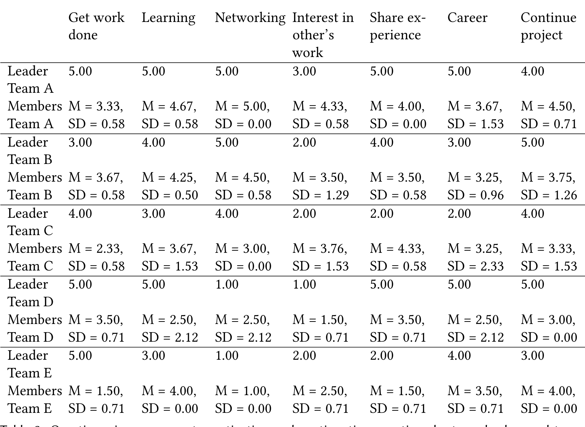

Team E SD = 0.71 SD = 0.00 SD = 0.00 SD = 0.71 SD = 0.71 SD = 0.71 SD = 0.00  
Table 3. Questionnaire responses to motivation and continuation questions by team leaders and team members. Member responses are reported as mean (M) and standard deviation (SD). All responses were given on a 5-point scale.

### 4.1.1 Team A.

The initiator and leader of this team (A01) is a marketing expert who had the idea to develop a tool to support career development ("was thinking about [...] career planning", A01). Her/his motivation to turn this idea into a hackathon project was to "broaden my depth and try new things out" (A01) and to further her/his career (c.f. 5.00 in Table 3). "Get work done" was thus a strong motivation for her/him (5.00). A01 purposefully assembled a diverse group of developers (A03, A05, A07), UX (A06) and HR (A02, A04) experts for this project. The eventual team members mainly got interested in this project because of its theme ("project that I'm interested in", A07), the opportunity to meet new people (M = 5.00, SD = 0.00, "meet new people", A06) and learn (M = 4.67, SD = 0.58, "expand my own knowledge", A02). None of the team members knew each other before participating in this hackathon project and the project was not directly related to any of their respective work tasks since the focus of aforementioned HR experts was not on internal career counseling.

The team conducted "weekly meetings before the hackathon" (A04) during which they ran through "a lot of iterations" (A03) to scope the project and develop a list of tasks. A01 also "talked to people about the project" (A01) beforehand in order to identify a suitable scope and to disseminate the project idea ("created a list of friends of [project name]", A01). Most team members also engaged in individual preparation activities before the hackathon. These were mainly related to specific technologies that the developers among the team members would use during the hackathon ("I was looking at those APIs", A03, "I was working on how I was gonna implement it", A05).