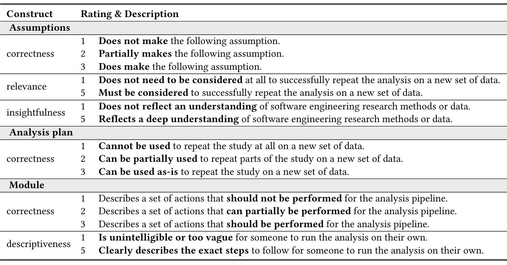

Table 3. An overview of the grading rubrics to score the GPT-4-generated assumptions, analysis plans, and code modules to replicate empirical software engineering papers. Correctness is graded on a scale of 1 to 3. Other constructs are graded on a scale of 1 to 5. The full rubrics are included in the supplemental materials [43].

assumptions and analysis plans. Finally, the instructions included space for participants to grade the assumptions and analysis plans according to the aforementioned rubrics.

During the interview, participants were presented with the instructions document and were debriefed on the task instructions. To evaluate the papers, participants read the abstract and methodology of the paper. After being provided the rubrics for the assumptions, they graded the assumptions by recording their scores in the instructions document and could refer to the methodology to reduce memory biases. Next, the participant discussed their impressions on the assumptions and on how to improve the output. The same process was repeated for the analysis plan. After the participant evaluated the first paper, the protocol was repeated for the second paper.

To keep the interview within the allotted time, data collection for that paper ended when the time limit was exceeded. Collection was resumed at the end if time allowed. This ensured two papers were evaluated while minimizing participant fatigue. To ensure all assumptions were evaluated in the user study, we shuffled the order of the assumptions for each participant.

Data. Participants rated assumptions and analysis plans on a 3-point Likert scale for correctness (i.e., not correct, partially correct, correct) with all scale points having defined criteria. For all other constructs, we use a 5-point scale, with only the extremes having defined criteria. An overview of the scoring criteria is in Table 3.

Assumptions were evaluated based on correctness, relevance (i.e., whether the assumption was necessary to consider in the replication), and insightfulness (i.e., whether the assumption reflected a deep understanding of software engineering research methodology or data).

Meanwhile, analysis plans were graded both in their entirety as well as at the individual module level. Analysis plans in their entirety were evaluated based on correctness. At the module-level, the plans were evaluated based on correctness and descriptiveness (i.e., whether the instructions provided were descriptive enough for another person to replicate the paper).

Piloting. Following best practices in human subjects experiments in software engineering [41], we piloted both the survey and interview with two software engineering researchers. This validated the