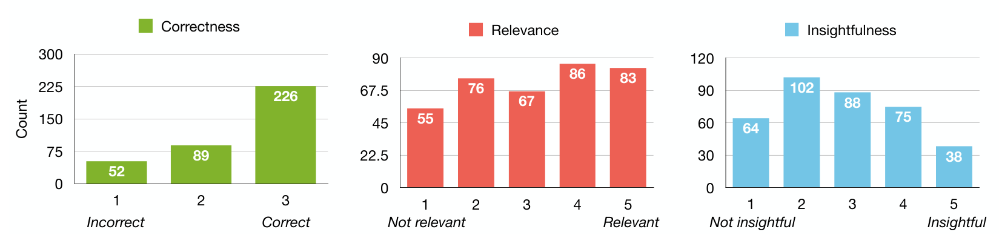

Fig. 5. The distribution of participants’ scoring of the GPT-4-generated assumptions by correctness (left), relevance (middle), and insightfulness (right) for all papers.

## 4 RESULTS

In this section, we report our results to the two research questions. Overall, we find that GPT-4 has some understanding of software engineering research methodology and data. However, we also observe that GPT-4 exhibits many limitations to their knowledge, such as lacking basic knowledge of software engineering data. We elaborate further on our findings below.

### 4.1 Can GPT-4 identify assumptions from research methodology? (RQ1)

We report our findings on participants’ ratings and impressions of the assumptions generated by GPT-4 on the seven research papers.

**Quantitative Results.** Figure 5 shows the distributions of participants’ ratings on the assumptions by correctness, relevance, and insightfulness across all the papers. Overall, we observe that participants rated the assumptions (N = 367 scores) as being high in correctness (μ = 2.5 out of 3), as 86% of assumptions were graded as partially correct or fully correct. The assumptions were also rated moderately high in terms of relevance (μ = 3.2 out of 5), as 46% of assumptions were rated as being relevant to the replication. Finally, we observe that participants rated the assumptions lowly in terms of insightfulness (μ = 2.8 out of 5), as only 31% of assumptions were rated as insightful.

**Qualitative Results.** We elicited 12 codes related to GPT-4’s capabilities and limitations for generating assumptions, where three main themes emerged: reasons for positive ratings ( ), reasons for negative ratings ( ), and ways of improving outputs ( ). We report the number of participants who mentioned this code with the multiplication symbol (×).

**Correct (13×).** A majority of participants found the assumptions to be correct, as they "seemed to match the assumptions that were swimming in my head" (P14). Additionally, "[assumptions] that weren’t [fully correct]... were usually partial correctness" (P2). As a result, some participants were surprised at GPT-4’s capability: "if an LLM generated these, I’m very impressed" (P1).

> “Some of the insights were similar to researchers reading the paper could generate.” (P6)

**Comprehensive (12×).** Many participants found the assumptions to be comprehensive by the breadth of topics covered. When asked to generate any assumptions that GPT-4 had missed, 7 participants were not able to suggest any assumptions. Even while taking notes of assumptions while reading the paper, participants still described the set of assumptions to be comprehensive:

> “Based on the notes I took, the assumptions are pretty comprehensive.” (P4)

**Insightful (8×).** Less frequently, participants also mentioned the assumptions to be insightful, as GPT-4 "[brought] up some great points about the paper and the assumptions made" (P1). Others were impressed that the assumptions were generated "not specifically mentioned in the paper" (P12).