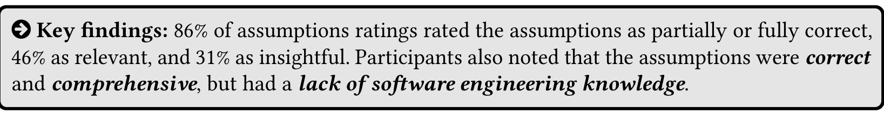

> **Reducing repetition (9×).** Participants often noted the set of assumptions were repetitive. Some participants identified word-for-word duplicated assumptions generated by GPT-4: "There's a couple weird duplicates, which I don't know if it's a data copying error or if the model actually repeated itself" (P4). Assumptions were also repetitive based on topic that "that syntactically might be slightly different, but semantically if you look at them, it's... the same." (P12)  
>  
> "Security-related labeling came up in several different forms. This is something that clued me in... it... was [LLM-generated] because that's something that LLMs tend to do." (P3)  
>  
> **Explaining how to work around assumptions (8×).** Participants noted that GPT-4 often generated text about when an assumption may not hold "that were counter to what was proposed in the paper" (P9), after presenting the main assumption. However, participants noted that no suggestions were provided on how to address the assumption if it did not hold:  
>  
> "It would be helpful if there was a suggestion to... handle that assumption." (P8)  
>  
> **Providing sources (6×).** Participants also mentioned that they would like a link to the source of the assumption, such as by "[giving] line numbers" (P13). This could explain "why these assumptions are important or have been made" (P5) or build confidence in GPT-4's responses:  
>  
> "If there's an AI, it should have a confidence interval telling me, 'I'm 99% confident this assumption is correct... or is explicitly there.'" (P11)

## 4.2 Can GPT-4 generate an analysis pipeline to replicate research methodology? (RQ2)

We report our findings on participants’ ratings and impressions of the analysis plans generated by GPT-4 on the seven research papers (Section 4.2.1). We also report the results from the manual evaluation performed by three authors on the GPT-4-generated code (Section 4.2.2).

### 4.2.1 Analysis Plan

We report our findings on participants’ ratings and impressions of the analysis plans and modules generated by GPT-4 on the seven research papers.

**Quantitative Results.** Figure 6 shows the distributions of participants’ ratings on the analysis plans by correctness, as well as individual modules by correctness and descriptiveness across all the papers. We observe that participants rated the analysis plans (N = 27 scores) as being moderate in terms of correctness (μ = 2.1 out of 3), as 89% of analysis plans were graded as partially or fully correct. Meanwhile, the individual modules (N = 87 scores) performed comparatively in terms of correctness (μ = 2.4 out of 3), with 72% of modules rated as being partially or fully correct. However, the distribution for the analysis plans is more skewed towards being partially correct compared to the distribution of the modules. Finally, we observe that participants rated the assumptions lowly in terms of descriptiveness (μ = 3.2 out of 5), as only 38% of assumptions were rated as descriptive.

**Qualitative Results.** We identified 6 codes related to GPT-4’s capabilities and limitations for generating analysis plans. Similar to the assumptions, three themes emerged from these codes: reasons for positive ratings (👍), reasons for negative ratings (👎), and ways of improving outputs (💡).

**High-level structure (11×).** Participants noted that the analysis plans were correct in their "high level steps" (P1), which was the main reason for positive correctness scores: "[The modules] broke up how I thought it would." (P3) Participants mentioned this could be a "useful [starting point] for somebody else if you want to replicate the analysis" (P10).