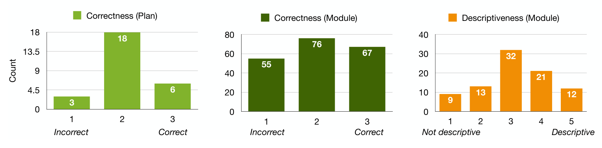

Fig. 6. The distribution of participants’ scoring of the GPT-4-generated analysis plans by correctness (left), as well as individual modules by correctness (middle) and descriptiveness (right), for all papers.

> “I thought it was able to chunk [the methodology] well into the different pieces, which were outlined in the paper.” (P13)
>
> Not descriptive (13×). Participants frequently noted that the description and methodology text corresponding to the analysis plan was not descriptive. Some participants felt the "detail was superfluous... which was a distraction to actually what's being done" (P9). Further, the descriptions were written largely for software engineering experts: "I would know what I would do in general... but I'm from the area" (P11). This is because smaller details were often not "super clear in the methodology" (P4) and were not elaborated upon: "Everything is really close to being almost exactly as I'd want it. But everything is missing, just like a little bit crisper description" (P4).
>
> “[The analysis plan] contains methodology text... but I would have wanted it to be a little bit more explicit.” (P13)
>
> Not correct (9×). Participants noted some of the analysis plans contained details that were incorrect. One participant noted incorrect module ordering: "The last step makes no sense in this order." (P11) Another participant noted that some of the modules created were useless, as they did not consider the replication context: "I would completely throw away the dataset loading [module] because I'm going to load a different dataset [for replication]." (P3) Other participants noted that the inputs of the module specification could also be incorrect:
>
> “[The module] says for the refactoring revision identification, the input is two program versions. But that's not necessarily true because we need the entire change history and then we look at a pair of revisions [and] see if there was a refactoring revision.” (P5)
>
> Providing additional context (6×). Participants noted one way to improve the analysis plan and module outputs was by providing context on related research artifacts, such as a "Git repository of the replication package" (P2) and "paper references" (P12) or context about the replication context, such as information about the "new dataset" (P3).
>
> “So [let’s say] I’m not even using GitHub. I’m using SVN. Can I tell the model I got this project and guide me to the next step in a... way that adapts to the user’s scenario?” (P6)
>
> Improving modularization (3×). A few participants said that the modularization could also be improved. In particular, participants noted that the responsibilities divided between modules were often uneven and could be divided into additional modules: "I think the Automatic Identification module is very big. I would have chunked it up into two smaller steps." (P1)
>
> “It's funny because all the work is actually in one of the modules.” (P7)
>
> Providing sources (3×). Some participants wanted a link to the source of the modules’ scope, such as through specific "reference[s] to [the] methodology section that it references" (P9).