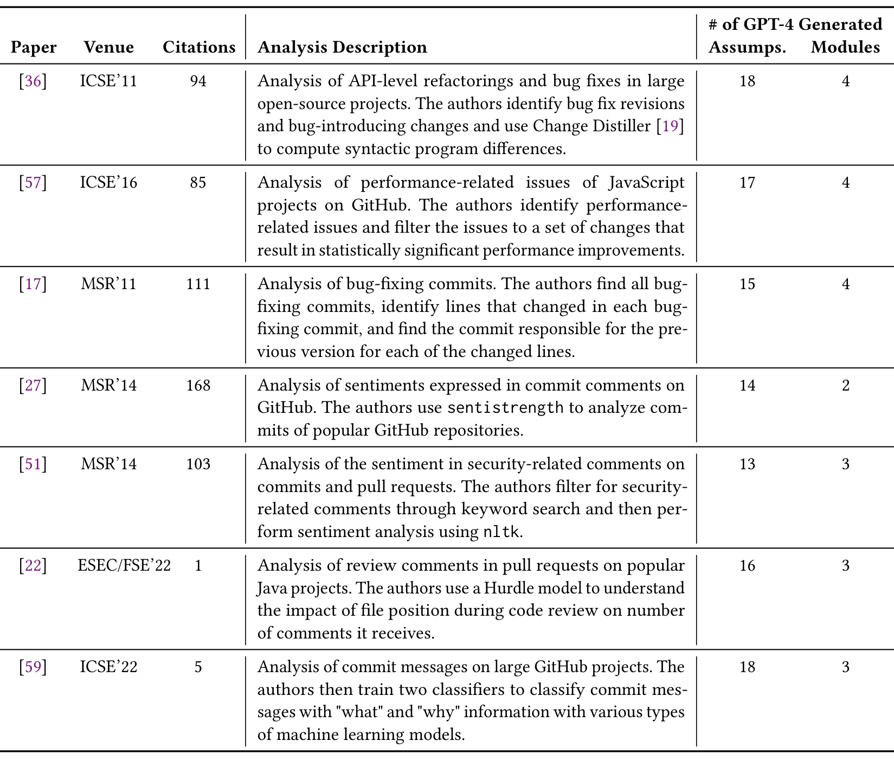

Table 1. A summary of the papers selected for GPT-4 to generate assumptions, analysis plans, and code. We report each paper’s venue, number of citations in the ACM Digital Library, and a brief description of the paper’s analysis. We also report number of assumptions and modules generated by GPT-4.

Such as A* search. In an evaluation with NLP experts, the authors found GPT-4 generated reasonable explanations of these concepts, but sometimes generated factually incorrect knowledge. Researchers also have applied LLMs for research in human–computer interaction. Wu et al. [66] replicated seminal crowdsourcing papers using LLMs, while other work found that GPT-3 could generate synthetic data for both open- [28] and closed-ended [58] questions in interviews and surveys. Lastly, Xiao et al. [67] found that GPT-3 could perform deductive qualitative coding on datasets.

Our work builds upon the literature by studying whether LLMs can analyze methodology and write code pipelines to repeat analyses, rather than returning factual knowledge or generating research data. Compared to prior work, our study specifically focuses on quantitative empirical research methods rather than qualitative ones. Finally, we extend our understanding of LLMs’ scientific knowledge by studying its performance in software engineering research.

## 3 METHODOLOGY

To answer the research questions, we selected seven empirical software engineering papers (Section 3.1). We used LLMs to automate the tasks that data scientists would perform in today’s practice.