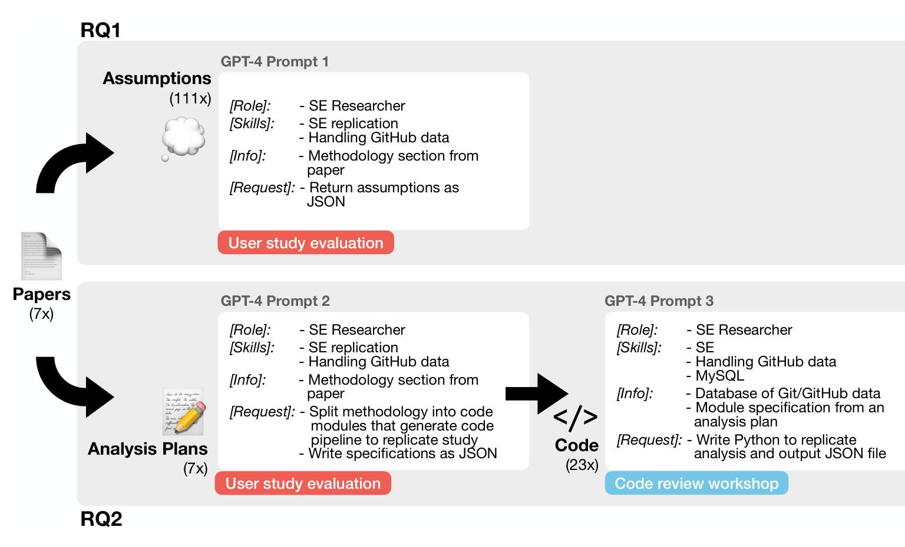

Fig. 1. An overview of the prompts used in the study. To answer RQ1, we used Prompt 1 to generate assumptions for each paper and evaluated them in a user study. To answer RQ2, we used Prompt 2 to create an analysis plan and evaluated it in a user study. We also used Prompt 3 to create the code modules of the analysis plan and evaluated it in a code review workshop. The prompts in the figure are only summaries of the actual ones; for the complete prompts, see the supplemental materials [43].

### 3.2 Prompting GPT-4

We present an overview of the prompting strategy applied to GPT-4 in Figure 1. To answer the research questions, we prompted GPT-4 to generate assumptions (RQ1). We also prompted GPT-4 to generate analysis plans (i.e., a list of module specifications) as well as code to implement the analysis plan (RQ2). We separated the analysis pipeline into two steps—analysis plans and code—to distinguish the higher-level abstraction of creating modules from the lower-level details of writing implementations. This is because code implementation is also influenced by higher levels of software design, like modules [42]; thus, studying both abstractions and implementations could reveal a more holistic understanding of GPT-4’s ability to generate analysis pipelines. We ran the outputs on GPT-4 on the OpenAI Python API in September 2023 with the default model parameters, except for temperature, which was set to 0 to have deterministic outputs.

#### 3.2.1 Prompt Design

We designed the prompt to provide the task structure in the beginning, relevant information in the middle, and instructions at the end. This structure leveraged LLMs' primacy and recency biases in input contexts [46] to emphasize the task structure and instructions.

The prompts started with one to two example input-output pairs for few-shot learning of the task and output format, following Brown et al. [10]. Next, we provided text-based instructions for GPT-4 (see Figure 1). The instructions included an explanation of GPT-4’s role as a software engineering researcher; skills it has, such as in software engineering replication or in MySQL; and additional information about the given task, such as a description of the inputs. Finally, the prompt included a request to extract, gather, order, or derive specific data, following the format provided in the example input-output pairs. The exact prompts and the generated assumptions, analysis plans, and code are available in the supplemental materials [43].