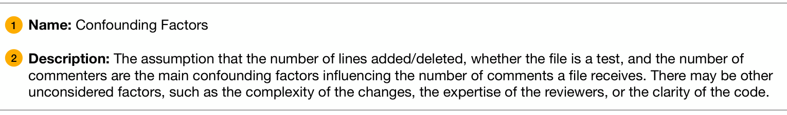
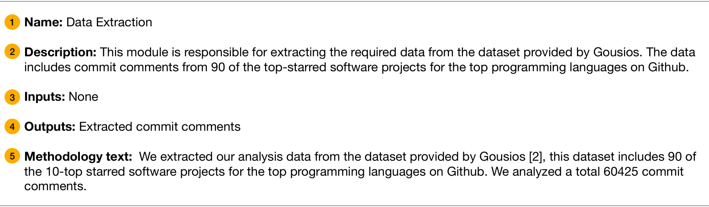

### 3.2.2 Data Output Format

Below, we further elaborate on each of the generation types. We report the number of each data type generated by GPT-4 using the multiplication symbol (×).

Fig. 2. Example GPT-4 generated assumption, given the methodology from Fregnan et al. [22]. Assumptions contain a name 1 and a description 2.

Fig. 3. Example GPT-4 generated module, given the methodology from Guzman et al. [27]. Modules contain a name 1, description 2, inputs 3, a description of outputs 4, and corresponding methodology text 5.

Assumptions (111×). The GPT-4 generated assumptions contain two pieces of information: a name and a description (see Figure 2). We prompted GPT-4 to generate assumptions that underlie the given research methodology. Next, we prompted GPT-4 to generate assumptions about applying the methodology to a different dataset.

Analysis plan (7×). Given a research paper methodology, GPT-4 generates an analysis plan that is represented as a list of code modules. It generates a code module that has a title, input (which may include one or more outputs from other modules in the analysis plan), output, description, and corresponding methodology text (see Figure 3). We prompted GPT-4 to divide the methodology text into a set of code modules and generate specifications following the above metadata.

Code (23×). Given a module specification, GPT-4 generates a piece of Python code that implements the specification (see Figure 4). We instructed GPT-4 to generate code that outputted data as a JSON object into a file, so that it may be reused by other modules by reading in the file. However, the code may also query an existing database filled with Git and GitHub data with a predefined schema; the schema is available in the supplemental materials [43]. To assist with code generation of downstream modules, we also instruct GPT-4 to return an example JSON object and a natural language description of the JSON object with the generated code. The example object and description is provided in the prompt for downstream modules in case they depend on it. This way modules that rely on earlier modules in the pipeline are able to update the input in their specifications to match this data representation.

### 3.3 User Study

We performed a user study with software engineering experts to validate the GPT-4-generated assumptions (RQ1) and analysis plans (RQ2) for each paper. The user study was reviewed and