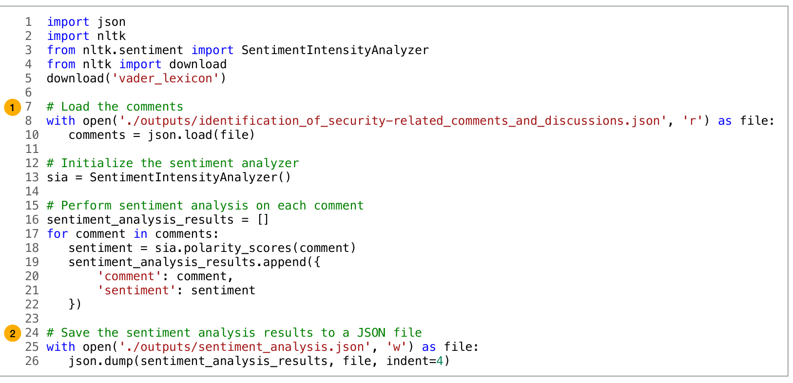

Fig. 4. Example GPT-4 generated code, given the module specification from the analysis plan for Pletea et al. [51]. Generated code reads data from JSON file or database 1, runs additional logic, then outputs the result as a JSON object 2.

approved by our institution’s Institutional Review Board. The survey and interview instruments used in the user study protocol (Section 3.3.2) are included in the supplemental material [43].

### 3.3.1 Participants.

**Recruitment.** We compiled a list of potential participants in the coauthors’ network who met the inclusion criteria. We then sent them invitations to participate in the study. Potential participants suggested other individuals who met the inclusion criteria, who were also sent study invitations. In total, 24 invitations were sent, with 14 participants participating in the user study. We note that having 14 participants allowed each paper to have three to four participants review the GPT-4 generated assumptions and analysis plans, reflecting common practices in academic peer-review. Additionally, while performing open coding on the interview data (Section 3.5), no new codes were added after 8 interviews, indicating that 14 participants was sufficient to achieve saturation.

**Demographics.** Participants (7 women, 7 men) were mostly located in the United States and Canada (N = 12), with a few participants also located in India (N = 2). Participants were experienced in software engineering–related research, with between 2 to 14 years of software engineering research experience (μ = 7.1 years) and 5 to 20 years of programming experience (μ = 8.4 years). Participants reported publishing between 0 to 50 publications in top-tier software engineering venues (μ = 8.2 publications) and serving as a reviewer 0 to 20 times at these venues (μ = 8.2 times).

Participants also reported being familiar with LLMs, with 86% of participants using these models at least on a weekly basis. Participants also reported an ability to analyze and evaluate AI applications based on a validated AI literacy instrument [63]. All participants reported being able to choose a proper solution when presented with multiple solutions from AI agents. Additionally, 93% of participants reported being able to evaluate the capabilities and limitations of AI applications after using them. Finally, 71% reported being able to select an appropriate AI for a particular task.