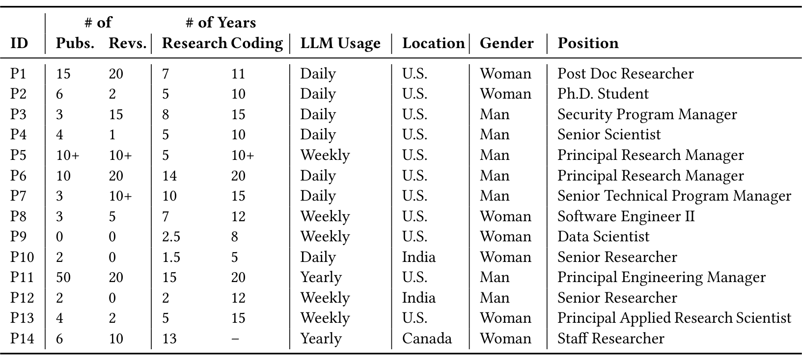

Table 2. An overview of the participants in the user study. We report each participant’s number of publications in top-tier software engineering venues, number of times served as a reviewer in software engineering venues, and years of experience doing software engineering research as well as programming. We also report the frequency of large language model usage, location, gender, and job position.

### 3.3.2 Protocol

The user study consisted of a survey to gather participants’ background information and an interview to collect participants’ evaluations of the GPT-4-generated assumptions and analysis plans. Participants were compensated with a $50 gift card.

Survey. We designed a 10-minute Microsoft Forms survey to collect participants’ demographics, programming background, research background, and familiarity with AI. Example topics included: years of experience in software engineering research and programming, the number of software engineering venues participants had reviewed for, and how often they used LLMs.

We collected information about participants’ gender following best practices from the HCI Guidelines for Gender Equity and Inclusivity [56]. To collect information on participants’ AI literacy, we used the validated instrument from Wang et al. [63]. Since participants would evaluate GPT-4 outputs in the interview, we used questions related to the instrument’s evaluation construct to understand the degree to which they could evaluate the strengths and weaknesses of AI models.

Interview. The first author conducted semi-structured interviews with participants. Participants assessed the GPT-4-generated assumptions and analysis plans for two research papers. The interview was 60 minutes long: 10 minutes for consent and instructions and 25 minutes for each paper. For each paper, the participant spent 5 minutes on reading the paper abstract and methodology, 10 minutes on assumptions, and 10 minutes on analysis plans.

To reduce participant fatigue, the interview did not include an evaluation of the generated code; instead, the authors performed a manual analysis (see Section 3.4). Interviews were recorded and transcribed. Recordings were deleted after transcription. Also, the papers were paired by length so the interview would stay under the allotted time.

Participants were provided with a document containing instructions with all relevant materials for them to complete the study. In the document, participants were instructed to act as a software engineering research consultant applying the assigned research papers’ methodology to company data. Their task was to evaluate outputs from an LLM tool that would assist them in the replication. Next, the instructions included grading rubrics to standardize the evaluation of the generated