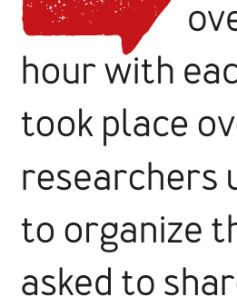

perspectives about whether code generated by use of an AI model should be capable of copyright protection. (Readers should note that this section summarizes the comments in Copilot Discussion forum posts and that users did not use precise terms. Also note that this summary presents a synopsis of the posts as they were observed and does not represent any personal opinions of the authors or official stance of the authors’ employers. Finally, note that while we have endeavored to summarize the comments to our best ability, we are not legal professionals and this summary is not intended to serve as a legal review of these topics.)

## HOW ARE FIRST-TIME USERS ENGAGING WITH COPILOT?

Findings from the forum analysis inspired several questions about Copilot use in practice. Thus, to better understand how developers engage with this tool in situ, we conducted an in-depth case study with five professional Python developers, strategically selected as external industry developers who had not

## Study Protocol

The Copilot case study took place over two days. The team spent an hour with each participant. Each interview took place over Microsoft Teams. The researchers used a PowerPoint presentation to organize the study, and participants were asked to share their screens as they engaged with Copilot.

Each interview consisted of the following steps:

### Task 1: Small Demonstration of Copilot

Participants were asked to launch Copilot via a preconfigured Codespace linked to a GitHub repository. From there participants were asked to complete a basic function that accepts an integer and returns whether that integer is a prime number. As discoverability was not part of the study, descriptions and guidance were provided, pointing out features of Copilot as they presented themselves.