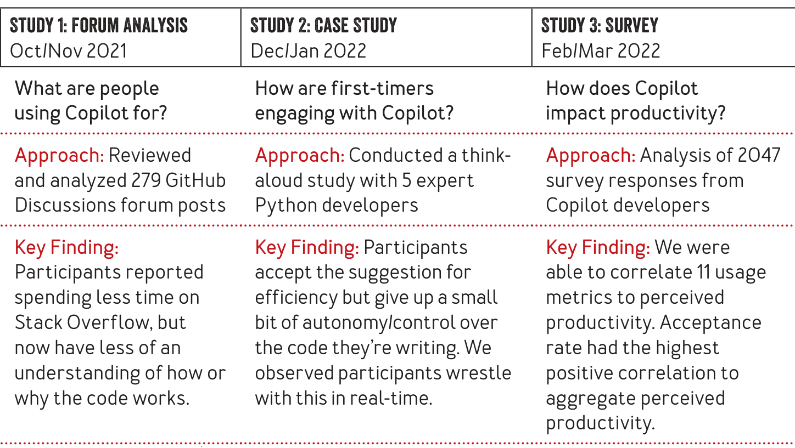

### TABLE 1: Summary of studies included in this paper

> accuracy, what you are going to type next.  
> The important difference here is that Copilot uses Codex, a language model trained on source code instead of text (e.g., emails, text messages, websites, or documents). This source code came from a large portion of the public code on GitHub, the largest repository of source code in existence.
>
> According to OpenAI, the team that built Codex, the model has been trained on more than 159 GB of Python code alone, in addition to code from many other languages. As such, it’s quite common for code that a developer is writing to be similar to some combination of pieces of code that Copilot has seen before (during model training). Copilot recognizes these similarities and offers suggestions based on the similar pieces of code on which it was trained. Copilot, however, doesn’t make suggestions to developers by making copies of code that it has seen previously. Rather, Copilot