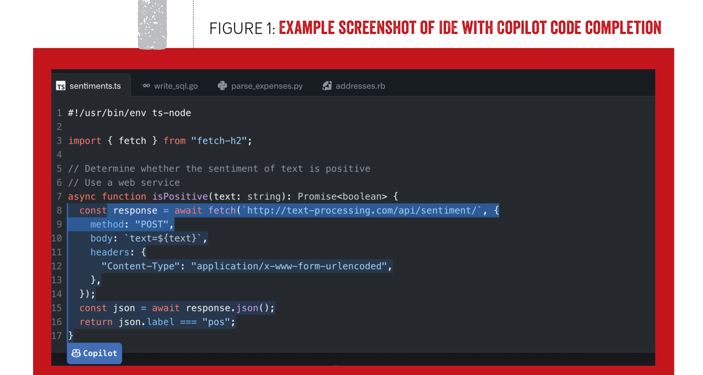

generates new suggestions by synthesizing what it has observed in billions of lines of code during model training (and that may not even exist in any code base). While Copilot leverages this very large model, more than a high-quality code-suggestion engine is required to help developers be more productive. Copilot has been incorporated into multiple IDEs in a way that makes code suggestions timely and seamless. As you write code, requests are continuously sent to Copilot's AI model, which is optimized to analyze the code, identify useful suggestions, and send them back in fractions of a second so that they can be offered to developers in their IDEs when needed, as shown in figure 1. The experience developers encounter is similar to the existing autocompletion that has been in modern IDEs.

> FIGURE 1: EXAMPLE SCREENSHOT OF IDE WITH COPILOT CODE COMPLETION