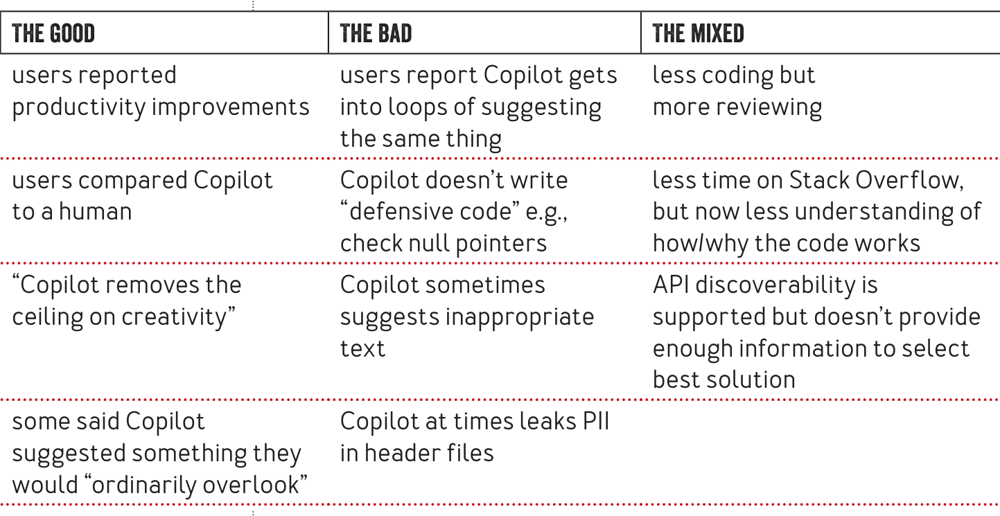

### TABLE 2: Early experiences with Copilot

could pose license compliance issues based on inclusion of code suggestions). The rationale for these opinions varied: Some believed that open-source licenses applicable to code used to train Copilot somehow applied; others pointed to copyright law; and still others posited a "moral basis" for giving back to open-source developers.

There were also discussions about how copyright applied to Copilot’s code suggestions. Some users questioned whether code suggested by Copilot would be protected by copyright, and if so, who might assert the copyright—GitHub, a developer using Copilot on a project, or even owners of code used to train Copilot (in cases where Copilot’s suggestions matched the code used to train Copilot). The discussions revealed that many developers may be unfamiliar with global copyright laws. Similarly, the discussions revealed that developers have differing