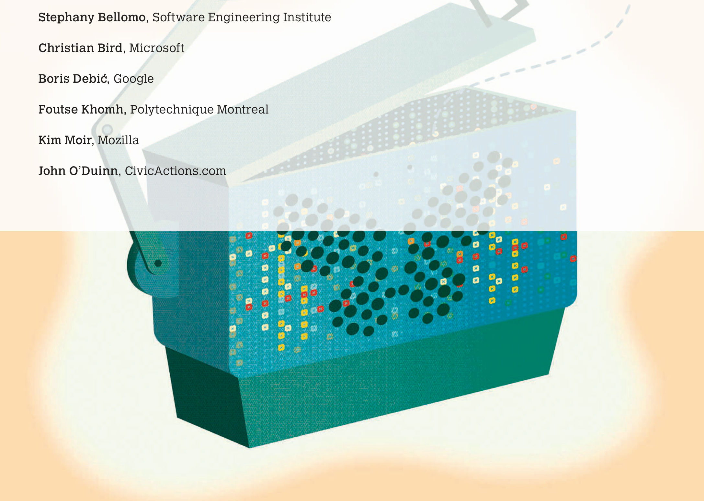
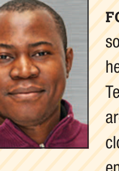
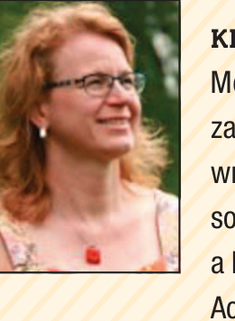
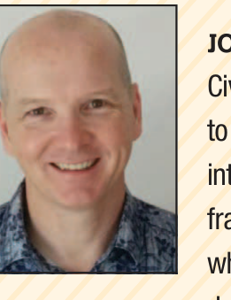
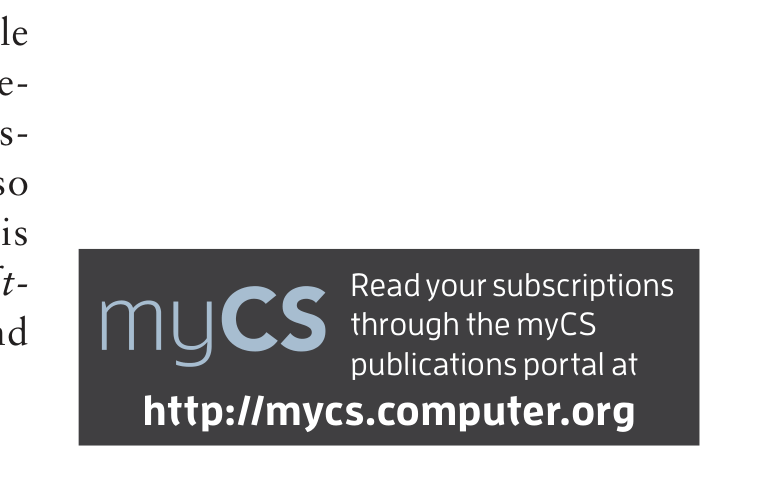

## Release Engineering 3.0

- Bram Adams, Polytechnique Montreal
- Stephany Bellomo, Software Engineering Institute
- Christian Bird, Microsoft
- Boris Debić, Google
- Foutse Khomh, Polytechnique Montreal
- Kim Moir, Mozilla
- John O’Duinn, CivicActions.com

> **Image description:** A large, stylized teal‑green toolbox or machine dominates the lower half of the page with its hinged lid partly open; the front panel is perforated with many dark circular holes and populated by small colored square markers (yellow, red, and green) that suggest many discrete components. A dashed flight path leads from the box to a small orange butterfly in the upper right, visually linking the toolbox to a release or departure. The upper left of the image is overlaid by the guest editors’ names (for example, Stephany Bellomo, Christian Bird, Boris Debić, Foutse Khomh, Kim Moir, and John O’Duinn), indicating this illustration accompanies the Release Engineering 3.0 introduction and acts as a metaphor for toolchains, componentized systems, and delivery to users.

---

WE’RE HAPPY TO introduce you to the Release Engineering 3.0 theme issue of IEEE Software. It builds on the successful RELENG workshop series (releng.polymtl.ca) and the March/April 2015 IEEE Software issue on Release Engineering. So, what’s all this fuzz about release engineering, and what about the “3.0” moniker?

## Release Engineering 3.0

Release engineering is the discipline of code integration, build, test execution, deployment, and delivery of high-quality software releases to users. First, the code contributions developed independently by an organization’s developers must be integrated into a coherent whole. Then, the source code, libraries, and any other resources of the integrated components must be transformed (“built”) into a working set of executables to enable testing and (if all is well) deployment into the production environment, such as a cloud, an app store, or some download server. Finally, the deployed product can be released at the right time to the right set of users. In other words, release engineering forms the vital link between software’s design and development phases and the finished product’s use and maintenance.

Releasing complex software systems on time with the right quality requires considerable process and technical changes.1 This is especially true when you aim to perform continuous delivery (or even deployment), in which a software product should be shippable (or shipped) after each valid code change, automatically. For example, continuous-integration builds and tests must be scaled up for increasing volumes of code changes, infrastructure requirements such as virtual machines or library dependencies must be codified using infrastructure-as-code programming languages, and operators should be able to roll back to a safe earlier release at the click of a button. Furthermore, the release-engineering team needs to provide a feedback loop to the development team to flag architectural or design issues that inhibit achieving rapid, robust deployment. For example, for canary deployment or release, two versions of the system must be live at the same moment, which requires compatibility of APIs and database schemas.

Even though the practices of continuous delivery and deployment have become part of developers’ vocabulary over the last eight years, the scope and nature of the process and technical changes we mentioned before have been costly to discover, often by trial and error. Even at this point, large software companies such as Google, Facebook, and Netflix, who were at the forefront of modern release-engineering practices, have a long list of open challenges and issues—for example, regarding the long-term viability and deficiencies of practices such as A/B testing or dark launching, or regarding dependency management in their ecosystems of autonomously updated microservices. Furthermore, new deployment platforms such as mobile-app stores still provide major challenges in terms of managing releases without having full control.

This brings us to the “3.0” moniker. Release Engineering 1.0 and 2.0 refer, respectively, to traditional ad hoc release engineering and today’s highly automated release engineering for general-purpose cloud and mobile systems. In contrast, Release Engineering 3.0 targets the future iteration of release-engineering processes aimed at supporting small companies, start-ups, civic organizations, government administrations, and safety-critical industries. For example, the software in cars, hospital equipment, or election software needs updates to deliver critical bug fixes and new functionality. However, without proper precautions, innocent lives could be at stake. Similarly, how should we go about continuously delivering software in new domains such as the Internet of Things or swarm robotics, without endangering people?

Ideally, small companies, start-ups, civic organizations, government administrations, and safety-critical industries (healthcare, the automotive industry, and so on) should be able to select and adopt a release-engineering process and tool chain that fit their needs. Yet, such an “out-of-the-box” process and tool chain are far from a reality, and so are textbooks or experience reports with empirically validated best practices for release engineering. Although many blogs and papers and some books discuss release engineering for large cloud applications and (to some extent) mobile apps, no thorough treatment exists of today’s challenges and solutions for release engineering of the “other 80 percent” of software systems.

### In This Issue

This theme issue aims to get the ball rolling on Release Engineering 3.0 and stimulate both industry practitioners and researchers to reflect on what such release-engineering practices and tools could look like and how they could evolve out of

---

## FOCUS: GUEST EDITORS’ INTRODUCTION

> **Image description:** A cropped color head-and-shoulders photograph of an adult man wearing rectangular eyeglasses and a gray hoodie, looking directly at the camera with a neutral expression. He has short light-brown hair, light facial stubble, and a fair complexion. The portrait is enclosed in a thin dark rectangular frame on a magazine page; the surrounding margin shows a pale diagonal striped background consistent with the issue’s editorial layout. The image appears among the guest-editor biographical photos in the introduction section of the paper.

BRAM ADAMS is an associate professor at Polytechnique Montreal, where he heads the Lab on Maintenance, Construction, and Intelligence of Software. His research interests include release engineering in general, as well as software integration, software build systems, and infrastructure as code. Adams obtained his PhD in computer science engineering from Ghent University. He is a steering-committee member of the International Workshop on Release Engineering (RELENG) and coedited the first IEEE Software issue on Release Engineering. Contact him at bram.adams@polymtl.ca.

> **Image description:** A close-up, head-and-shoulders photograph cropped on the right showing a dark-skinned man with short hair and a slight smile, wearing a maroon zip-up sweater. The subject is set against a neutral light-gray background and is contained within a thin dark border; to the right the magazine’s beige diagonal-striped bio panel and article text are visible. The image functions as an author/guest-editor portrait accompanying the Release Engineering 3.0 introduction in the issue.

FOUTSE KHOMH is an associate professor at Polytechnique Montreal, where he leads the Software Analytics and Technology Lab. His research interests are software maintenance and evolution, cloud engineering, service-centric software engineering, empirical software engineering, and software analytics. Khomh received a PhD in software engineering from the University of Montreal. He is a steering-committee member of RELENG and co-edited the first IEEE Software issue on Release Engineering. Contact him at foutse.khomh@polymtl.ca.

> **Image description:** A color, head-and-shoulders studio-style portrait of a smiling person with light brown hair pulled back and blue-green eyes. The subject wears small stud earrings and a light-gray top; the photo is tightly cropped on the right side and framed by a thin dark border. The inset portrait sits on a pale beige page background with subtle diagonal cream stripes, indicating it accompanies a biographical sidebar in the issue’s guest-editors section.

STEPHANY BELLOMO is a member of the technical staff at Carnegie Mellon University’s Software Engineering Institute. She focuses on empirical research for improving software delivery and working with US Department of Defense and government practitioners on software-related challenges. Bellomo received an MS in software engineering from George Mason University. She is a steering-committee member of RELENG and coedited the first IEEE Software issue on Release Engineering. Contact her at sbellomo@sei.cmu.edu.

> **Image description:** A cropped portrait photograph shows a smiling woman with shoulder-length light hair and eyeglasses, wearing small dangling earrings and a square red pendant on a short chain over a floral top. The image is inset with a thin dark border against the page’s beige diagonal-striped background and appears among the guest-editors’ portraits in the issue’s introductory pages.

KIM MOIR is a staff release engineer at Mozilla. Her interests lie in build optimization, scaling large infrastructure, and writing about the complexities of open source release engineering. Kim received a bachelor of business administration from Acadia University. She is a steering-committee member of RELENG and co-edited the first IEEE Software issue on Release Engineering. Contact her at kmoir@mozilla.com; kimmoir.blog.

> **Image description:** Close-up color headshot of a smiling adult male cropped at the shoulders; he has short dark hair, light skin, and an open smile showing teeth. The photograph shows a brick wall behind the subject, is enclosed in a thin dark-blue rectangular frame, and is set on a pale beige page with diagonal stripes. The image appears to be a formal portrait used alongside the guest-editors’ introductions in the issue.

CHRISTIAN BIRD is a researcher at Microsoft Research. He has studied many aspects of release engineering, most recently code movement and social dynamics in build teams. Bird received a PhD in computer science from the University of California, Davis. He is a steering-committee member of RELENG and coedited the first IEEE Software issue on Release Engineering. Contact him at cbird@microsoft.com.

> **Image description:** Small, framed color headshot showing a smiling, bald adult man wearing a patterned, collared shirt against a light, neutral background. The photo is cropped to show shoulders and head, set inside a thin dark border, and appears on the page alongside other guest-editor biography portraits in the issue’s introduction. The image is positioned next to a column of biographical text and aligned with diagonal, pale-striped page styling visible at the page edge.

JOHN O’DUINN is a senior strategist at CivicActions.com and an advisor and a mentor to geodistributed organizations. His research interests include how release engineering reframes the business of software development while at the same time improving the lives of developers and the wider public depending on these systems. O’Duinn received an MSc in computer science from Dublin City University. He’s a steering-committee member of RELENG. Contact him at john@oduinn.com.

> **Image description:** A close-up, head-and-shoulders studio-style portrait used on the guest-editors’ biography page. The image shows an adult with short light-brown hair and light stubble, facing the camera with a neutral expression and wearing a maroon sweater; the background is a light, slightly textured wall. The photo is printed with a thin black rectangular border and set against the issue’s pale yellow diagonal-striped page background, matching the other author headshots on the same page.

BORIS DEBIĆ is a Google engineer. With support from NASA’s Ames Research Center, he also directs the Mars Society’s NorCal Rover project. His research interests are release engineering, machine learning (classification), and privacy. Debić received an MSc in physics from the University of Zagreb. He’s a steering-committee member of RELENG. Contact him at releng@debic.net.

---

more-advanced forms of Release Engineering 2.0. With these goals in mind, after at least three experts from both academia and industry rigorously reviewed each submission, IEEE Software accepted the following four.

In “Continuous Experimentation: Challenges, Implementation Techniques, and Current Research,” Gerald Schermann and his colleagues review the state of the art of, and issues with, using the release-engineering pipeline for quick, data-driven experiments of new product features or tweaks. Such experiments target user subsets with a new release for a limited time, to obtain actual usage feedback (in production) that can help with decisions about future releases. Continuous experiments will likely be an essential component of Release Engineering 3.0.

In “Correct, Efficient, and Tailored: The Future of Build Systems,” Guillaume Maudoux and Kim Mens examine build systems, a critical ingredient of release-engineering pipelines. They survey various improvements made by different build system technologies and identify features and optimization mechanisms build systems could implement to make themselves suitable for Release Engineering 3.0, thereby improving the new pipeline’s efficiency and correctness.

In “Continuous Delivery: Building Trust in a Large-Scale, Complex Government Organization,” Rodrigo Siqueira and his colleagues discuss organizational and technical challenges related to the introduction of continuous-delivery practices in government administrations, which typically aren’t accustomed to release-engineering practices. The authors report their experience working with a government institution used to waterfall-like processes, and provide advice on how to implement continuous delivery. This article is one example of the application of Release Engineering 3.0 in a civic setting.

Finally, in “Over-the-Air Updates for Robotic Swarms,” Vivek Varadharajan and his colleagues consider another new domain for Release Engineering 3.0: robotic swarms. Such swarms are essential for supporting humanitarian missions in rough circumstances, where robots or drones must autonomously explore and interact with a disaster scene without global network connectivity, under time pressure. The authors outline the challenges of performing over-the-air software updates in this context and present an initial gossip-based approach that spreads updates in peer-to-peer fashion.

As is clear from the previous summaries, each article highlights a different facet of what Release Engineering 3.0 could look like, with two articles focusing on fundamental technologies and practices and two articles discussing new application domains. Of course, many unexamined facets remain; thus, we see this special issue as an initial milestone toward defining and elaborating Release Engineering 3.0.

Finally, we thank all the people who did a great job writing or reviewing the high-quality submissions for this theme issue. We also thank Editor in Chief Diomidis Spinellis and his IEEE Software crew for their guidance and support.

Happy reading!

### Reference
1. J. Humble and D. Farley, Continuous Delivery: Reliable Software Releases through Build, Test, and Deployment Automation, 1st ed., Addison-Wesley, 2010.

> **Image description:** A rectangular dark-gray banner promoting the myCS publications portal. At left is the myCS logo in pale blue and white, and to the right is the line "Read your subscriptions through the myCS publications portal at" in white text. The bottom of the banner prominently displays the portal URL in large bold white text: "http://mycs.computer.org."

> Read your subscriptions through the myCS publications portal at http://mycs.computer.org