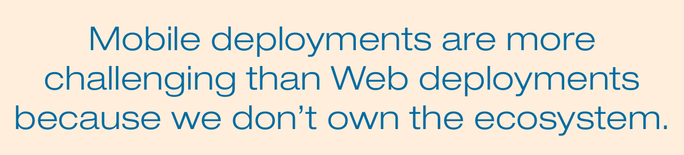

Moir: At Mozilla, release engineers don't monitor the quality of the release; we have a team called Release Management to perform that function. We use a "train model" for managing releases. When developers have a new feature, they'll land it on a certain branch and make sure the test suites run green. If so, the change set will be uplifted to another branch to ensure that the patch integrates with other changes on that branch and tests run green. Eventually, the new feature reaches the Aurora branch, which is an alpha branch, where it will sit for six weeks to bake; then it goes to the beta branch. Finally, six weeks later it goes to the release branch. This is one way of ensuring stability.

We limit the number of people who get a release. On a given release day, we might let 5 percent of the population running the desktop version of our browser get the new release. We have automatic crash reporting in the browser that reports to databases here.

Concerning rollback, we don't really roll releases back. If there were a serious problem, like a huge number of crashes on a certain release, we would block it so that no updates would occur and then do a point release. For example, if there were a security issue causing problems, we would do a point release so that users wouldn't get the last release and would be automatically updated to the newer release with the security fix. We call this a "zero-day fix."

Amid all the hype and buzz about continuous delivery, what's currently possible, and what are the limitations? How far should you go with continuous delivery?

Rossi: I've never worked in a true continuous-deployment environment. We have a pseudo-continuous deployment here—it's twice a day. Size is the limiting factor. All the continuous-deployment places I've

Continuous deployment obviously shines in the Web area, where you own the ecosystem. You can publish effortlessly to your Web fleet, and your users get the fixes and features instantly without noticing it. In minutes or hours, you will know whether something is wrong with the release.

As I understand continuous delivery, it will not happen on mobile in the near future. The current app distribution system is based on an ancient model that's not even as good as shrink-wrapped software. In this model, you build an artifact, you put it out to a third party that has total control over when and how it gets out, then the end users constitute a completely disparate map of if, when, and how it gets updated. And there is no way for you to influence that ecosystem.

So, you need user interaction for every single update, and that's insane. Why should I have to take time out of every day for the rest of my life to push a button and have my phone update its apps? But that's the model that we've had with iOS. iOS 7 has an easy way to turn on automatic app updates. Then you're not seeing that double-digit red number on your App Store icon every day. Unfortunately, though, this feature is not on by default. Android will put up roadblocks even if you have auto-update turned on. Of course, the owners of the platforms have valid reasons for trying to maintain this control, such as preventing malicious apps from auto-installing.

Our company, which has both good infrastructure and complex apps, can do automatic updates. In fact, any mobile developer could provide users the infrastructure to use their own channels to update apps.

How many crashes occurred? Are certain operating systems, platforms, or add-ons having problems? We'll analyze answers to those questions to determine whether we can roll the release out to the rest of the population. Other metrics come from users who give us feedback during the beta, support requests on our support website, sentiment analysis on Twitter, and the top 10 crashes across our continuous integration every week.

places I've visited had engineering teams of 20 to 50, even 100 people, pushing to a website with a number of users at best in the double-digit millions per day. The same processes don't scale above a few hundred developers working on a common code base or to a website that has either more complexity or users into the hundreds of millions. It doesn't scale at our company's size. Continuous deployment works for small teams, with 20 to 30 changes per day.

44 IEEE SOFTWARE | WWW.COMPUTER.ORG/SOFTWARE | @IEEESOFTWARE