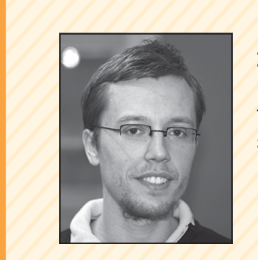
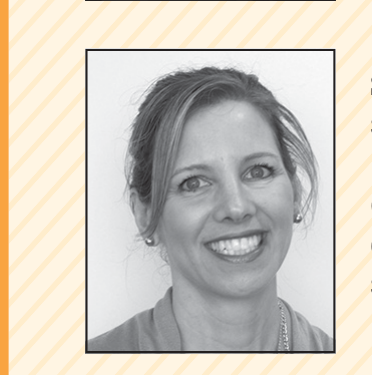
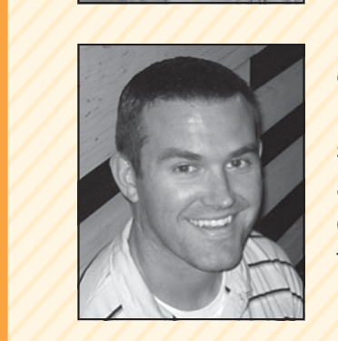
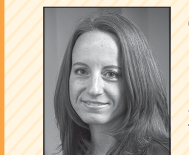
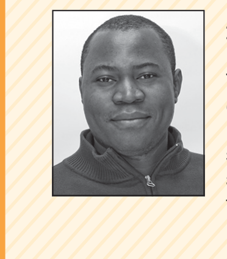
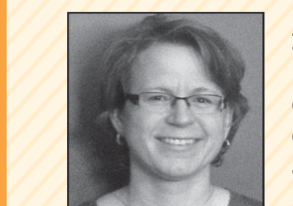

on Linux and Chrome, whereas
“Rapid Releases and Patch Backouts:
A Software Analytics Approach,” by
Rodrigo Souza and his colleagues,
examines how the release process
changed when Mozilla transitioned
to rapid releases. Finally, Jonathan
Bell and his colleagues propose ap-
proaches to speed up testing of Java
projects in “Vroom: Faster Build Pro-
cesses for Java.” We hope these ar-
ticles convey an idea about the state
of the practice and the challenges of
release engineering today.

## ABOUT THE AUTHORS

BRAM ADAMS is an assistant professor at Polytechnique Montréal, where he heads the Lab on Maintenance, Construction, and Intelligence of Software. His research interests include software release engineering in general, as well as software integration and software build systems in particular. Adams received a PhD in computer science engineering from Ghent University. Contact him at bram.adams@polymtl.ca.

STEPHANY BELLOMO is a senior member of the technical staff at the Carnegie Mellon University Software Engineering Institute. Her research interests include incremental software development, the architectural implications of DevOps, and continuous integration and delivery. Bellomo received an MS in software engineering from George Mason University. Contact her at sbellomo@sei.cmu.edu.

CHRISTIAN BIRD is a researcher at Microsoft Research in Redmond, Washington. His main research interest is empirical software engineering, predominantly examining collaboration and coordination in large software teams in both industrial and open source contexts. Bird received a PhD in computer science from the University of California at Davis under advisor Prem Devanbu. Contact him at christian.bird@microsoft.com.

TAMARA MARSHALL-KEIM is a senior editor at the Carnegie Mellon University Software Engineering Institute. Her research interests are applied linguistics, theory of rhetoric, and computer studies in language and literature. Marshall-Keim received an MA in English from the University of Florida. Contact her at tmarshall@sei.cmu.edu.

FOUTSE KHOMH is an assistant professor at Polytechnique Montréal, where he leads the SWAT (Software Analytics and Technologies Lab) team on software analytics and cloud-engineering research. His research interests include software maintenance and evolution, cloud engineering, service-centric software engineering, empirical software engineering, and software analytics. Khomh received a PhD in computer science from the University of Montreal. Contact him at foutse.khomh@polymtl.ca.

KIM MOIR is a release engineer at Mozilla. Her research interests are build optimization, scaling large infrastructure, and optimizing build and release pipelines. Moir received a Bachelor of Business Administration from Acadia University. Contact her at kmoir@mozilla.com.