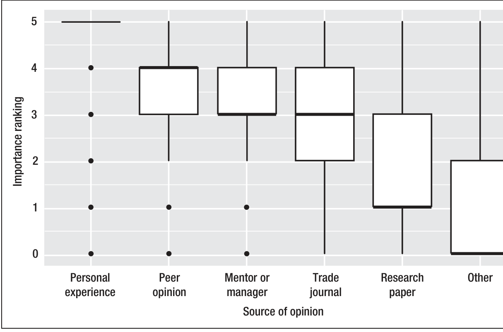

FIGURE 1. The survey respondents ranked the importance of their opinions’ sources, quoted from our full paper.2 We found no significant differences in these results across the demographic categories.

opinions were related to the observable phenomena in their projects.

### The Opinion’s Source

As we mentioned before, the developers chose the primary sources related to each proposition and ranked them. So, for each question–developer pair, we had a set of ranks, of cardinality 6, with values from 0 (lowest) to 5 (highest).

Figure 1 illustrates the results. Personal Experience ranked highest, then Peer Opinion, Mentor or Manager, Trade Journals, Research Papers, and Other. We found no significant differences in these results across the demographic categories.

These results weren’t that surprising; earlier research in social science has found much the same thing: opinion influence preferentially flows along stronger social ties.4 But think on that a minute. Really? We, as empirical software engineering researchers, found this profoundly distressing. Our life’s work, embodied in research papers, counted so little toward forming the

opinions of professional practitioners at one of the world’s leading software companies?

Look at it another way. Suppose a doctor recommended some powerful opioid for a minor (but annoying) digestive problem. Then, when asked what the research was on the drug’s effectiveness, he said, “Ah, I don’t know about research! It just works well in my personal experience; trust me.” That wouldn’t be very reassuring.

However, these days, medicine offers an inspiring model. Evidence-based medicine (EBM) is relatively new,5 dating back to as recently as the early 1990s. Since then, EBM has caused a revolution in medical practice. Closer to home, Barbara Kitchenham and others have been advocating for evidence-based software engineering since 2004.6 Perhaps we will soon catch up to medicine.

### The Relationship between Opinions and Evidence

For this investigation, we chose a highly controversial proposition: Geographically distributed teams produce code whose quality (defect occurrence) is just as good as that of teams that are not geographically distributed.

We looked at two projects, which we’ll call A and B. In the survey responses, developers working on A largely and strongly disagreed with this proposition, whereas developers working on B largely and strongly agreed with it. Surprisingly, both projects were widely distributed. Both had approximately 8,000 developers distributed across 100 buildings, and the repositories for both projects received commits from multiple buildings, campuses, and countries.

To quantify that distribution, we considered the percentage of files in each project that received at least 75 percent of their commits from one geographic area: building, city, region (for example, time zone), and country. The higher this percentage, the less distributed the development was. In project A, the percentages were 56 for building, 90 for city, 91 for region, and 92 for country. For B, the corresponding percentages were 76 for building, 80 for city, 83 for region, and 85 for country. Thus, B was slightly more distributed.

We then gathered defect data from both projects, based on the number of defect repairs in each file. We also gathered data per file on confounding predictive factors known to affect software quality, such as size, ownership, committer count, and commit count. Finally, we included a binary variable for each file’s distribution, at each distribution level (building, city, and so on), indicating whether at least 75 percent of the commits to a file rolled up to that distribution level. After much careful modeling,2 we found that the data supported some interesting interpretations.