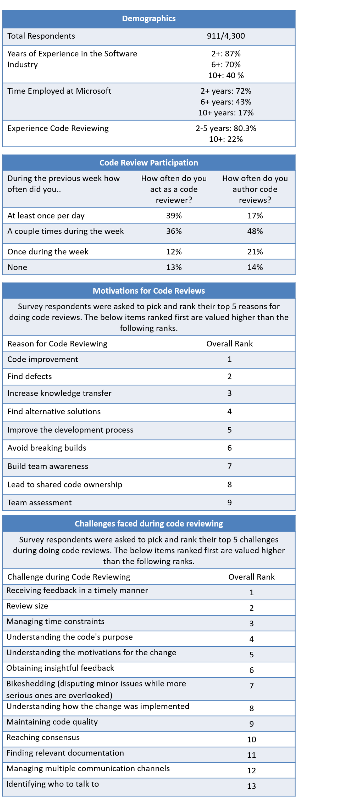

- Check-in of the code change to the target system (in some teams, this happens before review).

These steps are performed by all teams, but the order can vary slightly depending on a team’s policies, culture, and tools. A vast majority of engineers use an internal code review tool called CodeFlow [1]. This tool also supports and guides engineers through the reviewing steps. The most typical review cycle starts with the preparation of the code change by the code author. The author then selects the reviewer(s) (with some tool support) and the tool sends automatic notifications to selected reviewers. The reviewers then give feedback on the code change and a feedback notification is sent to the author. The author can then react on the received feedback and may iterate over the change. At some point, the author and the reviewer will be satisfied with the change and the change can be checked into the code base, or it will be rejected. Most communication between author and reviewer occurs through the code review tool, but other communication channels, such as face-to-face discussions, whiteboard sessions, video and voice chats, and IM, are used for contentious issue (i.e., issues that might reflect badly on someone) or to ensure a fast response. Almost all teams require a review before code can be checked in — a few teams allow exceptions, especially for trivial changes.

Microsoft engineers perform code reviews to improve code, find defects, transfer knowledge, explore alternative solutions, improve the development process, avoid build breaks, increase team awareness, share code ownership, and to assess the team (see Figure 1).

## 3. CODE REVIEWING CHALLENGES

Our interviewees and survey respondents reported a number of challenges (see bottom half of Fig. 1) which we discuss from two perspectives: the author of code to be reviewed, and the reviewer providing feedback. Organizational challenges are discussed in Section 5 as they mainly concern trade-offs that must be made. Some of those challenges are also reported by other researchers [6, 7, 8, 9] as discussed in our companion report.

### Challenges faced by code change authors

Authors of code changes discussed how it’s hard getting feedback in a timely manner. The survey respondents listed this as their top code reviewing challenge.

> “Usually you write up some code and then you send it out for review, and then about a day later you ping them to remind them... and then about half a day later you go to their office and knock on their door.” (Participant 7)

Another challenge concerned obtaining insightful feedback on code. Five interviewees mentioned that reviewers sometimes focus on insignificant details rather than looking for larger issues.

> “There is a lot of style [comments] a lot of the time, which I find annoying. And people will be like, ‘Maybe you should use this name?’” (Participant 7)

Participants mentioned that it’s difficult finding appropriate or willing reviewers. And interviewees said that knowing who to ask is challenging as well.

Figure 1: Overview of selected responses from the code review survey.