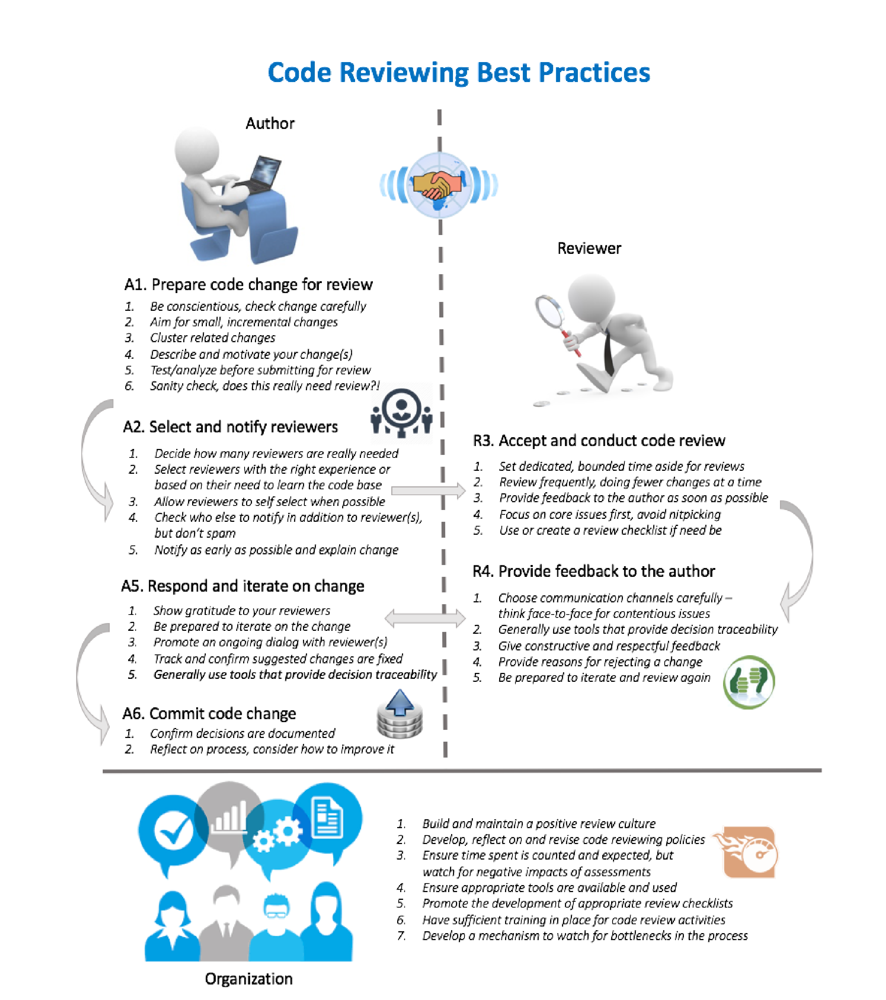

## Code Reviewing Best Practices

### Author

#### A1. Prepare code change for review
1. Be conscientious, check change carefully  
2. Aim for small, incremental changes  
3. Cluster related changes  
4. Describe and motivate your change(s)  
5. Test/analyze before submitting for review  
6. Sanity check, does this really need review?!

#### A2. Select and notify reviewers
1. Decide how many reviewers are really needed  
2. Select reviewers with the right experience or based on their need to learn the code base  
3. Allow reviewers to self select when possible  
4. Check who else to notify in addition to reviewer(s), but don't spam  
5. Notify as early as possible and explain change

#### A5. Respond and iterate on change
1. Show gratitude to your reviewers  
2. Be prepared to iterate on the change  
3. Promote an ongoing dialog with reviewer(s)  
4. Track and confirm suggested changes are fixed  
5. Generally use tools that provide decision traceability

#### A6. Commit code change
1. Confirm decisions are documented  
2. Reflect on process, consider how to improve it

### Reviewer

#### R3. Accept and conduct code review
1. Set dedicated, bounded time aside for reviews  
2. Review frequently, doing fewer changes at a time  
3. Provide feedback to the author as soon as possible  
4. Focus on core issues first, avoid nitpicking  
5. Use or create a review checklist if need be

#### R4. Provide feedback to the author
1. Choose communication channels carefully — think face-to-face for contentious issues  
2. Generally use tools that provide decision traceability  
3. Give constructive and respectful feedback  
4. Provide reasons for rejecting a change  
5. Be prepared to iterate and review again

### Organization
1. Build and maintain a positive review culture  
2. Develop, reflect on and revise code reviewing policies  
3. Ensure time spent is counted and expected, but watch for negative impacts of assessments  
4. Ensure appropriate tools are available and used  
5. Promote the development of appropriate review checklists  
6. Have sufficient training in place for code review activities  
7. Develop a mechanism to watch for bottlenecks in the process

Figure 2: An overview of the best practices we suggest for authors of code changes, reviewers of changes, and organizations. The diagram also shows the main steps of the code review life cycle.