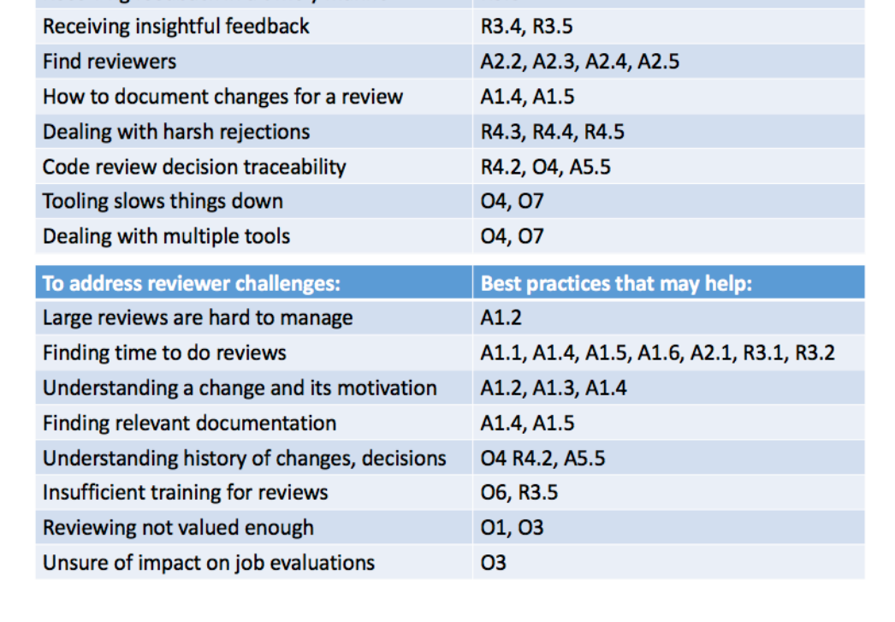

may be ways to improve their process and how they interact with their reviewers.

## Best practices for code reviewers

There are several best practices for reviewers to consider to help address the challenges they experience, but also to address author challenges. Although reviewers find it hard to find time to conduct their reviews, they should set dedicated but bounded time aside for reviewing, taking enough time to carefully understand the code of each review. Our participants also suggested that it is important to review frequently but review fewer changes at a time.

To help authors, it is important to provide feedback as soon as possible so that the authors will remember their change. It is also important to focus on core issues first, not wasting time on small problems at the expense of the design or logic problems. We further suggest to create and use a review checklist that is customized for the project's particular context.

While giving feedback on a review, reviewers should choose communication channels carefully. Richer channels, such as face-to-face or voice, are preferred for contentious issues or for discussing complex code changes. For non-contentious or sensitive issues, tools that provide traceability are preferred. It is also an important reviewing skill to know how to give constructive and respectful feedback while also clearly justifying and explaining the reasons for rejecting a change.

## Best practices for organizations to consider

Whether a product team or company, how an organization sets the stage for reviewing activities and how it supports and values code reviewing is critical to the success of code reviews. We share the following quote from a participant to motivate the importance of best practices for organizations:

> “My team is currently pretty good with reviews,
> but we do not review our process or talk about
> the policies much at all. This means new people
> have to learn it the hard way and probably means
> there is a lack of consistency. This is a problem
> in our team dynamic that I don’t think a tool
> can fix. On my team, this type of discussion falls
> into hygiene and I have to say, we are like street
> people.” (Survey response to Q#34 - Entry 11)

To maximize the value of code reviews, an organization should consider establishing a code review policy. Such a policy should help in building a positive review culture that sets the tone for constructive review feedback and discussion.

The organization should also consider how to ensure time spent reviewing is “counted” and “expected” and is seen as an important part of the development life cycle. But the organization or team should watch for negative impacts of employee assessment or incentives that may be linked to code reviewing activities. While rewarding engineers who spend considerable effort reviewing others’ code is encouraged, penalizing engineers who do not (often with a good reason) may lead to gaming of the system.

It is also important to ensure that appropriate tools are used and that they match the desired reviewing culture and defined process (if there is one). Tools may support certain steps in the process, such as finding and notifying reviewers, automating feedback, running style checkers, and testing. Reviewing tools should be lightweight and integrate well with other developer tools, especially with informal communication channels. Distributed teams may have additional tool needs. New tools for supporting code-reviewing activities are emerging all the time and an organization may wish to stay abreast of these developments.

Figure 3: Mapping suggested best practices to the reported code reviewing challenges.

To address challenges concerning knowing the expected process or how to use desired tools, an organization can ensure there is sufficient training in place. Informal training through mentorship may be all that is required. Finally, an organization should encourage all stakeholders to develop, reflect on, and revise code reviewing policies and checklists. Organizations should continuously measure the impact of the policies and tools used on their overall output (speed of development, development efficiency, product quality, employee satisfaction); any discovered bottlenecks should be resolved, e.g., a policy can help reduce notification overload or define which reviews can be skipped.

## 5. TRADEOFFS TO CONSIDER WHEN APPLYING BEST PRACTICES

The practices we suggest for authors, reviewers, and organizations may help address the challenges that emerged from our study. In Fig. 3, we suggest which of the best practices may help address particular challenges. For example, authors that take time to carefully consider which code changes really need a review (see best practice A1.6 in Fig. 2) may save the reviewers’ time. However, we acknowledge that not all of the practices may be applicable across all development or project contexts and that some of these practices may conflict with one another. Development teams face unique resource, time, and scope constraints that influence the choice of workflow and practices used. We discuss some of the inevitable trade-offs here.

When faced with time constraints, it may be necessary to trade off speed of the review over rigor. For a blocking change, a code review should be done quickly to avoid impacting other developers’ work, but only if the change does not impact a critical or consistently buggy part of the