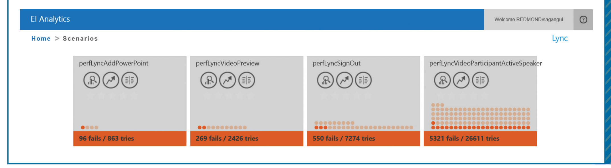

FIGURE 1. A sample of high-level view results for four scenarios in Lync. In each cell, the color reflects the overall prognosis (gray is untested; red and green show performance levels). The fails summary provides the number of attempts that didn’t succeed; the other buttons lead to various visualizations and detailed reports on the scenario.

might begin when the user clicks a UI element and conclude when a particular I/O request completes. The team specifies the scenario and the names of its constituent events and adds this scenario to a large scenario table stored on a server. A performance-monitoring subsystem on the client periodically checks for any changes to the scenario table, records the timestamps of these events, and transmits them to the performance database server within Microsoft. Because the act of transmitting collected data can affect performance, the development team provides rules for when and how often the data should be transmitted.

Additional information about the usage context that could help testers is also collected, such as:
- build numbers and versions,
- machine architecture (x86, x64, ARM),
- main and video memory available,
- network protocols, and
- connections to the server’s geographic region.

Although we primarily gathered data from employees within Microsoft, privacy is still an important concern—that is, although some companies don’t treat their employees’ work activities as private within the company, Microsoft does. We collect identifying data that we believe could affect performance such as geographical region, but we don’t transmit or record any personally identifiable information such as username or content of messages to our database.

For Lync, we have defined approximately 350 scenarios over the course of development. More than 48,000 users have participated in the dogfood program, and have thus used at least one such prerelease version of Lync.

### Visualization and Analytics

The Lync development team can explore the data results through a reporting website, EI Analytics. The application lets users examine high-level scenario performance results and, when desired, explore the data at a finer granularity in more detail.

Figure 1 depicts a snippet of Lync’s entry page, which contains a high-level view of three scenarios’ statuses (the full page contains many more scenarios). Each scenario is depicted by an informational box showing its name, how its performance compares to expected levels, and the frequency of success. Figure 2 shows how EI Analytics presents performance data for one service scenario.

The histogram is generated from the timings (or durations) for all users running that scenario. This particular case identifies three distinct user experience groups, represented by three Gaussian curves. The Gaussians are generated by decomposing the durations’ probability distribution functions. The dotted line shows the Gaussians’ actual fitted linear combination. The rightmost Gaussian denotes the worst user experience group in terms of performance and warrants engineer attention.

EI Analytics also lets users compare datasets for differences between conditions. Users can select different filters from a menu. For example, a developer might be concerned that the 64-bit version of an application is behaving differently than the 32-bit version. In Figure 3, one scenario is split across uses in these two versions of the Lync client. The left side of the figure shows event timing distributions on top of each other, and the right side displays a more compact view of the data in boxplot form. The target specification value for the scenario is depicted with a bold vertical black line.

One of our goals with this project is to monitor performance over time during development. Typically, builds go through a rhythm—features are added,