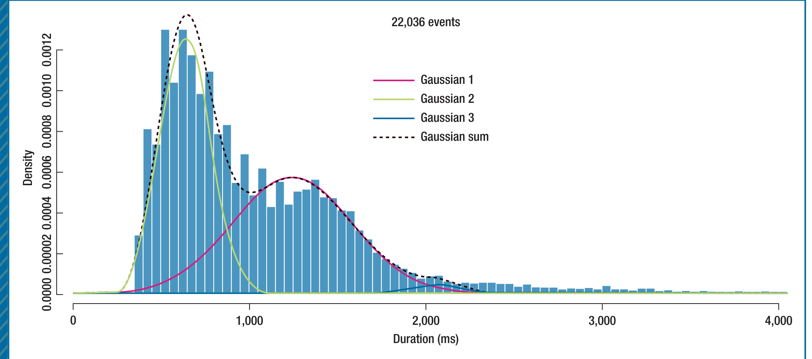
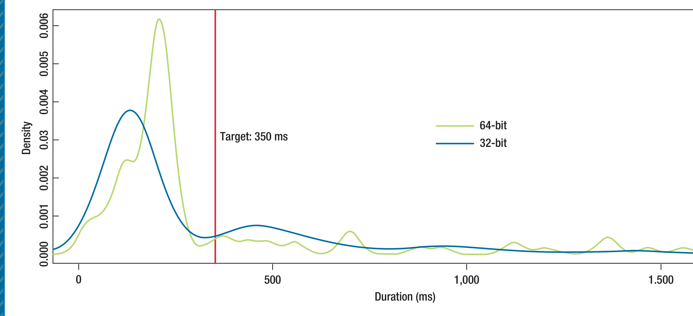

FIGURE 2. A histogram of the durations for a single scenario for a given build. The durations are fit to the sum of Gaussians, which each represent a different user experience.

FIGURE 3. Empirical distributions for a scenario for a given build drawn from users using 32-bit (blue) and 64-bit (green) versions of Lync. The black line indicates the target specification. More compact boxplots of the data are shown on the right.

and then developers focus on performance. We therefore provide a time trend analysis for each scenario, depicting a variable-width notched boxplot showing the performance distribution for a scenario for each build along a calendar timeline. Figure 4 shows one such build-over-build comparison.

The Lync team is also interested in international performance. User experience quality can be affected by distance from servers, local network conditions, and international firewalls and barriers. The world performance map (see Figure 5) indicates