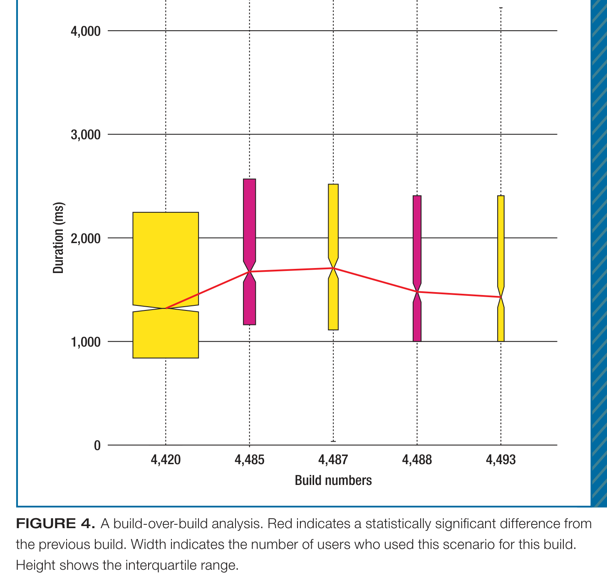
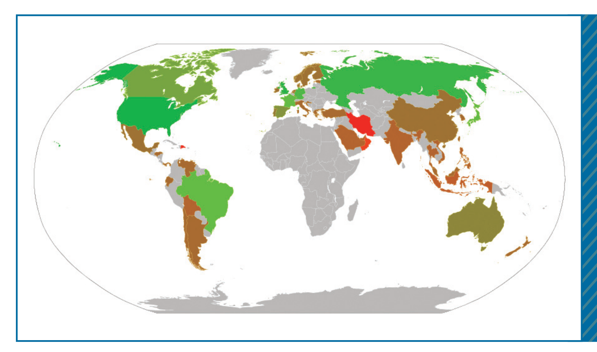

whether performance is suffering internationally and supports decisions about investments in network and server infrastructure.

## Impact

These techniques are only of value if their use positively impacts software development. Ultimately, this impact would result in improved customer satisfaction, but we’re too early in release to see results on that outcome. Nonetheless, we do have evidence that EI Analytics is having a positive impact on the development process and decision making.

## Organizational Change and Adoption

The availability of EI Analytics data is driving an organizational change within the Lync team. Historically, the team reserved performance testing for late in the deployment process because it was difficult to get performance data in an easily consumable fashion for the entire development process. Thus, most of the focus on performance occurred in the final weeks before release. This is changing as a result of our techniques.

We’re using a phased approach as we roll out EI Analytics to the Lync development team. In the initial phase, which is where we are right now, it’s being used in Lync “ship room,” a weekly meeting the project managers use to make decisions about shipping dates and feature cuts. Scenario performance provides an indication of whether a given feature needs additional work, should be considered for removal, or is ready to ship.

Some teams have begun to incorporate EI Analytics into their regular use outside ship room meetings. We’re working on the next phase of roll out, which will comprise incorporating the approach’s use in feature lead developers’ daily routines. By continuously monitoring performance during development, teams can catch issues before they reach the ship room.

FIGURE 4. A build-over-build analysis. Red indicates a statistically significant difference from the previous build. Width indicates the number of users who used this scenario for this build. Height shows the interquartile range.

FIGURE 5. An example (not real, for confidentiality reasons) of a world performance map for a single scenario and build. This map indicates how the global user population experiences the application.