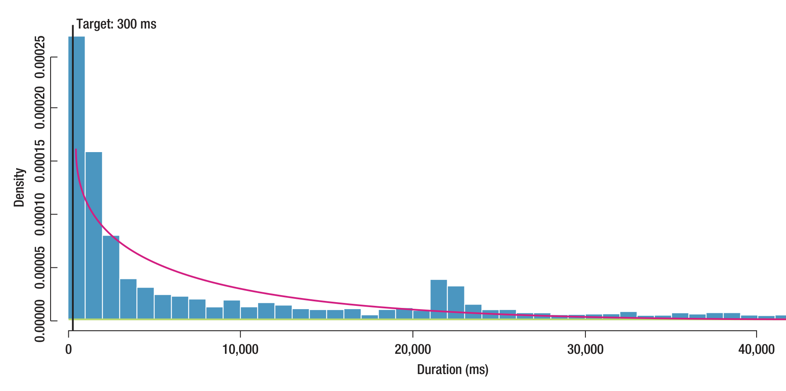

FIGURE 6. A histogram of durations for a scenario for a given build. Note the peak around 21,000 milliseconds, which alerted testers to an IPv6 timeout defect that didn’t manifest in standard testing.

### Detected Performance Issues

To demonstrate the way that EI Analytics has improved performance evaluation, we share two performance defects that it uncovered that would not have been identified using prior, conventional methods. These defects are representative of many issues that our approach has found.

#### Three ways to go.
Soon after deploying our system and examining the data being returned by it, we saw anomalies in one broadly used scenario. We found that this scenario was being invoked in three different ways. Much to our surprise, the scenario’s performance closely correlated with how it was invoked—one method of invocation took more than 10 times longer than the others, which led to further investigation and more fine-grained data gathering. The method of invocation that took the longest was a result of passive use of the scenario, so users and testers didn’t explicitly notice it. We were unaware of the impact on performance because it had gone unnoticed until we began using EI Analytics.

#### IPv6
Figure 6 depicts data for a frequent scenario from an early build of Lync. Although the desired time was around 300 milliseconds, a second peak was visible around 21,000 milliseconds. Although members of the ship room recognized that the behavior was aberrant, they couldn’t immediately determine the cause. However, domain experts who were familiar with recent system changes were able to quickly determine that this was being caused by timeouts in the IPv6 stack. Performance results from the test lab on the same build of the application didn’t show such a problem: the test machines that used IPv6 weren’t running the code that triggered the timeouts.

After developers deployed a fix, the data showed that the next build still had the bump, albeit smaller, around 21,000 milliseconds. Although performance had improved for many users, some were still encountering the issue. Neither the initial problem, nor the fact that the fix didn’t completely resolve it, would have been determined without EI Analytics.

This experience also taught us that although our approach is strong at showing if there are problems and which scenarios they relate to, these are simply signposts rather than ways to identify the cause of the problem. That task still requires domain expertise. The value of our approach is that it maximizes the effectiveness of experts’ time by pointing them to issues quickly.

These successes with the Lync team have encouraged three other network-based products and services to adopt our tool and monitoring technique.

Currently, testers determine specification thresholds. Ideally, we would