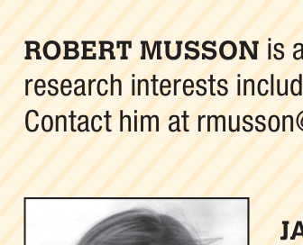
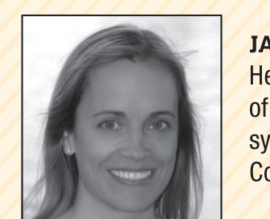
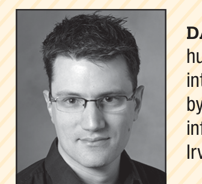
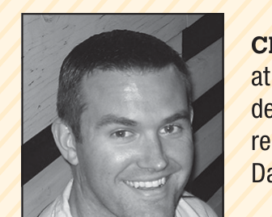

Our technique currently displays the results of the analysis to project stakeholders, but it doesn’t analyze the data to provide recommendations. Because the data can be sliced in many ways, it would be useful to have analysis that automatically looks for problems. For example, one analysis might look through the data to see if there are specific geographical regions experiencing poor performance and alert a team member who could then use fine-grained data to investigate possible causes.

Our technique has been used with beta testers, but we plan to continue using it after release. Lync users will be able to opt in to the data collection program, at which point we can collect timing data to track performance and identify problems as they occur after release. We plan to continue improving performance monitoring and analysis as we strive for data-driven decision making in development.

### References

1. A. Avritzer and E. Weyuker, “The Automatic Generation of Load Test Suites and the Assessment of the Resulting Software,” IEEE Trans. Software Eng., vol. 21, no. 9, 1995, pp. 705–716.  
2. G. Kiczales et al., “Aspect-Oriented Programming,” Proc. European Conf. Object Oriented Programming (ECOOP 97), Springer, 1997, pp. 327–353.

> Selected CS articles and columns are also available for free at http://ComputingNow.computer.org.

## ABOUT THE AUTHORS

**Robert Musson** is a principal data scientist on the Lync/Skype team at Microsoft. His research interests include process data and trends to improve the quality of the Lync product. Contact him at rmusson@microsoft.com.

**Jacqueline Richards** is a program manager lead at Microsoft. Her research interests include increasing the engineering capabilities of teams by delivering shared, Microsoft-wide engineering services and systems. Richards received a BA from the University of South Florida. Contact her at jacqrich@microsoft.com.

**Danyel Fisher** is a researcher in information visualization and human-computer interaction at Microsoft Research. His research interests include ways to help people work together around big data by providing easy-to-use data visualizations. Fisher received a PhD in information and computer science from the University of California, Irvine. Contact him at danyelf@microsoft.com.

**Christian Bird** is a researcher in empirical software engineering at Microsoft Research. His research interests include how large teams develop software, both in industrial and open source contexts. Bird received a PhD in computer science from the University of California, Davis. Contact him at cbird@microsoft.com.

**Brian Bussone** is a principal development lead on the Services Engineering Team at Microsoft. His research interests include providing insights from data. Bussone received a BS in electrical engineering from Michigan Technological University. Contact him at bbussone@microsoft.com.

**Sandipan Ganguly** is a senior data scientist at Microsoft. His research interests include developing machine learning algorithms using MapReduce for big data environments. Ganguly received a PhD in industrial engineering from Arizona State University. Contact him at sagangul@microsoft.com.