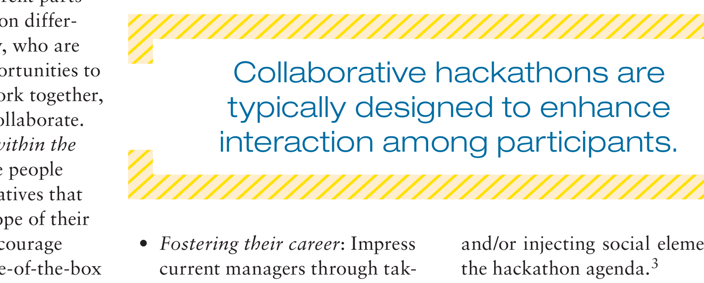

set out by both organizers and participants. The organizers need to be aware that their goals for hackathons may, and often will, be different from those of participants. Failure to consider a possible divergence in goals may result in not being able to recruit or to leverage the fullest potential of participants and may detract from participant satisfaction and outcome quality.

Some of the common goals for corporate hackathon organizers include the following:

- Enrich intracompany networks and reduce stovepiping: Motivate and provide an opportunity for people from different parts of the company and on different levels of seniority, who are unlikely to have opportunities to communicate and work together, to form teams and collaborate.
- Change the culture within the company: Encourage people to contribute to initiatives that are outside of the scope of their regular work and encourage creativity and outside-of-the-box thinking.
- Workforce development: Encourage participants to explore new roles like product or project managers and expand their technical skill set by facilitating a self-driven and collaborative learning environment.
- External image: Show potential future employees that the company is innovative and open to change.

In comparison with organizers’ goals, participants might have similar as well as different goals in mind:

- Having fun: Escape the constraints of company product plans and preset development processes and allow participants to work at their own pace on things they care about.
- Learning: Learn new technologies and tools, more about their current projects, and other skills such as collaboration, leadership, and project management.
- Winning prizes: Achieve monetary or other prizes such as recognition by leadership and/or their peers.
- Expanding personal networks: Grow individual professional networks within the company beyond the boundaries of their everyday work.

### Fostering Competition

One key choice has to do with incentives structured either to favor competing or cooperating. People generally take part voluntarily in hackathons, but various design features and incentives can shape their participation in either a competitive or cooperative direction. Collaborative hackathons are typically designed to enhance interaction among participants, thereby establishing or deepening connections that can foster longer-term collaboration post-hackathon.7 This can be achieved by facilitating interteam interactions with shared or interdependent goals.

> Collaborative hackathons are typically designed to enhance interaction among participants.

- Fostering their career: Impress current managers through taking on new roles during the hackathon or draw other departments’ attention to a participant’s skills.
- Getting the needed work done: Take advantage of this opportunity to pursue a project that is a high priority to an individual or team but a low priority to managers allocating resources.

## Design Choices

In this section, we elaborate on a set of core design choices that can be used to shape the design of hackathons for particular purposes and describe key design tradeoffs. Table 1 summarizes the design choices and supportive goals in the context of a corporate hackathon.

and/or injecting social elements into the hackathon agenda.3

One common approach used in collaborative-style hackathons is having “unconference” sessions13 during which participants give short technical briefings or pitch project ideas. Afterward, participants can be encouraged to wander around the room, discuss with the owner of an idea that they are interested in, and offer suggestions. This situation increases the chance of participants meeting new people and generating cross-pollination among ideas. Another approach is team fluidity where participants switch between teams at specified intervals, which allows members to meet others and exchange information about their projects.10 However, our interview data suggest that this approach might lead to