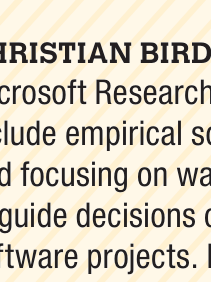
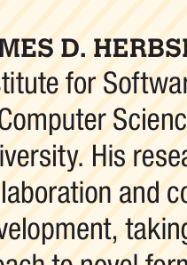

### Eipa Pae-Than

Eipa Pae-Than is a postdoctoral researcher at the Institute for Software Research in the School of Computer Science at Carnegie Mellon University. Her research interests include understanding how technology can shape new forms of collaboration that foster engagement, creativity and innovation, productivity, and outcome quality, using both qualitative and quantitative research methods. Pe-Than received a Ph.D. in information science from the Nanyang Technological University in Singapore. Contact her at eipapapt@cs.cmu.edu.

### Christian Bird

Christian Bird is a researcher at Microsoft Research. His research interests include empirical software engineering and ways to use data to guide decisions of stakeholders in large software projects. Bird received a Ph.D. in computer science from the University of California, Davis. Contact him at Christian.Bird@microsoft.com.

### Alexander Nolte

Alexander Nolte is a lecturer at the Institute of Computer Science at the University of Tartu and an adjunct assistant professor at the Institute for Software Research at Carnegie Mellon University. His research interests include understanding how individuals collaborate and supporting them by designing and evaluating sociotechnical approaches that spark creativity, foster innovation, and improve collaboration. Nolte received a Ph.D. in information systems from the University of Duisburg-Essen in Germany. Contact him at alexander.nolte@ut.ee.

### Steve Scallen

Steve Scallen is a principal design researcher at Microsoft Garage. His research interests include the development of tools and resources for hackathons, hackers, hack teams, and hack projects. Scallen received a Ph.D. from the University of Minnesota. Contact him at sscallen@microsoft.com.

### Anna Filippova

Anna Filippova is a data scientist at GitHub. Her research interests include fields of communications, organizational behavior, social psychology, and information systems, using both qualitative and quantitative methods. Filippova received a Ph.D. in communication and new media from the National University of Singapore. Contact her at annafil@gmail.com.

### James D. Herbsleb

James D. Herbsleb is a professor at the Institute for Software Research in the School of Computer Science at Carnegie Mellon University. His research interests include collaboration and coordination in software development, taking a sociotechnical approach to novel forms of organizing such as globally distributed development, open source communities and ecosystems, and hackathons. He led the Bell Labs Collaboratory Project at Bell Laboratories, Lucent Technologies. Herbsleb received a Ph.D. in psychology and a J.D. in law from the University of Nebraska. Contact him at jim.herbsleb@gmail.com.