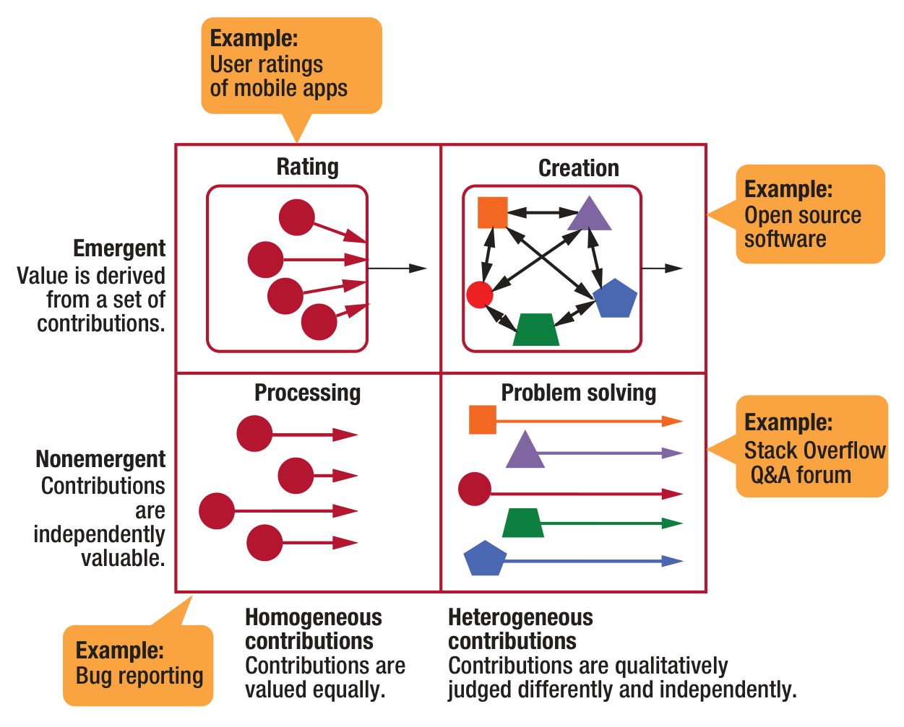
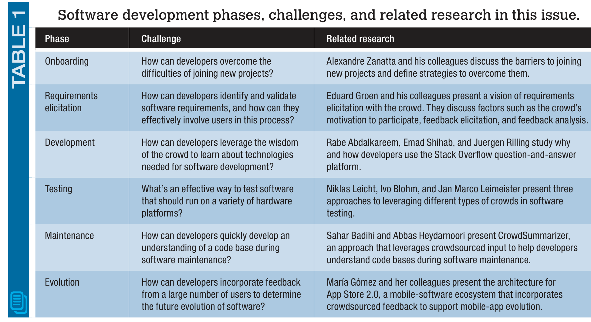

## Crowdsourcing for Software Engineering

Klaas-Jan Stol, Lero—the Irish Software Research Centre

Thomas D. LaToza, George Mason University

Christian Bird, Microsoft Research

### THE NATURE OF

The nature of work is changing dramatically through trends such as the commodification of expertise and democratization of participation.1 For example, professional stock photographers used to be able to charge hundreds of dollars for a picture.2 Today, sites such as www.istockphoto.com offer professional-quality images for as low as one dollar. Any amateur photographer can offer images through this platform.

Another example is Foldit, a game in which thousands of players work to solve puzzles; the aggregated output helps solve protein-folding problems.3 Using results from Foldit, researchers solved in just 10 days a complex problem that had stumped them for 15 years. These are just two instances of work being crowdsourced, disrupting existing business models and work practices. Tapping into the “wisdom of crowds”4 has become common, offering numerous opportunities to benefit software engineering practice. Today, companies can use a range of crowdsourcing platforms to have software developed or tested.5 A recent survey by Ke Mao and his colleagues reported the many ways in which developers can use crowds throughout the development life cycle.6 (Mao also

30 IEEE SOFTWARE | PUBLISHED BY THE IEEE COMPUTER SOCIETY

0740-7459/17/$33.00 © 2017 IEEE

---

FIGURE 1. A taxonomy of crowdsourcing tasks.14 Two dimensions (emergent–nonemergent and homogeneous–heterogeneous) lead to four types of tasks: rating, processing, creation, and problem solving.

Value results from the combination of contributions; nonemergent value is derived from the individual contributions themselves. The second dimension is whether contributions are homogeneous or heterogeneous.

The two dimensions lead to four types of crowdsourcing tasks. The first type is rating, which is when the crowd is asked to offer a judgment. An example is user ratings of apps in mobile-app stores such as Google Play. A single rating offers little value, but a large group of ratings can give considerable insight.14

The second type of task is processing; contributions represent actions the crowd can perform. An example of this is bug reporting. Although bugs vary in complexity, each bug report is basically the same in that it provides new insight on a software

product and thus adds value on its own. Labeling images on Mechanical Turk also falls in this category.

The third type of task is creation, which relies on a set of heterogeneous contributions that together generate something of value. An example of this is open source software. Contributions are heterogeneous because each contribution differs in nature, size, and complexity. The value is generated through combining all contributions; the result is an open source software system.

The fourth type of task is problem solving, which yields heterogeneous contributions, each of which is judged in its own regard and useful on its own. This category represents difficult tasks requiring significant creativity. The Netflix Prize contest falls in this category.

Some crowdsourcing platforms feature all four types. One such example is Topcoder, the largest crowdsourcing platform for software development, with over one million members. Creation happens when a customer crowdsources a complete solution through a large number of crowdsourcing competitions. Rating happens when participants evaluate the submissions. An example of processing is Topcoder’s bug hunt competitions, which pay participants for each new bug they find. Finally, Topcoder’s design challenges represent problem solving.

These differences in crowdsourcing approaches affect the size of the crowd that’s involved. Rating tasks involve many individuals; the result is an aggregation of the individual contributions (for example, a mobile app’s average score). Creation tasks’ outputs are also meant to be combined into a single outcome. Problem-solving tasks might involve many individuals or teams, but typically only one solution is selected. Consequently, only the winning team receives a reward, as was the case with the Netflix Prize. Thomas LaToza and his colleagues suggested a hybrid approach, proposing recombinations of intermediate results in software design tasks so that crowd members can “borrow from the crowd.”15

Other dimensions are important in shaping crowdsourcing platforms.1 Such dimensions include the locus of control in soliciting contributions, the nature of incentives offered to contributors, and the amount of context required for someone to contribute.

### Reasons for Using Crowdsourcing

Companies can use crowdsourcing approaches to address various needs.1,6 First, crowdsourcing can

---

## Software development phases, challenges, and related research in this issue.

be considered an alternative to outsourcing, similar to open-sourcing and inner-sourcing.6,16 Companies simply might not have sufficient internal resources or expertise to get a certain job done and thus might seek help from the crowd. Or, companies might want early releases of their software evaluated on a range of heterogeneous systems.17

A second reason for crowdsourcing is to reduce the time to market by splitting a large task into smaller tasks that an equal number of workers perform in parallel. A third reason is to generate a range of solutions—effectively drawing on ideas from a range of people. A fourth reason is to employ specific experts to find the best solution to a given problem.

### In This Issue

We received 18 submissions for this theme issue. On the basis of a thorough review process, we selected six articles that demonstrate how software development can benefit from crowdsourcing as either a source of knowledge needed to develop new software or a source for ideas and feedback on existing software. Interestingly, each chosen article deals with a different development phase (see Table 1). Furthermore, the authors are from research groups across the globe, including North America, South America, Europe, and the Middle East.

In “Barriers Faced by Newcomers to Software-Crowdsourcing Projects,” Alexandre Zanatta and his colleagues examine how new developers join software crowdsourcing projects and, as the title suggests, the variety of barriers they face. By discovering what the barriers are in a project, its owners and other involved developers can take appropriate action to remove those barriers, which in turn can help to involve more people. Ultimately, crowdsourcing aims to involve a large number of developers—that’s what makes it crowdsourcing. If sufficient people are involved, success will be more likely.

In “The Crowd in Requirements Engineering: The Landscape and Challenges,” Eduard Groen and his colleagues discuss how to engage the crowd in requirements elicitation. Requirements elicitation is a key activity in software development—after all, getting system requirements right early during a project can prevent much rework. Groen and his colleagues distinguish between pull feedback, which is initiated by a software supplier, and push feedback, which is initiated by a crowd of customers. Engaging users—the crowd—to elicit feedback that leads to new system requirements emphasizes the need for the continuous evolution of systems. However, this approach has its challenges, as the authors discuss.

In “What Do Developers Use the Crowd For? A Study Using Stack

MARCH/APRIL 2017 | IEEE SOFTWARE 33

---

"Overflow," Rabe Abdalkareem and his colleagues report on one of the most popular Q&A sites for developers. Q&A sites such Stack Overflow are basically crowdsourcing platforms that let developers benefit from the wisdom of the crowd. Abdalkareem and his colleagues performed a study that linked data from Stack Overflow to commit data on GitHub to better understand why and how developers use Stack Overflow.

María Gómez and her colleagues describe an architecture for future mobile-app stores. They discuss how they implemented several of this architecture’s key components (and provide links to their earlier research that offers technical details). App stores are a prime example of a software ecosystem, a trend that’s becoming increasingly important to the software industry. Software ecosystems consist of a platform (for example, Android, iOS, or the Eclipse IDE), third-party extension or plug-in providers (app developers), and users. The article demonstrates that a software ecosystem that’s designed to leverage different types of crowds greatly benefits all the stakeholders in the ecosystem.

In “Leveraging the Power of the Crowd for Software Testing,” Niklas Leicht and his colleagues argue that testing is becoming increasingly challenging because of the increased variety of hardware configurations. They present three crowdsourced software-testing approaches, each illustrated with a real-world case study. The article concludes with concrete steps for getting started.

In “CrowdSummarizer: Automated Generation of Code Summaries for Java Programs through Crowdsourcing,” Sahar Badihi and Abbas Heydarnoori propose an approach that leverages the crowd to generate code summaries and employs gamification to motivate developers to contribute. The resulting summaries can help developers quickly gain a good understanding of a code base when they perform software maintenance.

In “App Store 2.0: From Crowdsourced Information to Actionable Feedback in Mobile Ecosystems,” some examples of crowdsourcing such as Stack Overflow, bug bounties, and open source development are already firmly established. But we believe that many additional forms of crowdsourcing have the potential to further disrupt software development practice. Such emerging topics might seem irrelevant to the daily practice of software engineering, in which project deadlines are common and developers have little time to experiment with new approaches. One goal of this theme issue is to help overcome that mind-set by showcasing a variety of visions and practical use cases of crowdsourcing.

### Acknowledgments

We thank all the authors who submitted to this theme issue. We’re also grateful to the many expert reviewers who carefully evaluated the submissions. Science Foundation Ireland grants 15/SIRG/3293 and 13/RC/2094 partly supported this work.

### References

1. T.D. LaToza and A. van der Hoek, “Crowdsourcing in Software Engineering: Models, Motivations, and Challenges,” IEEE Software, vol. 33, no. 1, 2016, pp. 74–80.  
2. J. Howe, “The Rise of Crowdsourcing,” Wired, 1 June 2006; www.wired.com/2006/06/crowds.  
3. S. Cooper et al., “Predicting Protein Structures with a Multiplayer Online Game,” Nature, vol. 466, no. 7307, pp. 456–460.  
4. J. Surowiecki, The Wisdom of Crowds, Anchor, 2005.  
5. A.L. Zanatta et al., “Software Crowdsourcing Platforms,” IEEE Software, vol. 33, no. 6, 2016, pp. 112–116.

---

## CROWDSOURCING RESOURCES

A variety of resources about crowdsourcing are available; here’s a small selection.

### ARTICLES AND BOOKS
Much has been written on crowdsourcing. The following publications are excellent introductions to the topic:

- J. Howe, “The Rise of Crowdsourcing,” Wired, 1 June 2006; www.wired.com/2006/06/crowds. This seminal article discusses several examples of crowdsourcing.
- J. Surowiecki, The Wisdom of Crowds, Anchor, 2005.
- J. Howe, Crowdsourcing: Why the Power of the Crowd Is Driving the Future of Business, Crown Business, 2008.
- D.C. Brabham, Crowdsourcing, MIT Press, 2013. This is one of the first academic books on the topic.
- W. Li et al., eds., Crowdsourcing: Cloud-Based Software Development, Springer, 2015. This is a collection of chapters by a variety of researchers.
- T.W. Malone and M.S. Bernstein, eds., Handbook of Collective Intelligence, MIT Press, 2015. This is a thorough academic treatment of the many crowdsourcing-related models.

### EVENTS
A wide range of scientific events publish research on crowdsourcing in a computing context; here are just a few.

#### Dedicated Conferences and Workshops
- Crowdsourcing in Software Engineering (CSI-SE). The CSI-SE workshop series will run its fourth edition in May 2017, colocated with the International Conference on Software Engineering. See csise2017.github.io.
- International Symposium on Software Crowdsourcing (ISSC). ISSC has had two editions (2015 and 2016).
- Conference on Human Computation and Crowdsourcing (HCOMP). The fifth edition will take place in October 2017. See humancomputation.com/2017.

#### General Conferences
- Computer-Supported Cooperative Work and Social Computing (CSCW). CSCW is the premier conference on the design and use of technologies for individuals and communities. The 20th edition of CSCW was in February 2017. See cscw.acm.org/2017.
- Conference on Human Factors in Computing Systems (CHI). CHI is the top conference for research on human–computer interaction. CHI 2017 will take place in May 2017. See www.sigchi.org/conferences.
- International Conference on Software Engineering (ICSE). ICSE is the primary conference on software engineering research and covers a range of software development topics. The 39th edition of ICSE will occur in May 2017. See www.icse-conferences.org.
- International Conference on Information Systems (ICIS). ICIS is the main conference on information systems research, which is concerned with the development of information systems and their impact on users and society. The 38th edition of ICIS will be in December 2017. See aisnet.org/?ICISPage.

6. K. Mao et al., “A Survey of the Use of Crowdsourcing in Software Engineering,” J. Systems and Software, 2016; doi:10.1016/j.jss.2016.09.015.  
7. J. Howe, “Crowdsourcing: A Definition,” blog, 2 June 2006; crowdsourcing.typepad.com/cs/2006/06/crowdsourcing_a.html.  
8. K. Stol and B. Fitzgerald, “Two’s Company, Three’s a Crowd: A Case Study of Crowdsourcing Software Development,” Proc. 36th Int’l Conf. Software Eng. (ICSE 14), 2014, pp. 187–198.  
9. P.J. Ågerfalk, B. Fitzgerald, and K. Stol, “Not So Shore Anymore: The New Imperatives When Sourcing in the Age of Open,” ECIS 2015 Completed Research Papers, 2015, paper 2.  
10. X. Wang et al., “Microblogging in Open Source Software Development: The Case of Drupal Using Twitter,” IEEE Software, vol. 31, no. 4, 2014, pp. 72–80.  
11. L. Dabbish et al., “Social Coding in GitHub: Transparency and Collaboration in an Open Software Repository,” Proc. ACM 2012 Conf. Computer Supported Cooperative Work (CSCW 12), 2012, pp. 1277–1286.  
12. A. Begel, J. Bosch, and M.A. Storey, “Social Networking Meets Software

---

## ABOUT THE AUTHORS

### KLAAS-JAN STOL is a Research Fellow with Lero—the Irish Software Research Centre. His research focuses on new software development approaches that involve communities of developers, such as inner-sourcing and crowdsourcing. Stol received a PhD in computer science from the University of Limerick. Contact him at klaas-jan.stol@lero.ie.

### THOMAS D. LATOZA is an assistant professor of computer science at George Mason University. His research focuses on human aspects of software development, including empirical studies of practice and the design of novel tools for programming, software design, and collaboration. LaToza received a PhD in software engineering from Carnegie Mellon University. Contact him at tlatoza@gmu.edu.

### CHRISTIAN BIRD is a researcher in Microsoft Research’s Empirical Software Engineering group. He’s interested primarily in the relationship between software design, social dynamics, and processes in large development projects and in developing tools and techniques to help software teams. Bird received a PhD in computer science from the University of California, Davis. Contact him at christian.bird@microsoft.com.

> Development: Perspectives from GitHub, MSDN, StackExchange, and TopCoder,” IEEE Software, vol. 30, no. 1, 2013, pp. 52–66.
>
> 13. K. Boudreau, N. Lacetera, and K.R. Lakhani, “Incentives and Problem Uncertainty in Innovation Contests: An Empirical Analysis,” Management Science, vol. 57, no. 5, 2011, pp. 843–863.
>
> 14. D. Geiger, Personalized Task Recommendation in Crowdsourcing Systems, Springer, 2016.
>
> 15. T.D. LaToza et al., “Borrowing from the Crowd: A Study of Recombination in Software Design Competitions,” Proc. 37th Int’l Conf. Software Eng. (ICSE 15), 2015; doi:10.1109/ICSE.2015.72.
>
> 16. K. Stol and B. Fitzgerald, “Inner Source—Adopting Open Source Development Practices within Organizations: A Tutorial,” IEEE Software, vol. 32, no. 4, 2015, pp. 60–67.
>
> 17. R. Musson et al., “Leveraging the Crowd: How 48,000 Users Helped Improve Lync Performance,” IEEE Software, vol. 30, no. 4, 2013, pp. 38–45.
>
> 18. J. Bosch, “Speed, Data, and Ecosystems: The Future of Software Engineering,” IEEE Software, vol. 33, no. 1, 2016, pp. 82–88.

