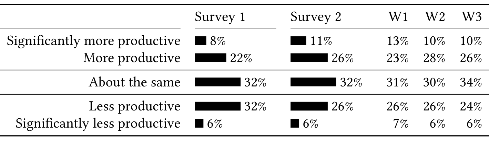

Table 1. Changes in self-reported productivity based on the responses to the question “Compared to working in office, how has your productivity changed?” (Q13, Q13*). The responses to Survey 2 are further broken down by week: April 22–25 (W1), April 26–May 2 (W2), and May 3–9 (W3).

relative to the effect size. The relationships we uncover are all correlational; we cannot distinguish causal effects using the survey.

## 4 CHANGE IN PRODUCTIVITY (RQ1)

In this section, we address the research question “How has engineers’ self-reported productivity changed since WFH?” (RQ1). In both surveys, we asked participants how their productivity has changed compared to working in office. The results are shown in Table 1.

- In both surveys, the majority of participants reported that their productivity had not changed or had even improved (62%–68%). However, a substantial portion of participants (32%–38%) reported that they were less productive.
- The percentage of people reporting to be less productive consistently dropped over the study period: from 38% in Survey 1 to 30% in the last week (W3) of Survey 2. This suggests that some (but not all) people found ways to restore their productivity to their original levels.

Ralph et al. [40] found evidence that developers have lower perceived productivity while working from home during the COVID-19 pandemic. Our findings also support this result but offer a more nuanced view: initially in Survey 1, more people reported lower productivity (38%) than higher productivity (30%); however, this later changed in Survey 2, when more people reported higher productivity (37%) than lower productivity (32%). Similar observations have been made by Forsgren [41] and Bao et al. [42]. We will discuss these papers in more detail in the related work (Section 9).

We performed a simple subgroup analysis of change in productivity across both surveys combined. We found no statistically significant difference between people managers (32% more productive) and individual contributors (35%). However, the difference between software engineers (31%) and program managers (40%) was statistically significant. At Microsoft, program managers define and design products and services, collaborating with many different stakeholders, including engineering teams. Their responsibilities span the entire product/service life cycle [43, 44].

It is important to recognize that at an individual level, people are affected differently by work from home: productivity can decrease, stay the same, or improve depending on a variety of challenges and benefits. In the next two sections, we discuss the higher level themes in terms of the challenges and benefits experienced that emerged from our qualitative analysis of the additional survey questions.

## 5 BENEFITS (RQ2)

In this section, we address the research question “What are the benefits engineers experience when working from home? How have these benefits affected productivity since WFH?” (RQ2). To identify