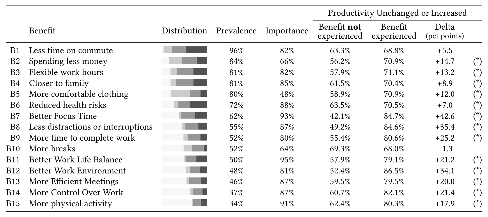

Table 2. Benefits in Survey 2. The column Distribution refers to the distribution of responses that (from left to right) do not experience a benefit (light gray), experience a benefit and consider the benefit as unimportant (gray), important (dark gray) or very important (darker gray). The column Prevalence indicates the percentage of respondents who experienced the benefit (■) while the column Importance describes the percentage of participants who indicated this benefit to be important or very important (percentage of ■ with respect to ■). The column Productivity Unchanged or Increased reports the percentage of respondents who reported that productivity stayed “about the same” or increased (“more productive”, “significantly more productive”) for respondents who did not experience the benefit vs. respondents who did experience the benefit; statistically significant differences (p < .01, with Benjamini-Hochberg correction [27]) are indicated with an asterisk (*). The benefits are sorted and numbered in descending order by column Prevalence.

> No need makeup, suitable dress, and few unnecessary social except meeting. Saving time. Not worry about if anyone will look at me when the moment don’t want to be looked. More concentrate on work. (P371)

> I feel more comfortable and have more privacy. I feel less pressured to do work and get to work on my own pace. (P442)

### Family, Children, and Pets.
Respondents liked being close to their families, children, and pets. They appreciated being able to see them during breaks or lunch and that they could take care of family needs when required.

> Being at home with family, especially with a toddler and baby. I get to spend a bit of time each day every few hours to just say hi and be around them, even if just for a few brief minutes. (P79)

> Work breaks are fulfilling if you have family members around. (P1265)

### Money.
Several participants pointed out that working from home saved them money because of the lack of commute and eating home-made food.

> I save money on food because I’m eating more out of the refrigerator than spending money on lunch every day. (P221)

> No wasted time & money on commute. (P72)