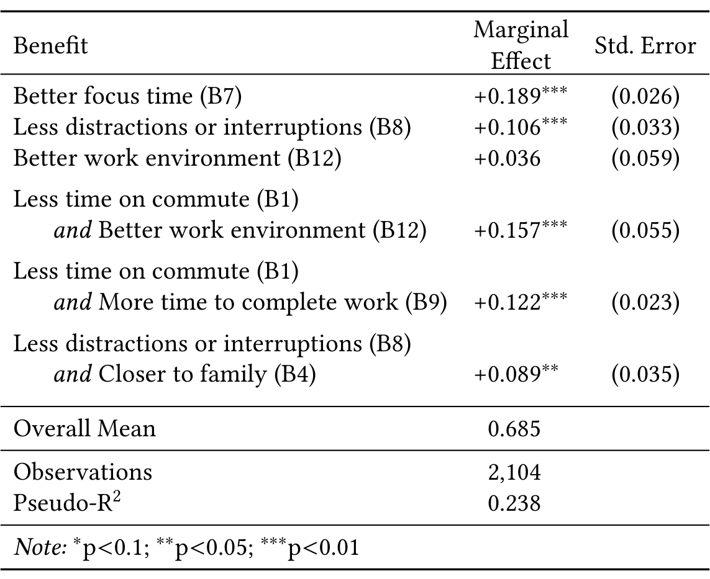

Table 3. Results from the Lasso logit analysis. The dependent variable was whether a participant reported that productivity stayed the same or increased. The explanatory variables are the direct effects and interactions for experienced benefits that were considered as important or very important. The logit coefficients are converted to marginal effects for interpretability. The marginal effect is the difference between changing the variable from 0 (absent) to 1 (present). The overall mean is the percentage of participants who reported that productivity stayed the same or increased.

and less distractions or interruptions (+10.6%). The coefficient for better work environment at home was not statistically significant; however, the interaction between better work environment and less time spent on commute (+15.7%) was. People who reported benefiting from both less time spent on commute and more time to complete their work were also more likely to report that their productivity remained the same or increased (+12.2%). As were people who benefited from both less distractions or interruptions and closer to family (+8.9%).

## 6 CHALLENGES (RQ3)

In this section, we address the research question “What are the challenges engineers face when working from home? How have these challenges affected productivity since WFH?” (RQ3). To identify the challenges, we analyzed the responses to the open-ended questions in Survey 1, and to quantify the association with productivity, we used the responses to Survey 2.

### 6.1 Survey 1: Challenges Experienced Working from Home

The survey respondents shared a wide range of challenges and many respondents indicated they experienced multiple challenges working from home. In this section, we discuss challenges that were frequently mentioned in Survey 1 or later emerged as significant in the productivity analysis based on Survey 2.

**Connectivity.** Of all the challenges, problems with connectivity was the most frequent challenge shared. This included access to remote desktops, special access workstations, and internet bandwidth.