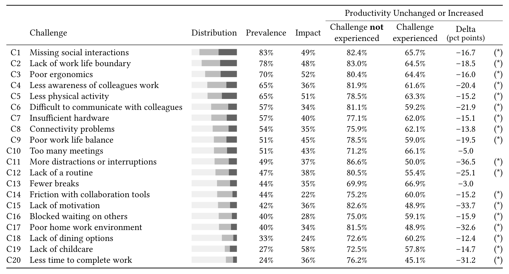

Table 4. Challenges in Survey 2. The column Distribution shows the distribution of responses that do not experience a challenge (light gray), experience this challenge as a minor issue (gray), and experience this challenge as a major issue (dark gray). The following column Prevalence indicates the percentage of respondents that experienced the challenge, while the column Impact describes the percentage of participants that indicated this challenge presented a major issue (percentage of [major] with respect to [experienced]). The column Productivity Unchanged or Increased reports the percentage of respondents who reported that productivity stayed “about the same” or increased (“more productive”, “significantly more productive”) for respondents who did not experience the challenge vs. respondents who did experience the challenge; statistically significant differences (p < .01, with Benjamini–Hochberg correction [27]) are indicated with an asterisk (*). The challenges are sorted and numbered in descending order by the Prevalence column.

## 6.2 Survey 2: Challenges and Productivity

From the themes that emerged in Survey 1, we inferred a list of 20 characteristic challenges (C1..C20) that we included in Survey 2. The results are displayed in Table 4. The challenges are sorted and numbered in descending order of frequency.

Frequency and Impact of Challenges. We make the following observations from Table 4 about the prevalence and impact of challenges:
- The Prevalence column shows the frequency of the challenges. The most frequently reported challenges (C1–C5) were missing social interactions (83%), lack of work-life boundaries (78%), poor ergonomics (70%), less awareness of colleagues' work (65%), and less physical activity (65%).
- The Impact column shows the percentage of participants that indicated a challenge to be a major issue among the participants who experienced it. The challenges most frequently rated as impactful are lack of childcare (58%, C16), poor ergonomics (52%, C3), and less physical activity (51%, C5). The challenges less frequently rated as a major issue are friction with collaboration tools (22%, C14), lack of dining options (24%, C18), and being blocked waiting on others (28%, C16).

Relationships between Challenges and Productivity. The Delta column of Table 4 shows the difference between the percentage of respondents who reported that their productivity stayed “about