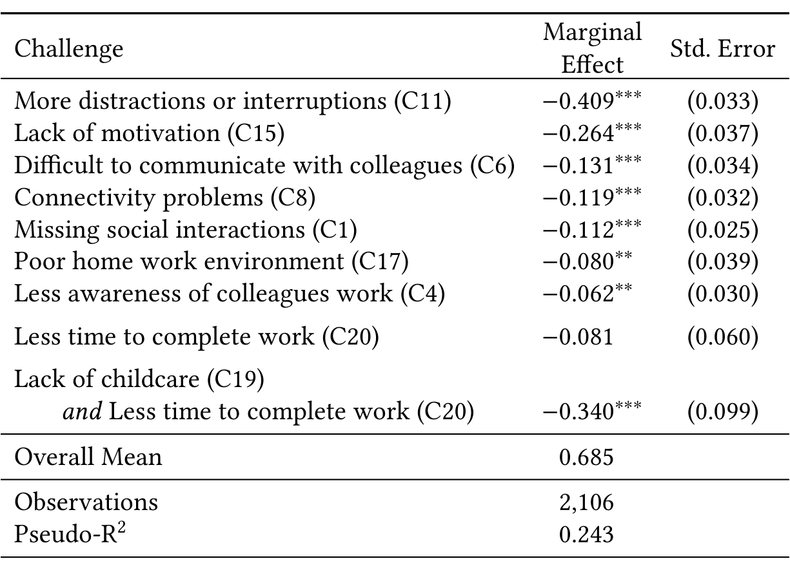

Table 5. Results from the Lasso logit analysis. The dependent variable was whether a participant reported that productivity stayed the same or increased. The explanatory variables are the direct effects and interactions for major challenges. The logit coefficients are converted to marginal effects for interpretability. The marginal effect is the difference between changing the variable from 0 (absent) to 1 (present). The overall mean is the percentage of participants who reported that productivity stayed the same or increased.

Pseudo-R

Note: *p<0.1; **p<0.05; ***p<0.01

### 7.1 Survey 1: Improvements to the Work from Home Experience

Respondents included several improvements that could be made to support their work from home experience. We briefly describe the most frequently mentioned improvements below. Survey 1 was sent within the first two weeks of employees working from home. Microsoft implemented many improvements throughout the pandemic to provide a better work from home experience to its employees, for example, employees facing school closures due to the pandemic were offered up to three months of paid parental leave [46] as well as resources and activities to support their physical, emotional and financial well-being.

Hardware. Although many respondents noted they were able to bring some equipment home or purchase additional devices, the most frequent possible improvement noted by respondents in the first survey was related to hardware. Insufficient hardware was also noted as a key challenge (as discussed in Section 6) and was mentioned by Ralph et al. in the Pandemic Programming study [40].

> I think that this is a reminder that when employing individuals that need certain equipment both at an office and at home, that we come up with a way to fully equip both locations simultaneously. (P994)

Many employees work with multiple monitors and sometimes multiple machines. In contrast, when working from home, employees are sometimes limited to just a laptop or a desktop with a single monitor. Large and/or multiple monitor setups have been found to improve productivity in information workers [47]. Indeed, the most frequently requested type of hardware we noted in the second survey was either larger or more monitors. Developers also asked for more powerful