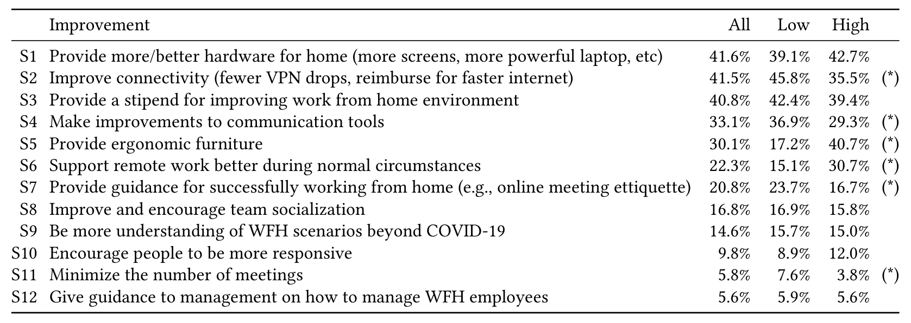

Table 6. Improvements in Survey 2. Participants could select up to three items. Column “All” indicates the frequency the improvement was suggested among all respondents, “Low” the frequency among respondents who reported a decrease in productivity, and “High” the frequency among respondents who reported an increase in productivity. Differences between the frequency for “Low” and “High” that are statistically significant with p < .01 after Benjamini-Hochberg correction [27] are labeled with an asterisk (*).

(column "High"). The improvements are sorted and numbered in descending order of frequency by all respondents.

We make the following observations:
- The most frequently selected improvement was to provide more/better hardware for home (41.6%), improve connectivity (41.5%), and provide a stipend for improving work from home environment (40.8%).
- Several improvements were more frequently selected by respondents who experienced a decrease in their productivity:6 improve connectivity (45.8% vs. 35.5%, S2), make improvements to communication tools (36.9% vs. 29.3%, S4), provide guidance for successfully working from home (23.7% vs. 16.7%, S7), and minimize the number of meetings (7.6% vs. 3.8%, S11).
- Several improvements were more frequently selected by respondents who experienced an increase in their productivity. The improvement provide ergonomic furniture was more than twice as likely to be selected (40.7% vs. 17.2%, S5). This may be because more productive respondents were satisfied with other potentially pressing needs. The improvement support remote work better during normal circumstances was selected twice as frequently (30.7% vs. 15.1%, S6). This may be because these respondents’ basic needs were met and they were focused on future needs and being able to continue working from home.

## 8 DISCUSSION

Although the pandemic is an unusual—and hopefully uncommon—event in the lives of software engineers, the sudden work from home directive provides an opportunity to study what happens when engineers at a very large company are suddenly in a remote working condition with the rest of their team and the entire organization. Engineering work is similar to knowledge work

6 We break down the improvements by productivity, not because we think that getting those improvements explains productivity, but because it shows how the needs of people who are already productive differ from those who do not. For example, if a company wants to focus on helping people who report difficulties remaining productive while working from home, then they should initially focus on improving connectivity and collaboration tools, not providing ergonomic furniture (since that was primarily requested by those who were already productive).