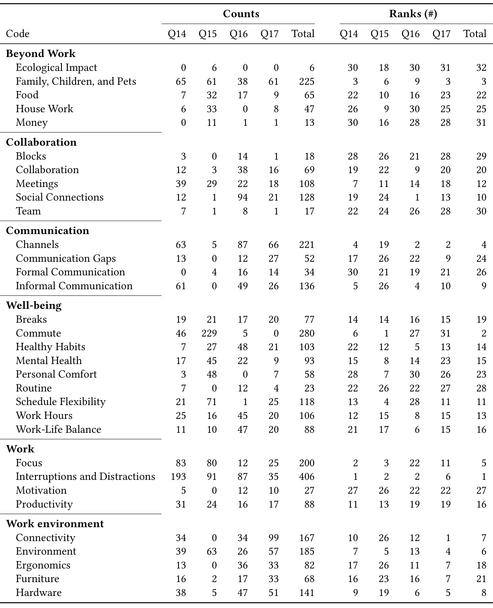

Table 7. Counts and Ranks of the Codes in Survey 1. The columns under Counts indicate the frequency of each code within questions "Please share details about your answer to the previous question on how your productivity has changed." (Q14), "What is good about working from home?" (Q15), "What is bad about working from home?" (Q16), "What challenges have you encountered working from home?" (Q17), and all four questions combined (Total). The columns under Ranks indicate the rank of each code with respect to the other codes for Q14, Q15, Q16, Q17, and all four questions combined (Total). The most frequent code is #1.

