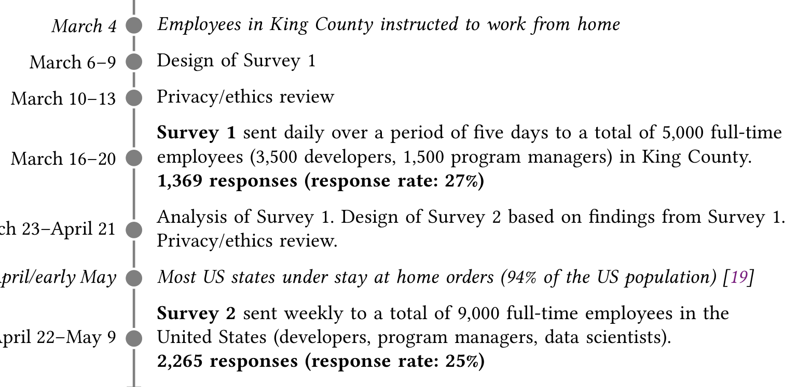

interruptions and context switches they experience. Other research about perceived developer productivity reported that the quality of one’s work environment plays a major role [15], while the effectiveness of a manager [16] is also an important factor on perceived productivity.

More recent research has expanded these factors to include additional elements that may influence perceived productivity and satisfaction, or that can be used in certain contexts to predict productivity. In an earlier study [17] we conducted with developers at Microsoft, the factors that more closely associate with one’s satisfaction with their self-reported productivity include job satisfaction, doing impactful work, having autonomy over one’s work, the ability to complete tasks, the quality of the engineering system, personal technical skills, and their work environment. Predictive factors [18] include job enthusiasm, peer support for new ideas, and getting job feedback, while “use of remote work to concentrate” showed the lowest variance across three large software companies in terms of self-reported productivity.

In our research, we build on this previous work by inquiring about factors already shown to be important for productivity while also allowing new factors that are particular to the pandemic (such as having children at home) to emerge from our study. We discuss our methodology and the surveys in the next section.

## 3 METHODOLOGY

We investigated the experiences of software engineers at Microsoft during the height of the COVID-19 pandemic in the United States using a set of online surveys. Figure 1 outlines the timeline of our study from March–May 2020.

*Fig. 1. Timeline for our multi-survey study*

**Research Context.** The first presumptive positive COVID-19 case in King County, WA (which includes the Microsoft headquarters) was reported on February 29, 2020. In the late afternoon of March 4, Microsoft informed its employees that "Consistent with King County guidance, we are recommending all employees who are in a job that can be done from home should do so" [20]. On March 11, the schools were closed in Washington State (which was made permanent for the school year on April 8). In April, many other restrictions were introduced, and by April 27, the outbreak has reached its peak in Washington State. Some restrictions on outdoor activities were later lifted.