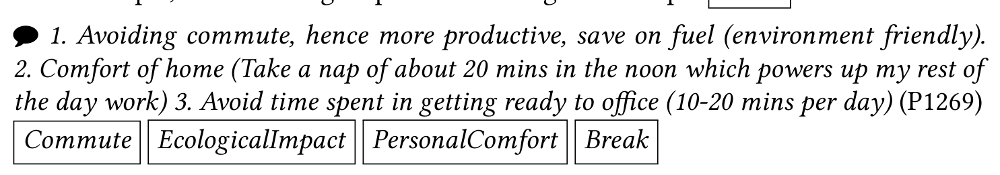

all required questions answered, for a response rate of 27% (comparable to the response rates of many other software engineering surveys [24, 25]). To encourage participation, survey respondents could enter a raffle of multiple $100 Amazon.com gift certificates. No reminder emails were sent.

### Data Analysis

For the open-ended responses to this first survey, we used an open-coding approach, iterating and refining through multiple rounds of independent coding of an initial sample of responses. We coded all of the open-ended questions listed above. Codes for positive aspects of working from home (benefits, RQ2), negative aspects of working from home (challenges, RQ3) and improvements (RQ4) emerged across the questions.

After several iterations coding and discussing codes, we finalized a unified coding scheme with codes, code definitions and code categories (see Appendix A). We applied these finalized codes to a random selection of 400 responses (see Table 7). No new codes emerged during this process. To improve the reliability of our codes, an external researcher used our coding scheme to code a subset of our sample (100) showing an agreement of 81.9%.

The final coding scheme contained 32 codes organized into the following six themes. (The complete list of codes and descriptions can be found in Appendix A.)

- Beyond work – Effects of work from home on non-work aspects of respondents’ lives, such as proximity to family, distribution of finances, and access to food.
- Collaboration – Aspects of respondents’ collaborative tasks, including challenges being creative with others, being blocked/waiting on others, and a range of interactions with co-workers.
- Communication – Work-related communication, including channels used, frequency, duration, planned versus ad-hoc, and the result of missing communication.
- Well-being – Responses related to the welfare of respondents, including changes to flexibility of schedule and location, and the effects of working from home on health (physical, mental, and emotional) and personal comfort.
- Work – Responses related to a direct effect on respondents’ technical work output, including codes related to productivity, motivation, and factors affecting focus and distraction.
- Work environment – Aspects of the setting in which the respondents accomplish their work when working from home, including the existence or lack of reliable internet connectivity, ergonomically sound furniture, satisfactory hardware, and dedicated space.

Note that some responses were coded with multiple codes when participants raised multiple points. For example, the following response was assigned multiple codes:

> 1. Avoiding commute, hence more productive, save on fuel (environment friendly).  
> 2. Comfort of home (Take a nap of about 20 mins in the noon which powers up my rest of the day work)  
> 3. Avoid time spent in getting ready to office (10–20 mins per day) (P1269)  
>
> Commute  EcologicalImpact  PersonalComfort  Break

We show the frequency of the main codes from the 400 responses in Table 7 in the Appendix. However, these counts do not represent an accurate description of which benefits or challenges may be more important, and which ones may affect productivity more or less as these are open-ended questions.3