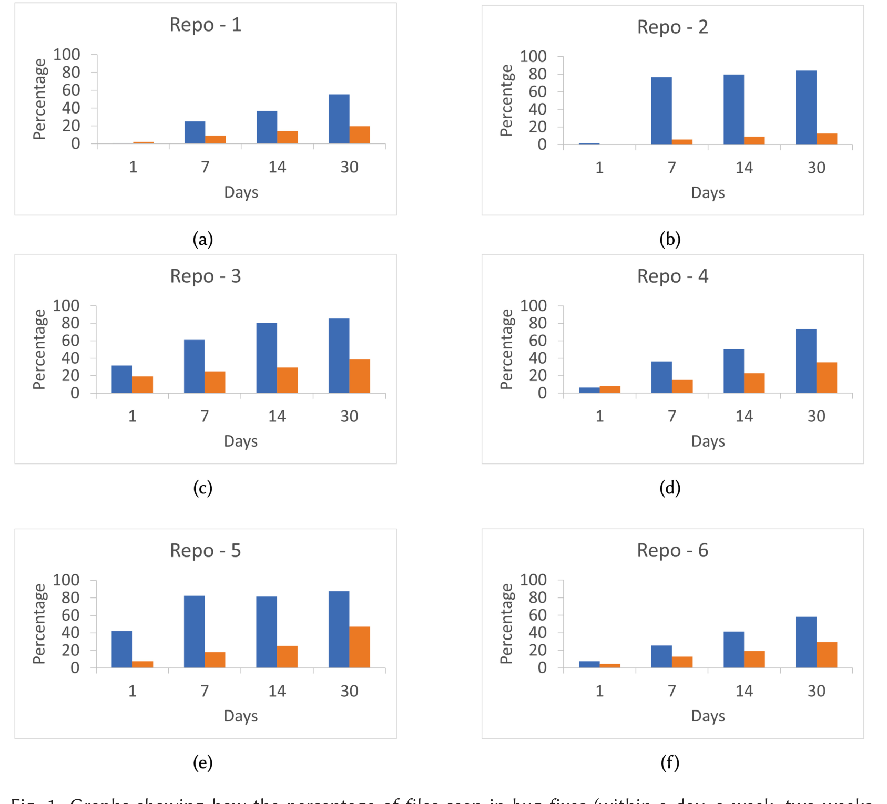

Fig. 1. Graphs showing how the percentage of files seen in bug fixes (within a day, a week, two weeks, and a month) is changing. Blue and orange bars represent concurrently and non-concurrently edited files, respectively.

## 4 SYSTEM DESIGN

Backed by the correlation analysis suggesting that concurrent edits may be prone to causing issues, and by a huge demand from engineering organizations inside Microsoft for a better tool that can detect conflicting changes early on and facilitate better communication among developers, we moved forward to materialize the idea of ConE into reality. We then performed large-scale testing and validation by deploying ConE on 234 repositories. Details about the implementation, deployment, and scale-out are provided in Section 5.

In this section, we describe ConE's conflict change detection methodology, algorithm and system design in detail. We will use the following terminology:

- Reference pull request is a pull request in which a new commit/update is pushed thus triggering the ConE algorithm to be run on that pull request.
- Active pull request is a pull request whose state is "active" when the ConE algorithm is triggered to be run on a reference pull request.