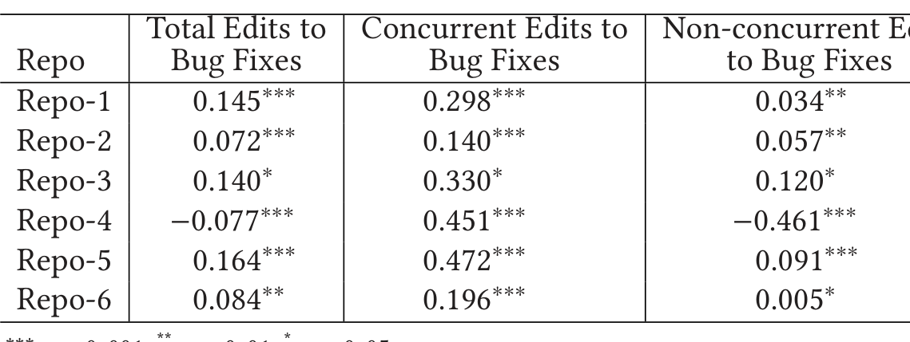

Table 2. Spearman Rank Correlation Analysis for Total Edits, Concurrent Edits, Non-concurrent Edits Versus Bug Fixes

Repo-6 0.084

***p < 0.001, **p < 0.01, *p < 0.05.

A key design consideration is that we want to avoid false alarms. In the current state of the practice developers never receive warnings about potentially harmful concurrent edits. Based on this, we believe it is acceptable to miss a few warnings. However, giving false warnings will likely lead to rejection of a tool like ConE. For that reason, ConE has several built-in heuristics that are aimed at reducing such false alarms.

Due to the nature of the problem, the domain we are operating in, and the algorithm we have in place, it is possible to see notifications that are false alarms. One of the design choices that we had to make was to minimize the false alarms by making it more conservative. A side effect of this is our coverage (number of pull requests for which we send a notification) will be lower. Studies have shown that, in large organizations, tools that generate many false alarms are not used and eventually deprecated [46]. However, recent techniques proposed by Brindescu et al. [11], can potentially aid in facilitating a decision by determining the merge conflict situations to flag, based on the complexity of the merge conflict.

## 4.1 Core Concepts

ConE constantly listens to events that happen in an Azure DevOps environment [5]. When any new activity is recorded (e.g., pushing a new update or commit) in a pull request, the ConE algorithm is run against that pull request. Based on the outcome, ConE notifies the author of the pull request about conflicting changes. We describe two novel constructs that we came up with for detecting conflicting changes and determining candidates for notifications: EOO and the existence of RCEs. Next, we provide a detailed description of ConE’s conflict change detection algorithm and the parameters we have in place to tune ConE’s algorithm.

### 4.1.1 Extent of Overlap (EOO)

ConE scans all the active pull requests that meet our filtering criteria (explained in Section 3.1) and for each such pull request (reference pull request) calculates the percentage of files edited in the reference pull request that overlap with each of the active pull requests:

Extent of Overlap = (|F_r ∩ F_a − F_e| / |F_r|) * 100,

where F_r = Files edited in reference pull request, F_a = Files edited in a given active pull request, F_e = Files excluded, i.e., files that are not of types listed in the paragraph below. The idea is to find the percentage of items that are commonly edited in multiple active pull requests and create a pairwise overlap score for each of the active and reference pull request pairs. Intuitively, if the overlap between two active pull requests is high, then the probability of them doing duplicate work or causing merge conflicts when they are merged is also going to be high. We use this technique to calculate the overlap in terms of number of overlapping files for now. This can be easily extended