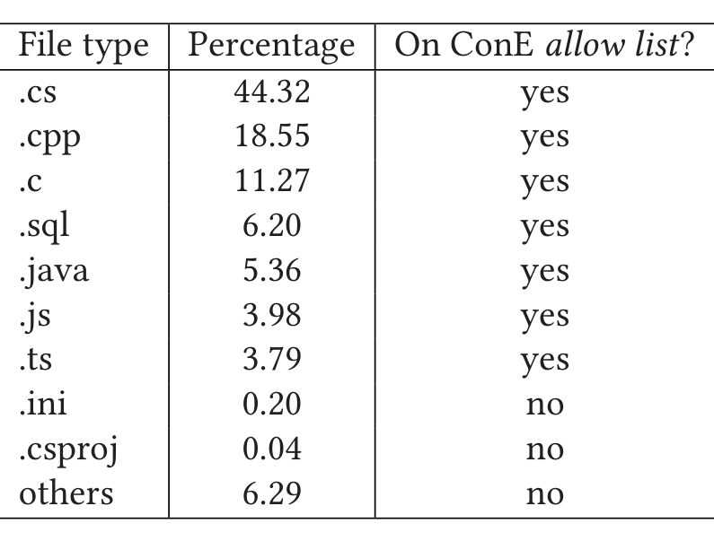
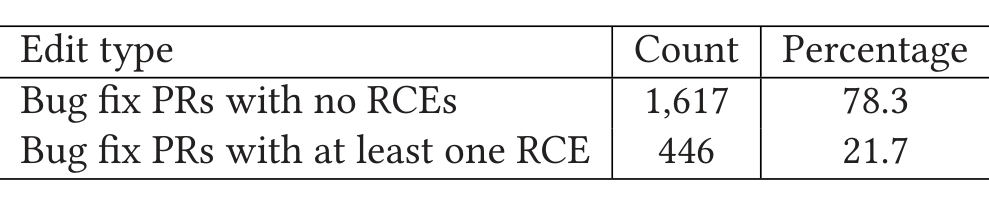

Table 3. Distribution of File Types Seen in Bug Fixes

Table 4. Number of Bug Fixes with RCEs and No RCEs

To calculate the overlap between two active pull requests in terms of number of classes or methods or stubs if that data is available.

A milder version of EOO is used by the model proposed by Owhadi-Kareshk et al. [40], which looks at the number of files that are commonly edited in two pull requests when determining conflicting changes. While calculating extent of overlap it is important to exclude edits to certain file types whose probability of inducing conflicts is minimal. This helps in reducing false alarms in our notifications significantly. Based on a manual inspection of 500 randomly selected bug fix pull requests, by the first three authors, we concluded that concurrent edits to initialization or configuration files are relatively safe, but that concurrent edits to source code files are more likely to lead to problems. Therefore, we created an allow list based on file types as shown in Table 3. As can be seen, this eliminates around 6.4% of the files. Note that such an allow list is programming language-specific. When ConE is to be applied in different contexts, different allow lists are likely needed.

#### 4.1.2 Rarely Concurrently Edited files (RCEs).

These are the files that typically are not edited concurrently, recently. Usually all the updates or edits to them are performed, in a controlled fashion, by a single person or small set of people. Seeing RCEs in multiple active pull requests is an anomalous phenomenon. For example, a file foo.cs is always edited by a given developer, through one active pull request at any point. The ConE system keeps a track of such files and tags them as RCEs. In the future, if multiple active pull requests are seen editing this file simultaneously, ConE flags them. Our intuition is that if a lot of RCEs are seen in multiple active pull requests, which is unusual, then changes to these files should be reviewed carefully and everyone involved in editing them should be aware of others’ changes.

We performed an empirical analysis, from our shadow mode deployment data (as explained in Section 5.2), to understand how pervasive RCEs really are. As explained in Table 4, 21.7% of bug fixes contain at least one RCE while the total number of RCEs in these repositories is just 2%. Based on this data and anecdotal feedback from developers, we realized that concurrent edits to RCEs are an unusual activity that should not be seen a lot. But, if observed, then it should be notified to all the developers involved.