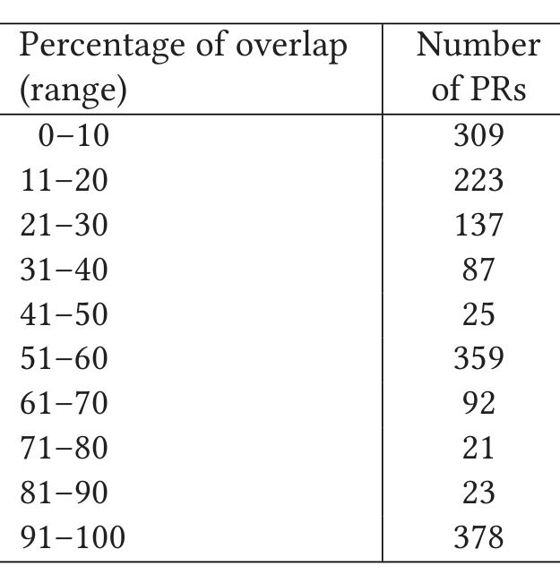

Table 5. Distribution of Extent of Overlap

> **Step 5:** Check for the existence of RCEs and the number of RCEs between each pair of reference and active pull request. Create a tuple Tr = ⟨PR_r, PR_a, R⟩ where PR_r is the reference pull request, PR_a is the active pull request and R is the number of RCEs in the overlap of reference and active pull requests. Do this for all reference and active pull request combinations. At the end of this step, we have a list of tuples, Tra = [⟨PR1, PR7, 2⟩, ⟨PR1, PR12, 2⟩, ⟨PR1, PR34, 9⟩, ...].
>
> **Step 6:** Apply thresholds on the values for extent of overlap and the number of RCEs, as explained in Section 4.3. For example, we can apply a threshold that we select the pull requests whose extent of overlap is greater than 50% OR there should be at least two RCEs. We go through the list of tuples that we have generated in Steps 4 and 5 above and apply the thresholding criteria.
>
> **Step 7:** Apply a ranking algorithm to prioritize the pull requests that need to be looked at first if multiple pull requests are selected by the algorithm. We rank candidate pull requests based on the number of RCEs present and then by the extent of overlap. This is because RCEs being edited through multiple active pull requests is an anomalous phenomenon that needs to be prioritized.

### 4.3 Default Thresholds and Parameter Tuning

In this section, we describe the thresholding criteria, and the rationale that needs to be applied while choosing parameter values for large-scale deployment. The parameters that we have in place are: the EOO, the number of RCEs, the window of time period (i.e., the number of months to consider for determining RCEs), and the total number of file edits in the reference PR.

In line with our objectives, we are searching for parameter settings that find actual conflicts, yet minimize false alarms. Furthermore, we target settings that are easy to explain (e.g., “this PR was flagged, because half of the files changed it are also touched in another PR”).

Threshold for EOO. For Extent of Overlap, we explored what would happen if we put the threshold at 50%: if at least half of the files edited in another pull request, then consider it for notification. To assess the consequences of this, we randomly selected 1,654 pull requests, which have at least one file overlapped with another pull request. This data set is a subset of the data collected to perform empirical analysis on concurrent edits (see Section 3). We manually inspected each of these 1,654 pull requests to make sure the overlap we observe is indeed correct. Our empirical analysis (see Table 5) shows that 50% of the pull requests have an overlap of 50% or less. Thus, this simple heuristic eliminates half of the candidate pull requests for notification, substantially reducing potential false alarms, and keeping the candidates that are more likely to be in conflict.