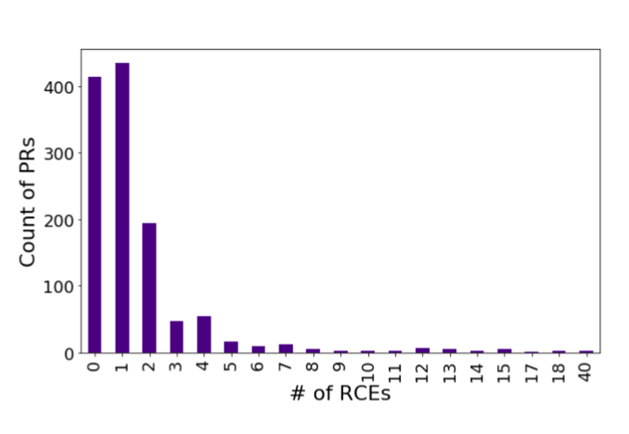
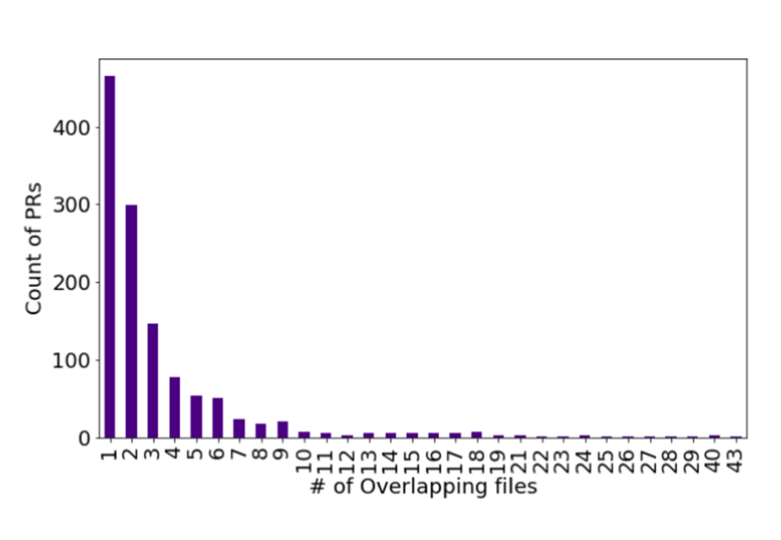

Fig. 2. Distribution of the number of PRs with a given number of RCEs.

Fig. 3. Distribution of the number of PRs with a given number of overlapping files.

**Threshold for RCEs:** For RCEs, we again followed a simple rule: If the active-reference pull request pair contains at least two files that are modified in them, which are always edited in isolation, then select the active pull request as a candidate. As shown in Figure 2, the majority of the pull requests contain fewer than two RCEs. To be conservative, we imposed a threshold on RCE >= 2, i.e., to select a PR as a candidate, that pull request needs to have at least two RCEs that are commonly edited between the reference and active pull requests.

**Number of overlapping files:** Assume a developer creates a pull request by editing two files and one of them is also edited in another active pull request. Here EOO is 50%. This means this pull request qualifies to be picked as a candidate for notification. Editing just one file in two active pull requests might not be enough to reasonably make an assumption about the potential of conflicts arising. Therefore, we impose a threshold on the “number of files” that needs to be edited, simultaneously, in both pull requests. As a starting point, we imposed a threshold of two, i.e., every candidate pull request should have more than two overlapping files (in addition to satisfying the EOO condition of >= 50%). We plotted the distribution of the number of overlapping files in Figure 3. As shown in Figure 3, the number of PRs (on the Y-axis) drops sharply after the number of overlapping file edits is two. Therefore, we picked two as the default threshold.

**Threshold Customization:** In addition to the empirical analysis, we collected initial feedback from developers working with the production systems through our shadow mode deployment (Section 5.2). One of the prominent requests from the developers was to enable the repository administrators to change the values of the parameters explained above based on the developer feedback. Therefore, we provided customization provisions to make the ConE system suit each repository’s needs. Based on the pull request patterns and needs of the repository, system administrators can tune the thresholds to optimize the efficacy of the ConE system for particular repositories.

## 5 IMPLEMENTATION AND DEPLOYMENT

### 5.1 Core Components and Implementation

The core ConE components are displayed in Figure 4. ConE is implemented on Azure DevOps (ADO), the DevOps platform provided by Microsoft. We chose to develop ConE on ADO due to its extensibility that allows third-party services to interact with pull requests through various collaboration points, such as adding comments in pull requests, a rich set of APIs provided by ADO to read metadata about pull requests, and service hooks that allow a third-party application to listen to events, such as updates that happen inside the pull request environment.

Within Azure DevOps, as shown in the left box of Figure 4, ConE listens to events triggered by pull requests, and has the ability to decorate pull requests with notifications about potentially