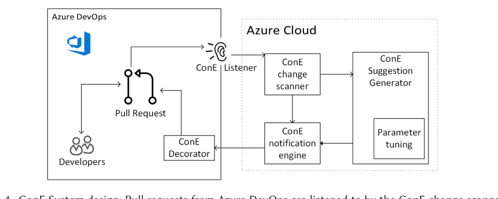

Fig. 4. ConE System design: Pull requests from Azure DevOps are listened to by the ConE change scanner, suggestion generator, notification engine, and decorator.

conflicting other pull requests. The ConE service itself, shown at the right in Figure 4, runs within the Azure Cloud. The ConE change scanner listens to pull request events, and dispatches them to workers in the ConE suggestion generator. Furthermore, the scanner monitors telemetry data from interactions with ConE notifications. The core ConE algorithm is offered as a scalable service in the Suggestion Generator, with parameters tunable as explained in Section 4.3.

The ConE Service is implemented using C# and .NET 4.7. It has been built on top of Microsoft Azure cloud services: Azure Batch [4] for compute, Azure DevOps service hooks for event notification, Azure worker roles and its service bus for processing events, Azure SQL for data storage, Azure Active Directory for authentication and Application Insights for telemetry and alerting.

## 5.2 ConE Deployment

We selected 234 repositories to pilot ConE in the first phase. Some of the key attributes based on which the repository selection process has taken place are listed below:

- Prioritize repositories where we have developers and managers who volunteered to try ConE, since we expect them to be willing to provide meaningful feedback.
- Include repositories that are of different sizes (based on the number of files present in them): very large, large, medium, and small.
- Include repositories that host source code for a diverse set of products and services. That includes client-side products, mobile apps, enterprise services, cloud services, and gaming services.
- Consider repositories that have cross-geography and cross-timezone collaborators, as well as repositories that have most of the collaborators from a single country.
- Consider repositories that host source code written in multiple programming languages including combinations of Java, C#, C++, Objective C, Swift, Javascript, React, SQL, and so on.
- Include repositories that contain a mix of developers with different levels of experience (based on their job titles): Senior, mid-level, and junior.

We enabled ConE in shadow mode on 60 repositories for two months (with a more liberal set of parameters to maximize the number of suggestions we generate). In this mode, we actively listen to pull requests, run the ConE algorithm, generate suggestions, and save all the suggestions in our SQL data store for further analysis, without sending the notifications to the developers. We generated and saved 1,200 suggestions by enabling ConE in this mode for two months. We then