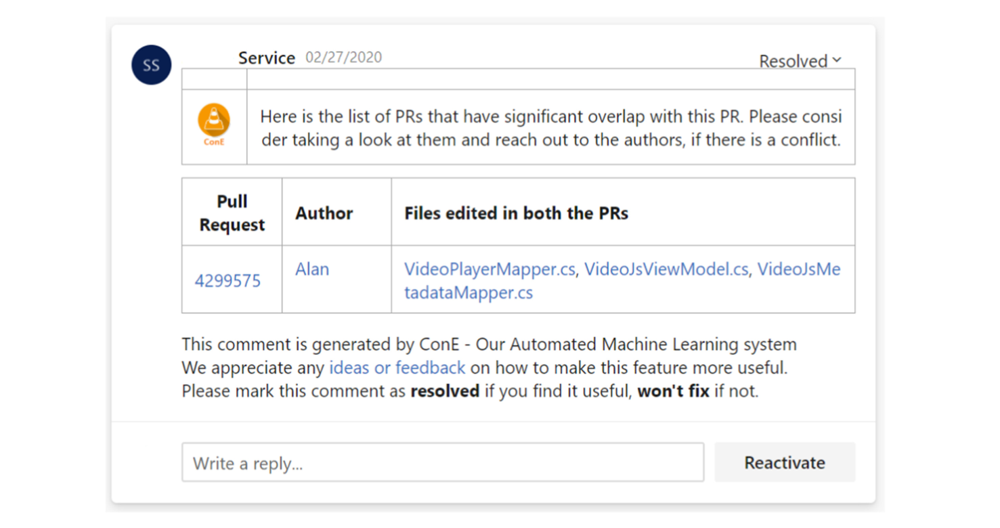

Fig. 5. ConE notification that a pull request has significant overlap with another pull request.

went through the suggestions and the telemetry collected to optimize the system before a large-scale rollout.

The primary purpose of shadow mode deployment is to validate whether operationalizing a service like ConE is even possible at the scale of Microsoft. Furthermore, it allowed us to check whether we indeed can flag meaningful conflicting pull requests, and what developers would think of the corresponding notifications. The telemetry we collected includes the time it takes to run the ConE algorithm, resource utilization, the number of suggestions the ConE system would have made, and so on. We experimented with tuning our parameters (explained in Section 4.3) and their impact on the processing time and system utilization. This helped us in understanding the scale and infrastructure requirements and overall feasibility.

We collected feedback from the developers by reaching out to them directly. We have shown them the suggestions we would have made if the ConE system was enabled on their pull requests, the format of the suggestions, and the mode of notifications. We iterated over the design of the notification based on the user feedback before settling on the version of the notification as shown in Figure 5.

After multiple iterations of user studies and feedback collection on the design, frequency, and the quality of the ConE suggestions as validated by the developers participated in our shadow mode deployment program, we turned on the notifications on 234 repositories.

### 5.3 Notification Mechanism

We leveraged Azure DevOps’s collaboration points to send notifications to developers. A notification is a comment placed by our system in Azure DevOps pull requests. Figure 5 shows a screenshot of a comment placed by ConE on an actual pull request. It displays the key elements of a ConE notification: a comment text that provides a brief description of the notification, the id of the conflicting pull request, the name(s) of the author(s) of the conflicting pull request, files that are commonly edited in the pull requests, a provision to provide feedback by resolving or not fixing a comment (marked as “Resolved” in the example), and the option to reply to the comment inline to provide explicit written feedback.

While ConE actively monitors every commit that is being pushed to a pull request, it will only add a second comment on the same pull request again if the state of the active or the reference