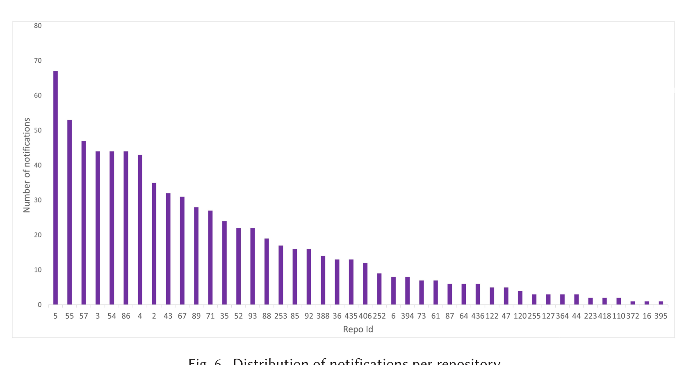
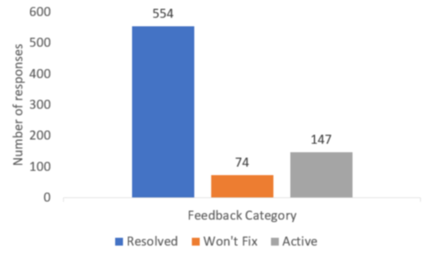

Fig. 6. Distribution of notifications per repository.

Fig. 7. Number of positive (Resolved), negative (Won't Fix), and neutral (Active) responses to ConE notifications.

shown in Figure 5. A user can choose not to provide any feedback by just leaving the comment as is, in the “Active” state. Through this, we collect direct feedback from the users of the ConE system.

Figure 7 shows the distribution of the feedback received. The vast majority (554 of 775, or 71.48%) of notifications were flagged as “Resolved.” For 147 (18.96%) of the notifications, no feedback was provided. Various studies have shown that users tend to provide explicit negative feedback when they do not like or agree with a recommendation, while they tend not to be so explicit about positive feedback [35, 43]. Therefore, we cautiously interpret this as neutral to positive.

We manually analyzed all 74 (9.5%) cases where the developers provided negative feedback. For the majority of them, the developer was already aware of the other conflicting pull request. In some cases the developers thought that ConE is raising a false alarm as they expect no one else to be making changes to the same files as the ones they are editing. When we show them the other overlapping pull requests that were active while they were working on their pull request, to their surprise, the notifications were not false alarms. We list some of the anecdotes in Section 6.4.

## 6.2 Extent of Interaction

As discussed in Section 5.3, a typical ConE notification/comment has multiple elements that a developer can interact with: for each conflicting pull request, the pull request id, files with conflicting