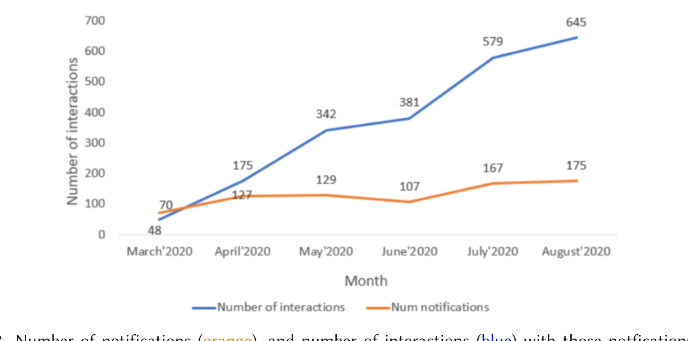

Fig. 8. Number of notifications (orange), and number of interactions (blue) with those notifications, per month. As developers become more familiar with ConE, they increasingly interact with its notifications.

changes, and the author name are shown. These are deep links. Developers can just take a look at the comment and ignore it or interact with it by clicking on one of the “clickable elements” in the ConE notification. If the user decides to pursue further clicking on one of these elements, then that action is also logged as telemetry (in Azure AppInsights).

From March to September of 2020, we logged 2,170 interactions on 775 comments that ConE has placed, which amounts to 2.8 clicks per notification on average. Measured over time, as shown in Figure 8, the number of interactions and the “clicks per notification” are clearly increasing as more and more people are getting used to ConE comments, and are using it to learn more about conflicting pull requests recommended by ConE.

Note that the extent of interaction does not include additional actions developers can take to contact authors of conflicting pull requests once ConE has made them aware of the conflicts, such as reaching out by phone, walking into each other’s office, or a simple talk at the water cooler.

### 6.3 User Interviews

The quantitative feedback discussed so far captures both direct (comment resolution percentage) and indirect (extent of interaction) feedback. To better understand the usefulness we directly reached out (via Microsoft Teams, asynchronously) to authors of 100 randomly selected pull requests for which ConE placed comments. The user feedback for these 100 pull requests is 45% positively resolved, 35% won’t fix, and 20% no response. The interviewers did not know these authors, nor had worked with them before, also because the teams working on the systems under study are organizationally far away from the interviewers.

The interview format is semi-structured where users are free to bring up their own ideas and free to express their opinions about the ConE system. We posed the following questions:

1. Is it useful to know about these other PRs that change the same file as yours?
2. If yes, then roughly how much effort do you estimate was saved as a result of finding out about the overlapping PRs? If not, then is there other information about overlapping PRs that could be useful to you?
3. Does knowing about the overlapping PRs help you to avoid or mitigate a future merge conflict?
4. What action (if any) will you likely take now that you know about the overlapping PRs?