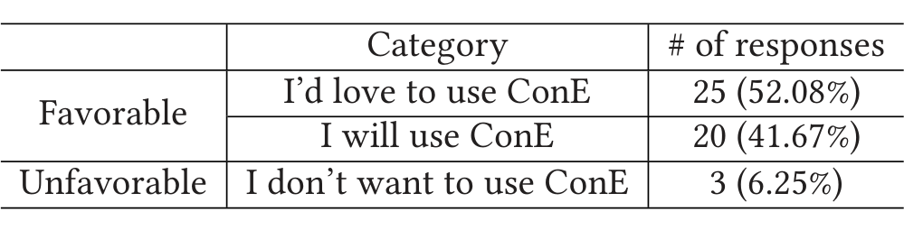

Table 6. Distribution of Qualitative Feedback Responses

(5) Would you be interested in keeping using ConE that notifies you about overlapping PRs in the future? (Note that we aim to avoid being too noisy by not alerting if the overlapping files are frequently edited by many people, if they are not source code files, etc.)

We did not receive the responses in a uniform format directly based on the structure of the questions. We used Microsoft Teams to reach out to the developers and the questions are open ended. Therefore, we could not enforce a strict policy on the number of questions the respondents should answer and on the length of the answers. Some of the participants answered all questions, while some answered only one or two. Some respondents were detailed in their response, while some were succinct with “yes” or “no” answers. Some of the respondents provided a free-form response, with an average word count of just 47 words per response. So, we could not calculate the distribution of responses for all questions. However, we see that for question 5, there were responses. We coded and categorized the responses we received for question 5 as explained below. The first three authors, together, grouped the responses that were received (48 of 100), until consensus was reached, into two categories: Favorable (if the users would like to continue using ConE, i.e., the answer to question 5 is along the lines of “I will use ConE” or a “I’d love to use/keep using ConE”) and Unfavorable (users do not find the ConE system to be useful and do not want to continue using it). Table 6 shows the distribution of the feedback: 93.75% of the respondents indicated their interest and willingness to use ConE.

### 6.4 Representative Quotes

To offer an impression, we list some typical quotes (positive and negative) that we received from the developers. In one of the pull requests where we sent a ConE notification notifying about potential conflicting changes, a developer said:

> “I wasn’t aware about the other two conflicting PRs that are notified by ConE. I believe that would be very helpful to have a tool that could provide information about existence of other PRs and let you know if they perform duplicate work or conflicting change!!”

It turned out that the other two developers (the authors of the conflicting pull requests flagged by ConE) are from entirely different organizations and geographies. Their common denominator is the CEO of the company. It would be very difficult for the author of the reference pull request to know about the existence of the other two pull requests without ConE bringing it to their notice. Several remarks are clear indicators of the usefulness of the ConE system:

- “Yes, I would be really interested in a tool that would notify overlapping PRs.”
- “Looking forward to use it! Very promising!”
- “ConE is such a neat tool! Very simple but super effective!”
- “ConE is a great tool, looking forward to seeing more recommendations from ConE.”
- “This is an awesome tool, Thank you so much for working to improve our engineering!”
- “It is a nice feature and when altering files that are critical or very complex, it is great to know.”