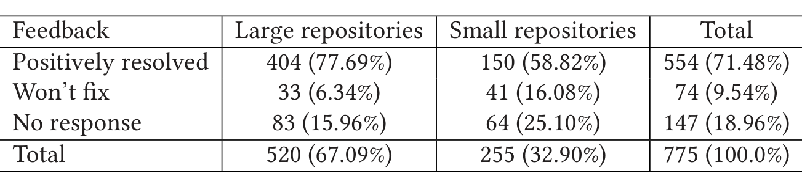

Table 7. Distribution of Quantitative Feedback Based on Size of the Repository

Makes changes to their code base. Interestingly, there were cases where some of these developers were surprised to see another active pull request, created by a different developer, from a different team sometimes, which was editing the same area of the source code as their pull request. This could be a result of underestimating the pace with which service dependencies are introduced, product road maps change, and codebases are re-purposed in large-scale organizations.

## 7 DISCUSSION

In this section, we describe the outlook and future work. We also explain some of the limitations of the ConE system and how we plan to address them.

### 7.1 Outlook

One of the immediate goals of the ConE system is to expand its reach beyond the initial 234 on which it is enabled, and eventually on every source code repository in Microsoft. Furthermore, in the long run, Microsoft may consider offering ConE as part of its Azure DevOps pipeline, making it available to its customers across the world. Likewise, GitHub may consider developing a free version of ConE as an extension on the GitHub marketplace for the broader developer community to benefit from this work.

As explained, ConE is expected to generate false alarms because of the fact that it is a heuristics-based system. To improve the system and reduce the number of false alarms at this point, ConE checks for very simple but effective heuristics (see Section 4.2) and conditions to flag conflicting changes that causes unintended consequences. We offer three configuration parameters (see Section 4.3), that help us make the solution effective by striking a suitable balance between the rate of false alarms and coverage, and customize the solution based on individual repository needs.

To further improve precision, we would like to investigate the options that let us go one level deeper from file level to, e.g., analyze actual code diffs. Understanding code diffs and performing semantic analysis on them is a natural next step for a system like ConE. Providing diff information across every developer branch is fundamentally expensive, so it is not offered by Azure DevOps, the source control system on which ConE is operationalized, nor by other commercial or free source control systems like GitLab or GitHub. A possible remedy is to bring the diff information into the ConE system. This involves checking out two versions of the same file, within ConE, and finding differences. This has to happen in real-time, in a scalable and language agnostic fashion.

Once we have the diff information, another idea is to apply deep learning and code embeddings to develop better contextual understanding of code changes. We can use the semantic understanding in combination with the historical data about concurrent and non-concurrent edits to develop better prediction models and raise alarms when concurrent edits are problematic.

ConE was found to be useful by facilitating early intervention about the potential conflicting change. However, this does not fully solve the problem, i.e., fixing the merge conflicts or merging the duplicate code. Exploring auto-fixing of conflicts or code duplication as a natural extension to ConE’s conflict detection algorithm will help in alleviating the problems caused by the conflicts and fixing them in an automated fashion.